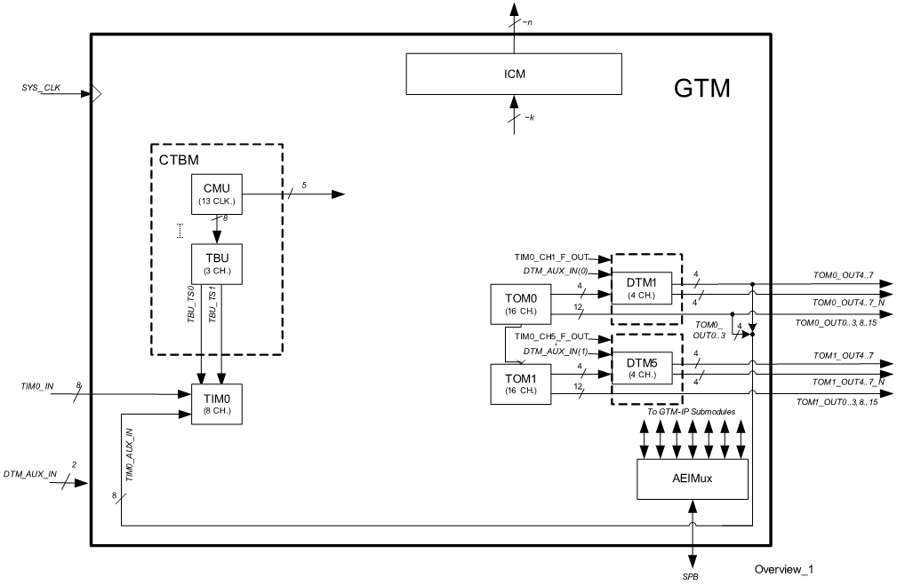
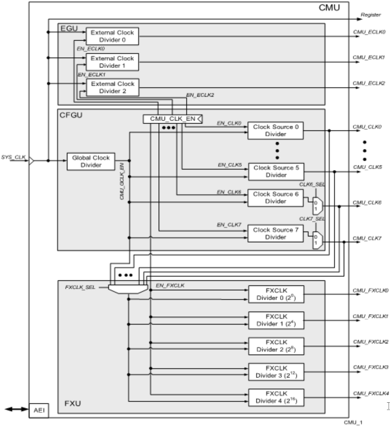
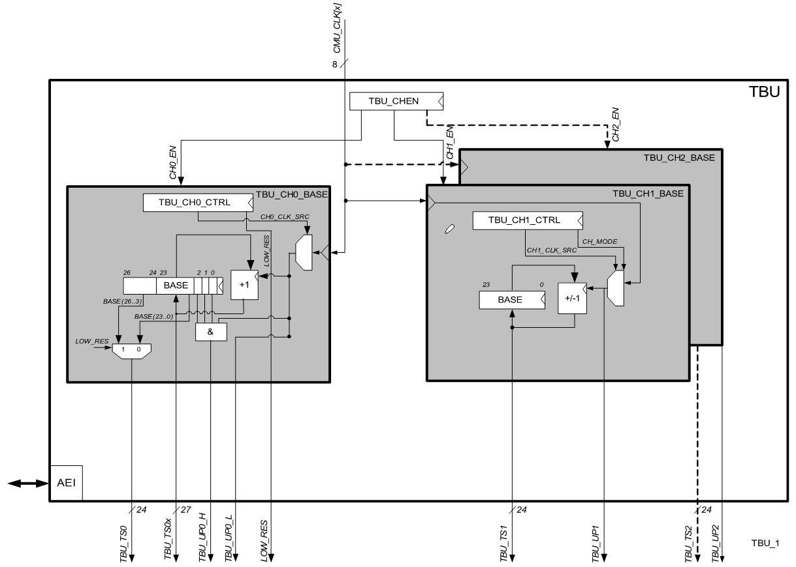
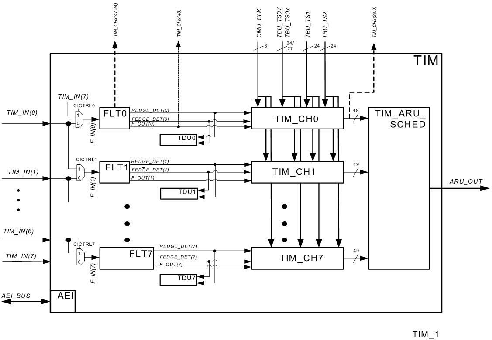
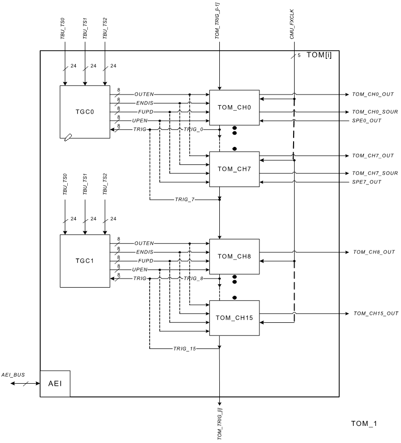
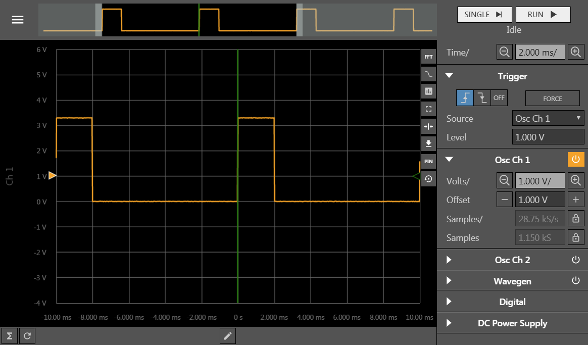

# Chronos ruler

## 시작하는 질문

* Servo의 데이타시트를 찾아보니, on-time 값, 600 (즉, 1500 - 900) ~ 2400(1500 + 900) usec 범위로 디지탈 신호를 입력하여, Servo의 각도를 조정한다고 한다.  주기적으로 동작시켜야 하는데, 어떤 서브시스템으로 이 신호를 발생시키는 것이 좋을까?
* pulse 신호를 발생시키면서, 주기(주파수)와 도통시간(on-time)을 바꿀 수 있느면 Application Kit 보드 위에 있는 Beeper 도 사용할 수 있겠다.  원격으로 동작 시킬 때 소리로 나에게 상태를 알려주는 방법중에 하나로 활용할 수 있겠네!


("Chronos ruler(시간의 지배자)"라는 이번 절의 제목은 같은 이름의 애니메이션 시리즈에서 따왔습니다.  비슷한 성격의 시리즈물 중에 닥터후라는 영국드라마도 있지만, 닥터후는 시간 뿐만 아니라 공간도 이동을 해서 시간의 지배자를 선택했습니다.)

제어공학, 신호처리를 배우면 아날로그 신호를 AD 변환기로 샘플링해서 디지탈로 바꾸고, 이정보를 활용해서 연산을 수행하고 DA 변환을 거쳐서 아날로그 신호로 만들어 출력한다고 배웁니다.  그런데 AURIX 메뉴얼을 열심히 찾아보아도 DA 변환기는 없습니다.  음성신호등을 처리하는 몇몇 경우를 제외하고는 DA 변환기로 아날로그 신호를 복원하는 시스템은 없습니다. 대신 디지탈의 On, Off 상태를 사용하여 아날로그적인 정보를 처리하는 방법을 일반적으로 사용합니다.

------

## Objectives

* Generic Timer Module (GTM) 이해
* GTM 사용법 습득

## References

* TC23x TC22x Family User's Manual v1.1 - Chap 24 Generic Timer Module (GTM)
* iLLD_TC23A Help / Modules/ GTM

**[Example Code]**

* MyIlldModule_TC23A - GtmTomTimer, GtmTomServo

------


## Example Description

* 1ms 마다 timer interrupt를 발생시키고, Servo motor를 0도로 맞추도록 PWM을 발생시킬 수 있습니다.


## Background 정보

* 타이머의 사용법 중에 Output Compare 활용 방법에 대한 일반론 설명은 어떨까?
* 참고로 input capture 에 대한 일반론 설명은 WhereAreYou 를 참고하기 바랍니다.


## AURIX - related

* **Generic Timer Module (GTM)**은 시간 관리 플랫폼입니다.

    * GTM을 구성하는 서브 모듈로는 Clock Management Module (CMU), Time Base Unit (TBU), Timer Input Module (TIM), Timer Output Module (TOM), Dead Time Module (DTM)가 있습니다.
        * CMU와 TBU는 기준 시간을 생성하기 위한 모듈입니다.
        * TIM은 기준 시간을 활용하여 input capture 기능에 사용되는 모듈입니다.
        * TOM, DTM은 기준 시간을 활용하여 output compare 기능을 수행하는 모듈입니다.

    * 아래 그림은 GTM의 Block Diagram을 나타냅니다.

    

**Clock Management Module (CMU)**

* CMU는 counter와 GTM의 **clock**을 생성하는 것을 담당합니다.

* CMU는 세가지의 subunits 들로 구성되며 서로 다른 clock을 생성할 수 있습니다.

* Configurable Clock Generation (CFGU)

    * *8개의 clocks* 을 출력할 수 있습니다.
    * *TIM과 TBU*에 사용됩니다.
    * 임의의 clock source를 선택할 수 있기 때문에 넓은 범위 내 기준 시간을 설정할 수 있습니다.

* Fixed Clock Generation (FXU)

    * *5개의 clocks* 을 출력할 수 있습니다.
    * 사전에 정의된 설정으로 clock을 생성합니다.
    * *TOM*에 사용됩니다.

* External Clock Generation (EGU)

    * 3개의 external clocks을 출력할 수 있습니다.

      


**Time Base Unit (TBU)**

* TBU는 GTM을 위한 공용 기준 시간 (**base timer**)을 생성합니다.
* 3개의 base timer가 있습니다.
* TBU channel 0 time base register (TBU_CH0_BASE)는 27 bits이며 경우에 따라 상위 24 bit 또는 하위 24 bit을 선택적으로 사용가능합니다.
* TBU channel 1, 2 time base register (TBU_CH#_BASE)는 24 bits 입니다.
* 각 base timer는 독립적으로 구동되나 global TBU channel enable을 통해 3개의 base timer를 동기화 할 수도 있습니다.

    


**Timer Input Module (TIM)**

* TIM은 GTM의 입력 신호를 **filtering** 하거나 **capturing**하는 역할을 합니다.
* 기본적으로 TIM은 입력 신호의 rising edge나 falling edge의 time stamp를 찍는 역할을 합니다. 동시에 signal level, edge 갯수, PWM 신호의 주기 등도 함께 측정 가능합니다.
* 8개의 입력 채널이 있으며, 앞단에 TIM Filter Functionality (FLT)를 통해 rising edge, falling edge, 또는 모든 edge를 counting  할 건지 선택하게 됩니다.
* Filtering 된 신호는 TIM_CH#에 들어가며 Timeout Detection Unit을 통해 time stamp를 찍게 됩니다.

​    

**, Timer Output Module (TOM)**

* **PWM을 생성**하는 합니다.
* 16개의 독립된 출력을 내보냅니다.
* TGC0와 TGC1는 전체 출력을 제어합니다. PWM을 활성화시킬 지 말지, PWM 주기, DUTY cycle 등을 설정할 수 있습니다.

​    

## iLLD - related

* Demo code description
  * Generic Timer module을 가지고 Period와 Duty 주기를 설정하여 원하는 주기 Pulse를 만들 수 있습니다.
  * GTM을 이용하여 Servo motor와 DCmotor를 구동시킬 수 있습니다.

### Module Configuration

```c
void GtmTomTimer_initTimer(void)
{
    {   // Create Gtm Timer Output Module (TOM) configuration for timer
        IfxGtm_Tom_Timer_Config timerConfig;

        // TOM timer configuration 초기화
        IfxGtm_Tom_Timer_initConfig(&timerConfig, &MODULE_GTM);

        // timer configuration에 대한 세부 설정 셋팅
        timerConfig.base.frequency       = 100;		// Set PWM period
        timerConfig.base.isrPriority     = ISR_PRIORITY(INTERRUPT_TIMER_1MS);
        timerConfig.base.isrProvider     = ISR_PROVIDER(INTERRUPT_TIMER_1MS);
        timerConfig.base.minResolution   = (1.0 / timerConfig.base.frequency) / 1000;
        timerConfig.base.trigger.enabled = FALSE;
        timerConfig.tom                  = IfxGtm_Tom_1;	// Set TOM1 for TOM object
        timerConfig.timerChannel         = IfxGtm_Tom_Ch_7;	// Set Channel 7
        timerConfig.clock                = IfxGtm_Tom_Ch_ClkSrc_cmuFxclk2;

        // Set output port, p33.10
        timerConfig.triggerOut                      = &IfxGtm_TOM1_7_TOUT32_P33_10_OUT;
        timerConfig.base.trigger.outputEnabled      = TRUE;
        timerConfig.base.trigger.enabled            = TRUE;
        timerConfig.base.trigger.triggerPoint       = 150000/16/16; /* 1.5msec source: Fxclk1 100MHz/16 */
        timerConfig.base.trigger.risingEdgeAtPeriod = TRUE; // Rising edge에서 interrupt 발생

        // 변경된 설정을 적용하기 위해 다시 초기화
        IfxGtm_Tom_Timer_init(&g_GtmTomTimer.drivers.timerOneMs, &timerConfig);

        // Start timer
        IfxGtm_Tom_Timer_run(&g_GtmTomTimer.drivers.timerOneMs);
    }
}

void GtmTomServo_init(void)
{
    /* disable interrupts */
    boolean  interruptState = IfxCpu_disableInterrupts();

    // GTM clock frequency 설정
    Ifx_GTM *gtm = &MODULE_GTM;
    g_GtmTomTimer.info.gtmFreq = IfxGtm_Cmu_getModuleFrequency(gtm);
    IfxGtm_enable(gtm);

    // Global clock frequency 설정
    IfxGtm_Cmu_setGclkFrequency(gtm, g_GtmTomTimer.info.gtmFreq);
    g_GtmTomTimer.info.gtmGclkFreq = IfxGtm_Cmu_getGclkFrequency(gtm);

    // Gtm timer initialization
    GtmTomTimer_initTimer();

    printf("Gtm Tom Timer is initialised\n");

    /* enable interrupts again */
    IfxCpu_restoreInterrupts(interruptState);

    IfxGtm_Cmu_enableClocks(gtm, IFXGTM_CMU_CLKEN_FXCLK | IFXGTM_CMU_CLKEN_CLK0);
}
```


### Interrupt Configuration

* 1ms 마다 인터럽트를 발생시킨다.

```c
void ISR_Timer_1ms(void)
{
    IfxCpu_enableInterrupts();

    IfxGtm_Tom_Timer_acknowledgeTimerIrq(&g_GtmTomTimer.drivers.timerOneMs);
    g_GtmTomTimer.isrCounter.slotOneMs++;
}
```


### Module Behavior

```c
float32 onTime = 1.5; /* 0.5: -90, 1.5: 0, 2.5: +90 */

void GtmTomServo_run(void)
{
	Ifx_TimerValue triggerPoint= (onTime * 100000) /16/16;
	IfxGtm_Tom_Timer_disableUpdate(&g_GtmTomTimer.drivers.timerOneMs);

    // Set PWM duty
	IfxGtm_Tom_Timer_setTrigger(&g_GtmTomTimer.drivers.timerOneMs, triggerPoint);
	IfxGtm_Tom_Timer_applyUpdate(&g_GtmTomTimer.drivers.timerOneMs);
}
```





## 추가적인 설명


------


## 마치며...

이처럼 시간과 관련된 신호를 발생해여 정보를 입출력하는 방법은 마이크로컨트롤러에서 가장 일반적으로 사용하는 입출력 방법입니다.   특히 전력전자 분야에서는 PWM 이라 불리는 방법을 적극적으로 활용하고 있습니다 (PWM의 구체적인 활용 및 내용은 [Synchronized PWM](/SynchronizedPwm.md) 절에서 다루겠습니다.)  출력 신호 뿐만 아니라 특정 이벤트의 발생 여부 등을 감지하기 위해서도 시간과 관련되 디지탈 신호를 일반적으로 사용하고 있습니다.  그 전형적인 활용예가 [Where are you?](WhereAreYou.md) 절의 엔코더 신호의 인터페이스와 활용입니다.

**시간과 관련된 디지탈 신호** 를 잘 다룰 수 있게 되면, **마이크로컨트롤러의 지배자** 가 될 수 있습니다.
