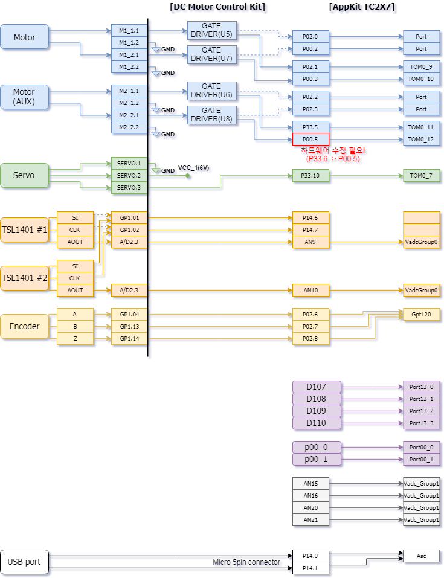
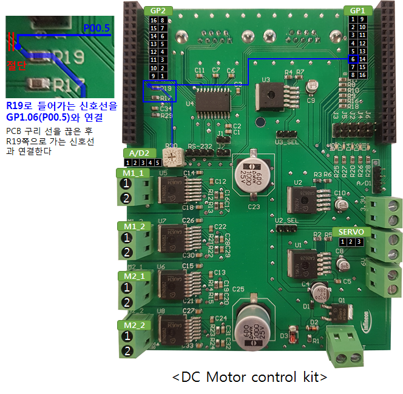

# Connection Guide for Infineon Racer

## Components
*   Application Kit TC2X7 V1.0
*   DC Motor Control Kit (Infineon Released)
    *  보조모터 사용을 위한 하드웨어 수정 필요
*   DC Motor
*   Servo motor
*   CCD (TSL1401 X 2)
*   Incremental Encoder 1024(/512/256) PPR
    * E30S4-1024-3-N-5 사용

## Connection Diagram
* *DC Motor Control Kit* 과 *Application Kit TC2X7 V1.0* 의 경우 별도의 하드웨어 작업 없이 커넥터 연결
* USB/Blutooth 모듈은 *Application Kit TC2X7 V1.0* 에 내장되어 있는 Micro-5Pin connector를 이용하여 연결

## Hardware Modification of Motor Driver Kit
* M2_1과 M2_2를 이용해 모터를 구동하기 위해서 Gate driver (U8)의 *IN* 신호로 들어가는 *P33.6* 신호를 *GP1.06(P00.5)* 로 변경하여 사용 해야함 (그림 참조)
* 납땜 시 주변에 깔려있는 구리(GND)와 합선되지 않게 주의 필요

* !ToDo
  * 실물의 모델 정보 정확하게 반영 [X] - 모터와 서보모터 스펙 필요
  * 외부 구성 요소와 보드와의 연결 핀 정보 구체적으로 기술 [O]
  * Board 에서 수정할 사항 [O]
