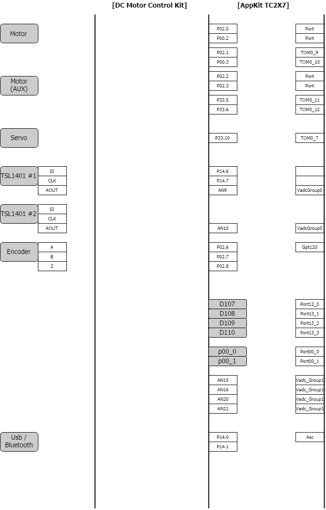

# Connection Guide for Infineon Racer

## Components
*   Application Kit TC2X7 V1.0
*   DC Motor Control Kit (Infineon Released)
*   ???DC Motor??? <= Need to update
*   ???Servo??? <= Need to update
*   CCD (TSL1401 X 2)
*   ???Incremental Encoder 1024(/512/256) PPR??? *<=Need to update*

## Connection Diagram

* !ToDo
  * 실물의 모델 정보 정확하게 반영
  * 외부 구성 요소와 보드와의 연결 핀 정보 구체적으로 기술
  * Board 에서 수정할 사항

