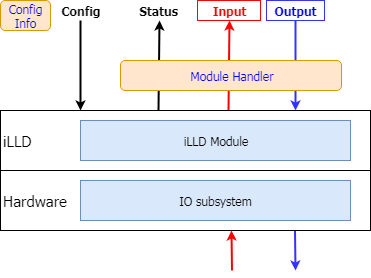
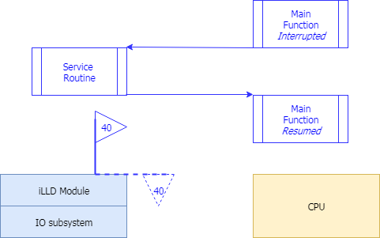

# Do Me a Favor?

## 시작하는 질문

* iLLD 를 사용하는 예제 코드는 이제 만들어서 실행해 볼 수 있게 되었는데....  **라이브러리를 잘 사용하려면 어떻게 해야하나?**
* MCU를 사용할 때 인터럽트가 중요한데, iLLD를 사용할 때는 **인터럽트를 어떻게 설정하고 ISR은 어떻게 만들어 주지?**


iLLD 라이브러리를 사용하면서 간단한 메쏘드(함수)를 호출하는 것이 아니라, 복잡하게 보이는 구조체의 구조체들과 너무 길어서 읽다가 이름을 까먹는 변수, 함수이름들을 계속 만나게 된다.  무턱대고 코드를 들여다 보며 분석하는 용기를 내기 보다는 이것을 설계한 사람의 생각을 이해하는 것이 우선이다.  그리고 전형적인 사용 패턴을 파악 한다면 좀 더 쉽게 이 라이브러리를 사용할 수 있을 것이다.  어쨌든 이 라이브러리는 나에게 호의를 배풀어 주는 서비스의 집합 이다. iLLD에게 말을 걸어보자. **"모듈들을 편하게 사용해 보고 싶어요.  저 좀 도와주세요"**


마이크로컨트롤러 프로그래밍을 하면서 고민스럽고 중요한 것들 중에 하나가 인터럽트 처리 부분이다.  특정 조건, 상황이 되었을 때 이벤트를 발생 시키고, 마이크로컨트롤러에서 하던 일을 중단하고 이벤트에 대하여 처리해 주어야 한다.  마이크로컨트롤러에서 관리할 수 있는 이벤트가 어떤 것들이 있는지, 이 부분에 대하여 어떻게 설정해 주어야 하는지, 그리고 해당 이벤트에 어떤 일들을 시켜야 하는지, 설계자가 고민할 것이 많은 부분이다.  이벤트가 MCU에게 신호를 보내온다. **"저 할 말 있는데요.  저 좀 도와주세요!"**


## Objectives

* **설정(Configuration) 정보**를 인식하고, 정적인 정보와 동적인 정보로 구분할 수 있도록 하고
* 각 **모듈을 초기화** 하는 패턴을 이해하고
* **인터럽트 관련 서비스를 활용**할 수 있도록 한다.

## References
* iLLD_TC23A 1.0.1.4.0 도움말 - STM, CPU/Interrupt Functions
* iLLD_TC23A_Demos_1_0_1_4_0 - StmDemo

**[Example Code]**

* MyStm_TC23A


## iLLD를 사용하는 패턴

* iLLD 모듈을 사용한다는 말은
    * **Configuration**: 모듈을 원하는 대로 설정하고
    * **Status**: 모듈의 상태를 살펴보며 필요시 조정하고
    * **Input/Output**: 외부 신호를 읽고 쓰는 동작을 하는 것

* 3가지 형태의 정보를 주고 받는 프로그래밍을 해야 한다.

    * IO subsystem 수준에서는 레지스터를 통해서 하고
    * iLLD 모듈을 사용할 때는 변수와 함수를 통해서 한다.

* iLLD 모듈에서 사용하는 변수는

    * 설정 정보를 담고 있는 **Configuration Data Structure** 와
    * 해당 모듈을 가르키는 **Handler(Runtime Variable)** 로 구성된다.

* iLLD 모듈에서 사용하는 함수는

    * 모듈별로 명명법에 따라 선언/정의 되어 있고,
    * Configuration Data Structure 와 Handler를 사용하여 해당 동작을 수행한다.

    ​




* 예시

```
IfxStm_initCompare(g_Stm.stmSfr, &g_Stm.stmConfig);
	//IfxStm_initCompare: 함수
	//g_Stm.stmSfr: Handler
	//g_Stm.stmConfig: Configuration Data Structure
```


### Configuration 하기

* 설정과 관련된 정보들이 구조체로 구성되어 있다.
    * 설정과 관련된 레지스터의 갯수가 많고,
    * 레지스터의 이름으로만 명명 해 놓으면 연관성을 찾기가 어렵다.
* iLLD 모듈을 내가 원하는 방식으로 설정하려면
    1. 모듈 설정과 관련된 자료형을 찾고, `Ifx<ModuleName>_Config`
    2. 그 자료형(구조체)으로 설정 변수를 선언하고,  `<ModuleName>Config`
    3. 설정 변수 초기화 함수를 사용해서 기본값으로 초기화 하고, `Ifx<ModuleName>_initConfig(<ModuleName>Config)`
    4. 필요한 값을 사용자가 변경하고, `<ModuleName>Config.member = UserValue`
    5. 설정 변수로 모듈을 초기화 한다. `Ifx<ModuleName>_init(&<ModuleName>Config)`
* 예시

```
//1. 모듈 설정과 관련된 자료형을 찾고, in StmDemo.h
typedef struct
{
    IfxStm_CompareConfig stmConfig;         
	...
} App_Stm
	// [참고] IfxStm.h 에 정의되어 있는 IfxStm_CompareConfig 자료형
    typedef struct
    {
        IfxStm_Comparator          comparator;
        IfxStm_ComparatorInterrupt comparatorInterrupt;
        IfxStm_ComparatorOffset    compareOffset;
        IfxStm_ComparatorSize      compareSize;
        uint32                     ticks;
        Ifx_Priority               triggerPriority;
        IfxSrc_Tos                 typeOfService;
    } IfxStm_CompareConfig;


//2. 그 자료형(구조체)으로 설정 변수를 선언하고, in StmDemo.c
App_Stm g_Stm;

//3. 설정 변수 초기화 함수를 사용해서 기본값으로 초기화 하고, in StmDemo.c
    IfxStm_initCompareConfig(&g_Stm.stmConfig);

//4. 필요한 값을 사용자가 변경하고, in StmDemo.c
    g_Stm.stmConfig.ticks           = TimeConst_1s;

//5. 설정 변수로 모듈을 초기화 한다.
    IfxStm_initCompare(g_Stm.stmSfr, &g_Stm.stmConfig);
```

* 설정이 간단하지 않은 이유
    * 입출력 동작과 관계된 상세한 동작을 CPU의 간섭없이,
    * IO subsystem 알아서 입출력 동작을 수행하도록 구성하는 스마트한 모듈이기 때문이다.
    * 매일 아침 가게에 가서 우유를 사서 먹는 것이 아니라 우유를 배달해 달라고 계약을 하는 것과 같다.
* 위에서 **3. 설정 변수 초기화 함수를 사용해서 기본값으로 초기화** 하는 이유
    * 위의 `IfxStm_CompareConfig` 자료형은 7개의 멤버를 가지고 있어서 각각의 멤버를 사용자가 직접 초기화 할 수 있는 정도 이다.
    * 그러나 복잡도가 높은 모듈의 경우에는 수십개의 멤버를 초기화 하여야 한다.
    * iLLD에서 그러한 이유로 구조체의 멤버를 DEFAULT 값으로 초기화 하는 함수를 제공하고 있다.
    * 이것을 사용하면 모든 멤버를 초기화 하는 수고를 줄일 수 있다.


## 인터럽트를 등록하고 사용하는 방법

* 인터럽트란
    * 마이크로컨트롤러의 서브시스템이 특정 상황이 되었을 때, 다른 말로 이벤트가 발생되었을 때,
    * CPU에게 이것을 알리고 CPU가 진행하던 일을 멈추고
    * 이 이벤트에 해당하는 일을 처리하는 하는 메커니즘 이다.
* 프로그램을 실행할 수 있는 곳은 한군데, CPU, 뿐이다.
    * CPU는 원래 자기가 처리해야 하는 일을 순차적으로 실행하고,
    * 이벤트 상황이 되었을 때 그 때만 잠시 이벤트와 관련된 일을 처리해 주는 방식이다.
    * 공부를 하다가 전화가 오면 그 전화를 받고, 그 전화가 끝나면 다시 공부를 하는 것처럼 말이다.
* 이 인터럽트를 사용하기 위해서는 상당한 저수준의 프로그래밍이 필요하다.
    * CPU에서 인터럽트를 받아들일지 말지,
    * 어떤 모듈에서 인터럽트를 발생시킬지 말지,
    * 해당하는 일, Service Routine, 은 어느 곳에 위치 시킬지,
    * 이 정보들의 테이블은 어떻게 구성할지 등등 말이다.
* iLLD는 저수준의 프로그래밍 지식 없이 인터럽트를 등록하고 사용할 수 있는 편리한 서비스를 제공하고 있다.
    * 다만 그 정보들이 여러 파일에 흩어져 있고,
    * 저수준의 정보를 정리해야 함으로
    * 필요한 배경 지식은 갖추어야 한다.
* 이를 위해서 인터럽트를 사용하는데 필요한 정보들과 과정을 간략화 하면 다음의 그림과 같다.

[설정 관련]

1. 각 모듈은 어떤 인터럽트를 발생 시킬지 CPU와 사전에 **약속**이 되어 있어야 한다.
2. 그리고 그 인터럽트가 발생 될 때 **어떤 동작**을 할지,  Interrupt Service Routine이, 프로그래밍 되어 있어야 한다.

[사전 조건 관련]

3. 모듈이 해당 인터럽트를 발생시킬 수 있도록 **활성화** 되어 있어야 한다.
4. CPU가 인터럽트 발생시 그것을 처리할 수 있도록 **설정**되어 있어야 한다.

[실행 관련]

5. 모듈에서 인터럽트 발생 조건이 되면 해당 인터럽트를 발생, 해당 **플래그를 세트**시킨다. 하드웨어적으로 자동으로
6. 그러면 CPU는 그 인터럽트 발생을 감지하게 되고 해당 인터럽트 서비스 루틴을 **실행**하게 된다.  설정 정보에 기반하여 자동으로
7. 서비스 루틴에서는 해당 프로그램을 수행하고 다음번 인터럽트 발생을 위하여 다시 모듈의 인터럽트를 활성화, **해당 플래그를 클리어**, 한다.  해당 서비스를 호출하여 수동으로





### MyStm_TC23A 의 인터럽트

예제를 통해서 위의 각 동작들에 대하여 코드 수준으로 살펴보면 다음과 같다.


#### [설정 1] 모듈과 CPU의 약속


```c
// StmDemo.c 의 66행

IFX_INTERRUPT(STM_Int0Handler, 0, ISR_PRIORITY_STM_INT0);
```
* 제일 중요한 약속: 어떤 인터럽트를, 우선순위 얼마로, 서비스루틴의 이름은 무엇으로 하는지
    * `IFX_INTERRUPT`:  인라인 어셈블리 매크로 함수를 통해서, (솔직히 이 말이 무슨 말인지 이해하기도 좀 어렵습니다), 인터럽트 벡터 테이블에 등록이 됩니다.
    * `STM_Int0Handler`:  ISR 이름 입니다. 정확히 문법적으로 ISR의 Function Pointer
    * `0`: ISR을 처리하는 CPU의 번호, Multi-core 에서도 사용하는 라이브러리라서 그렇습니다.
    * `ISR_PRIORITY_STM_INT0`: 인터럽트 속성에 관한 중요한 정보 입니다.  이 값으로 내부적으로 관리됩니다.  구체적인 정보는 `ConfigurationIsr.h` 파일에서 사용자가 설정하게 됩니다.  우선순위와 실행하는 CPU의 번호


#### [설정 2] 어떤 동작을 할지, Interrupt Service Routine

```c
// StmDemo.c 의 76행

void STM_Int0Handler(void)
{

}
```

* Interrupt Service Routine
    * 위의 매크로 함수로 등록된 ISR
    * 이곳에 인터럽트와 관련된 구체적인 프로그래밍을 하게 됩니다.


#### [사전조건 3] 모듈의 해당 인터럽트 활성화

```c
// StmDemo.c 의 137행
void IfxStmDemo_init(void)
{
    /* disable interrupts */
    boolean interruptState = IfxCpu_disableInterrupts();
	// 중간 생략
    g_Stm.stmConfig.triggerPriority = ISR_PRIORITY_STM_INT0;
    g_Stm.stmConfig.typeOfService   = IfxSrc_Tos_cpu0;
	// 중간 생략
    /* enable interrupts again */
    IfxCpu_restoreInterrupts(interruptState);
}

```

* 모듈을 설정 하면서 인터럽트 관련정보 반영

    * `ISR_PRIORITY_STM_INT0`: ConfigurationIsr.h 에 정의된 인터럽트 관련 설정 정보
    * `IfxSrc_Tos_cpu0`: Multi-core 여서 CPU0 에서 실행한다는 의미

    ​

#### [사전조건 4] CPU가 인터럽트를 받아들이게 설정

```c
// Cpu0_Main.c 의 77 행
int core0_main(void)
{
	// 중간 생략
    /* Enable the global interrupts of this CPU */
    IfxCpu_enableInterrupts();
}

```

* `IfxCpu_enableInterrupts()` CPU가 인터럽트를 받아들이도록 만드는 함수

    * 이렇게 설정하면 모든 인터럽트에서 CPU가 반응을 하게 됩니다.

* [참고] Atomic operation & Atomic section

    *  `IfxStmDemo_init()` 함수의 `IfxCpu_disableInterrupts()` 와  `IfxCpu_restoreInterrupts()`
    *  `IfxCpu_disableInterrupts()` 를 실행하면 이후에 CPU는 인터럽트를 받아들이지 않습니다.
    * `IfxCpu_enableInterrupts()`가 호출 되던지 다른 방법으로,  `IfxCpu_restoreInterrupts()` 와 같은 함수로 이전 상태를 복구 할 때 까지 모든 인터럽트는 처리되지 않게(Blocking) 됩니다.
    * 이 코드가 필요한 이유는 특정 코드가 실행 될 때 인터럽트 등으로 인해서 방해 받지 않도록 하기 위함입니다.  이와 같은 동작을 atomic operation 이라 이렇게 보호되는 코드 영역을 atomic section 이라 부릅니다.

  ​

#### [실행 5] 모듈의 인터럽트 발생, 해당 플래그 세트

* 모듈에서 해당 조건이 만족되면, 인터럽트 상황이 발생되면, 모듈의 특정 레지스터를 세트하고 CPU에 알려주게 됩니다.  

    * 이 레지스터를 일반적으로 **인터럽트 플래그** 라고 하고,
    * 모듈과 CPU 사이에 이런 플래그 정보로 상태를 알리는 방식을 **플래그 메카니즘** 이라 합니다.
    * 일반적으로 모듈의 인터럽트 플래그는 자동적으로 세트 됩니다.
    * 그러므로 소프트웨어 상으로 프로그래밍 할 것은 없습니다.

  ​

#### [실행 6] CPU의 인터럽트 서비스 루틴 실행

* 모듈에서 인터럽트가 발생되면 CPU는 하던 일을 멈추고 해당 ISR를 실행하게 됩니다.
    * 내부적으로는 스택에 관련 정보들을 PUSH 하고
    * 인터럽트 벡터테이블을 참고하여, 이것은 [설정1] 연결된 ISR의 Function Pointer 입니다.
    * 해당 인터럽트로 분기해 가게 됩니다.  함수 호출 관계로 설명하면 ISR을 호출하여 실행하게 됩니다.
    * ISR의 실행을 마치게 되면 스택에 저장했던 정보를 복원하여
    * 중단 했던 일을 계속 실행하게 됩니다.
    * 위에 상술한 구체적인 정보는 사용자 입장에서는 몰라도 지장은 없습니다만
    * 스케쥴링 혹은 RTOS와 같이 깊이 있는 프로그램을 사용할 때는 고려하여야 하는 사항 입니다.


#### [실행 7] 인터럽트 서비스 루틴 내에서 해당 플래그 클리어

```c
// StmDemo.c 의 78행

void STM_Int0Handler(void)
{
    IfxStm_clearCompareFlag(g_Stm.stmSfr, g_Stm.stmConfig.comparator);
	// 이하 생략
}
```

* ISR 내에서는 일반적으로 해당 인터럽트의 플래그를 클리어 해주는 동작을 가지고 있습니다.
    * 이 단계를 실행하지 않으면 인터럽트가 한번만 발생하고 이후에는 발생되지 않습니다.
    * 일반적으로 인터럽트는 해당 조건이 되었을 경우 지속적으로 발생해야 함으로 이 플래그를 클리어 해주는 동작이 있어야 합니다.
* 굳이 이렇게 플래그 메카니즘을 넣은 이유는
    * 인터럽트가 발생 했을 때 해당 순간의 이벤트에 대해서만 반응을 하도록 하기 위해서 입니다.


## 이 챕터를 정리하며

* iLLD는 잘 **구조화된 라이브러리** 입니다.

    * 그 구조를 파악하면 좀 더 쉽게 사용할 수 있습니다.
    * 모듈과 관계된 정보들을 구조체를 사용해서 관리하고
    * 모듈에 접근하는 다양한 함수들을 제공하고 있습니다.

* iLLD를 사용하면 **인터럽트 처리를 쉽게** 할 수 있습니다.

    * 제공하는 설정파일, ConfigurationIsr.h,을 사용해서 인터럽트 관련 정보들을 정리하고
    * `IFX_INTERRUP` 함수를 사용해서 저수준의 정보들을 등록할 수 있습니다.

  ​

* iLLD는 이렇게 AURIX의 모듈을 사용할 때 **우리에게 편의를 제공**하고 있습니다.

* 우리들은 iLLD를 사용해서 AURIX가 **외부 이벤트들에게 편의를 제공하도록** 프로그래밍 할 수 있습니다.
