# Getting Started

## Objectives
* 개발환경을 설치하고
* InfineonRacer 코드를 다운 받아 빌드하고
* 각종 IO를 연결하여 동작 여부를 확인한다.

## References
* 개발환경 관련
    * [HighTec Free TriCore™ Entry Tool Chain](https://free-entry-toolchain.hightec-edv.com/index.php)
    * [SerialPlot](https://hackaday.io/project/5334-serialplot-realtime-plotting-software)
    * [TeraTerm](https://ttssh2.osdn.jp/)

* Build 관련
    * php 관련 - [Stackoverflow](https://stackoverflow.com/questions/21397073/msvcr110-dll-is-missing-from-computer-error-while-installing-php)

## Example Description

* 개발환경 구축
    * 개발환경 구축을 위해 Tricore tool chain(compiler)와 UDE(Universal Debugger Engine)가 포함되어 있는 *HighTec*  설치
    * 인피니언에서 제공하는 *BIFACES* build environment 설치
    * Serial 통신 및 Shell 환경 구축을 위한 SerialPlot, TeraTerm 설치

* *BIFACES* 를 통하여 소스코드 빌드
    * 다운 받고, 빌드하고, 버닝하고 TFT, Shell 로 동작 확인

* 예제 동작 확인
    * *Application Kit TC2X7 V1.0* 보드(이하 *AppKit*)를 이용한 LED, Beeper, TFT 예제 동작
    * *DC Motor Control Kit* 보드(이하 *MotorKit*)를 이용한 Motor, Encoder, Line scan camera 예제 동작

---
## 개발환경 설치

### HighTec Installation

* Dependency: [Java SE Development Kit](http://www.oracle.com/technetwork/java/javase/downloads/jdk8-downloads-2133151.html) **(32bit)**
    * Windows 32bit 64bit 운영체제 모두 32bit 버전으로 다운받아야 함 (최신 버전으로 받으면 됨)

 


* [Tricore tool chain 홈페이지](http://free-entry-toolchain.hightec-rt.com/index.php)에서 개인 정보 입력 후 Generate License File & Download 버튼 클릭
    * 이때 입력한 개인정보는 HighTec 다운로드 완료 후 License 인증 시 필요

 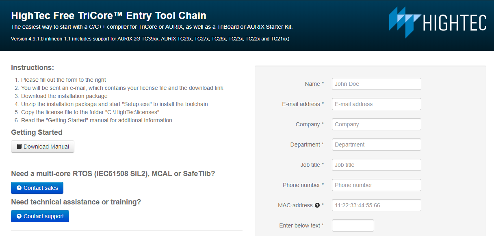

* *free_tricore_entry_tool_chain.zip* 다운로드 후 압축 해제

* 압축 해제된 파일 중 *setup.exe* 를 실행 후 설치 진행

 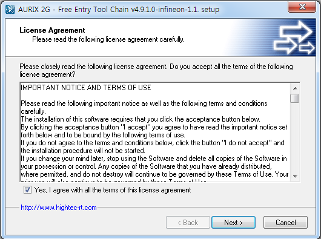
 
 (HighTec 설치 진행 중 **UDEVisualPlatfrom** 과 **CDM Driver Package HighTec** 가 설치됨)

* 설치 완료 후 **Eclipse.exe** *(C:\HIGHTEC\ide\eclipse-v1.6.1)* , **UDEVisualPlatfrom.exe** *(C:\Program Files (x86)\pls\UDE Starterkit 4.8)* 실행 확인

    * **Eclipse** 실행화면 (Workspace는 defualt 값 사용)

 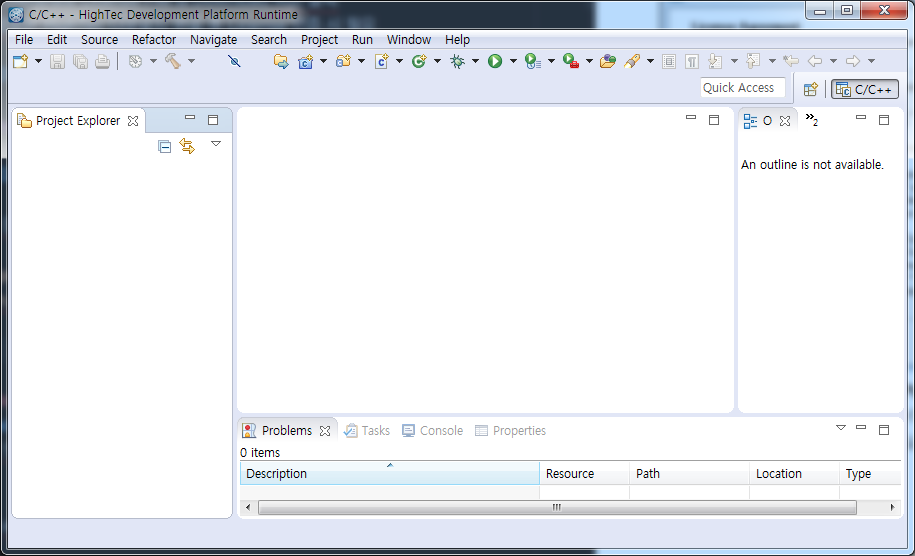

### BIFACES Installation

* BIFACES [Download](https://drive.google.com/open?id=1tYg7DDeB-HNf8ZCV7toeD5UtMwiLin4A)
    * 위 링크를 통해 다운 받은 압축파일 *(BIFACES_V1_0_0_Win32.zip)* 압축 해제

    * BIFACES_V1_0_0.exe 실행

    * *Select Components* 에서 *Full installation for Win32* 선택 후 설치 진행

 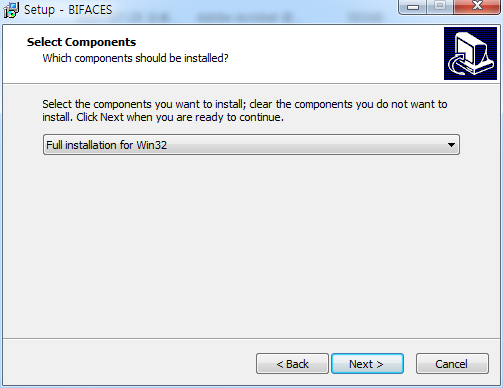

* 설치 완료 후 **StartBifaces.bat** *(C:\Tools\BifacesTools)*  파일을 실행
    * **.bat** file 실행 화면 (Workspace는 defualt 값 사용)

 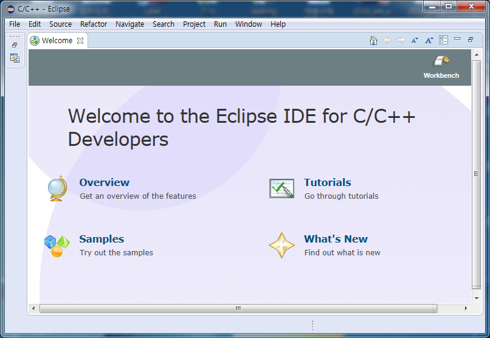

### SerialPlot Installation

* [SerialPlot](https://hackaday.io/project/5334-serialplot-realtime-plotting-software) 공식 홈페이지에 접속하여 다운로드 및 설치 진행하거나 아래 링크를 이용 (자신의 PC 운영체제에 맞게 설치)
    * 64bit setup: https://bitbucket.org/hyOzd/serialplot/downloads/serialplot-0.9.0-win64.exe
    * 32bit setup: https://bitbucket.org/hyOzd/serialplot/downloads/serialplot-0.9.0-win32.exe

* 설치 완료 후 **serialplot.exe** *C:\Program Files\serialplot\bin* 프로그램을 실행 확인
    * **SerialPlot** 실행 화면

 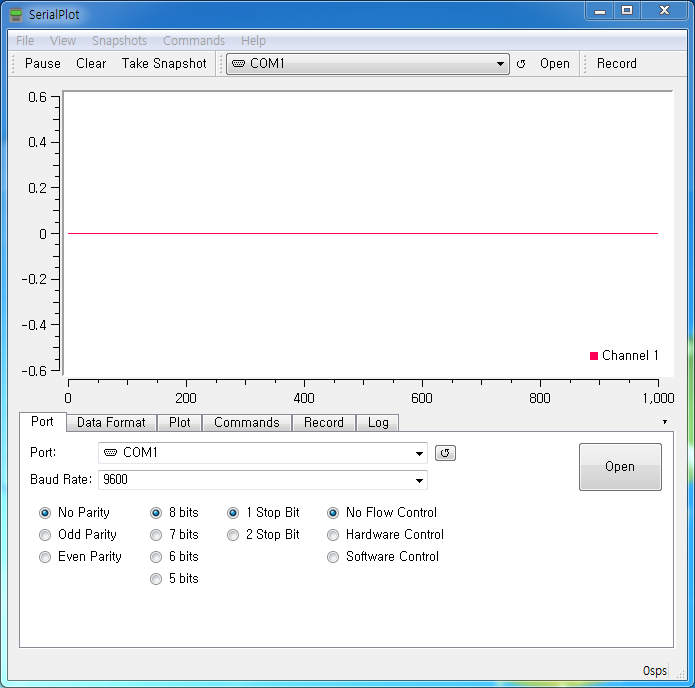

### TeraTerm Installation

* [TeraTerm](https://ttssh2.osdn.jp/) 공식 홈페이지에 접속하여 다운로드 및 설치 진행

* *Select Components* 에서 *Standard installation* 선택 후 설치 진행

 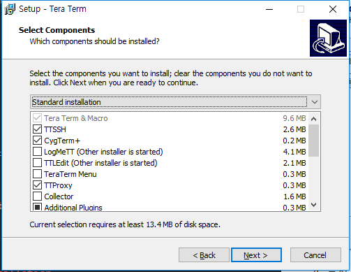

* 설치 완료 후 **ttermpro.exe** *(C:\Program Files (x86)\teraterm)* 실행 확인
    * **ttermpro.exe** 실행 화면

 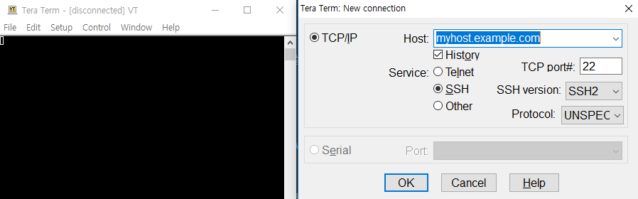    

---
## InfineonRacer Project Build

### Project download and import

* [InfineonRacer](https://github.com/realsosy/InfineonRacer) 홈페이지 에서 **Clone or download** >> **Download ZIP** 클릭 후 *InfineonRacer-master.zip* downloasd 후 압축 해제

 

* 압축 해제한 폴더 확인

 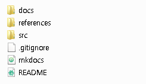

* *BIFACES* 실행 (**StartBifaces.bat** *(C:\Tools\BifacesTools)* 실행)  

* Workspace 설정
    * 소스코드를 포함한 프로젝트를 관리 할 폴더 설정
    * 새로 만든 Workspace에 *src* 폴더 *(~\InfineonRacer-master\src)* 를 복사 또는 이동 하거나
    * *src* 폴더를 Workspace로 지정

 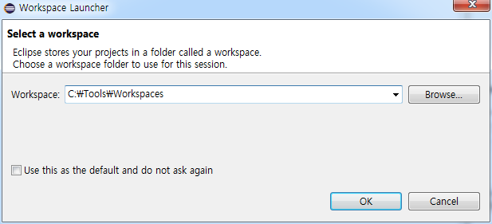

* 다운로드 받은  *InfineonRacer* 프로젝트 Import
    * **File** >> **Import** 클릭

 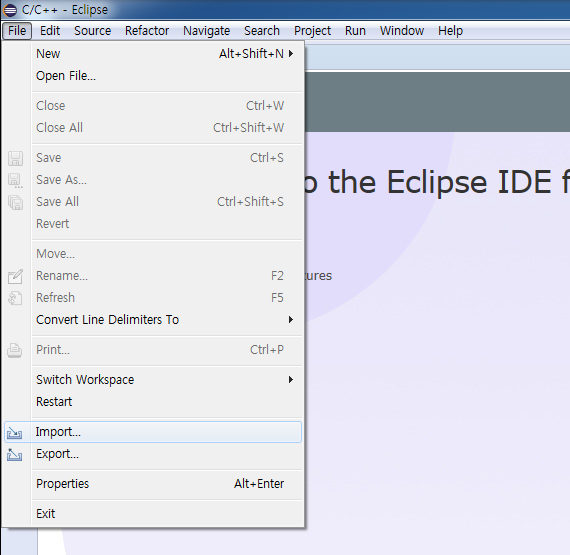

* **General** >> **Existing Projects into Workspace** 선택 후 **Next >** 클릭

 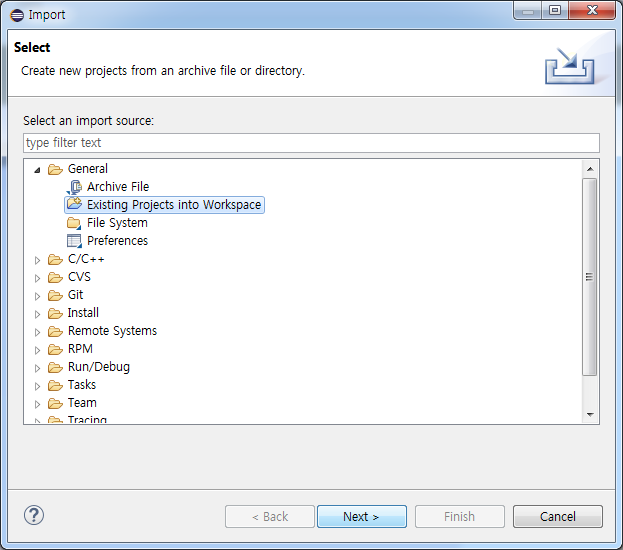

* **Select root directory** 에서 **Browse...** 클릭, Workspace의  *src* 폴더 선택 후 **확인** 클릭

 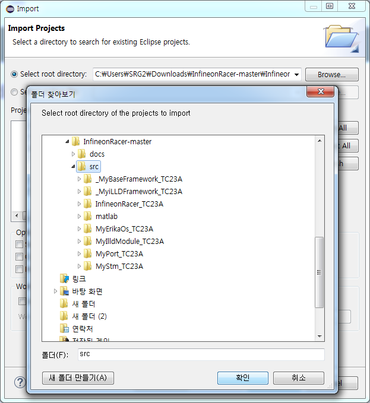

* *Projects* 탭에서 **InfineonRacer_TC23A** 체크박스 선택 후 **Finish** 클릭
    * 다른 프로젝트는 *InfineonRacer* 에서 다루는 각각의 [모듈기능](https://github.com/realsosy/InfineonRacer#dive-into-aurix-world-using-infineonracer) 으로 나누어져 있음

 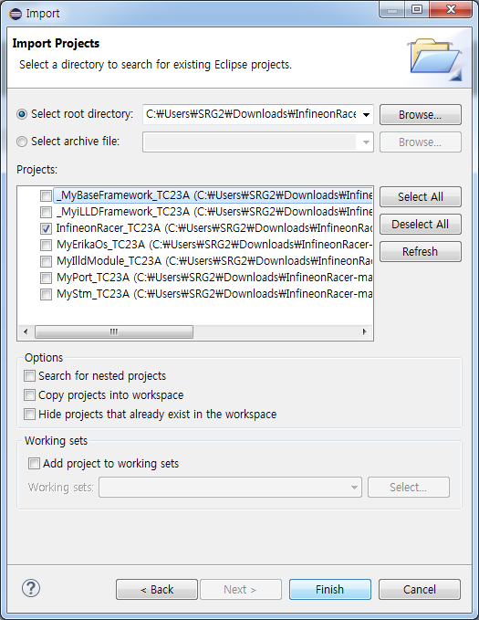  

* *Project Explorer* 를 통해 Import 된 프로젝트를 확인할 수 있음 (Welcom 창은 닫으면 됨)

 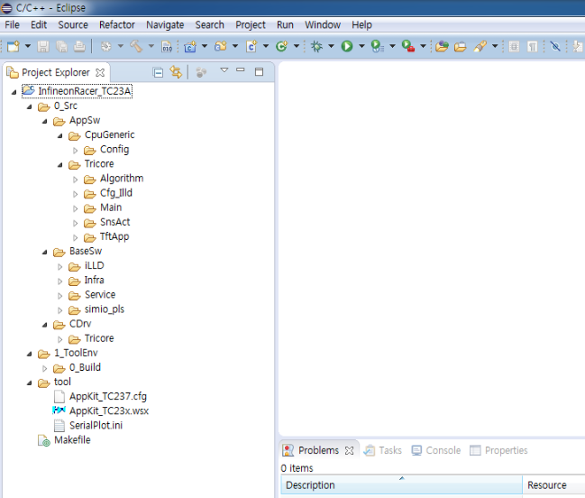

### Build

* Build 전 Complier 설정
    * *Project explorer*  창에서 **InfineonRacer_TC23A** >> **1_ToolEnv** >> **0_Build** >> **1_Config** >> **Config_Tricore_Gnuc** 안에 있는 **Config_Gnuc.mk** 파일을 더블클릭 하면 편집 가능한 Edit창이 나옴
    * Tricore toolchain의 경로 및 버전이 맞게 설정되어 있는지 확인
    ```
    B_GNUC_TRICORE_PATH:= C:\HIGHTEC\toolchains\tricore\v4.9.1.0-infineon-1.1
    ```

* *Project explorer* 를 통한 build
    * *Project Explorer* 창에서 Build 할 프로젝트를 우클릭 한 뒤 **Build Project** 클릭

 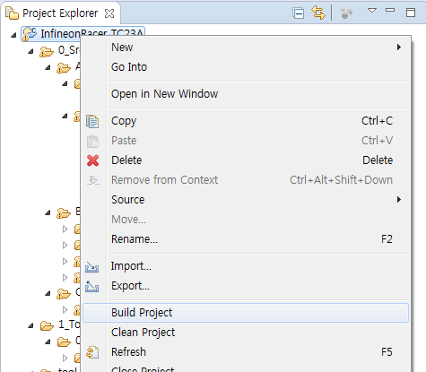

* Build 후 결과
    * *0_Build* 폴더에 **9_Make** 폴더 생성
    * **2_Out** 폴더 생성
    * *2_Out/Tricore_Gnuc/Gnuc_Files* 에 **.elf** 파일과 **.hex** 파일 그리고 **.map** 파일 생성

 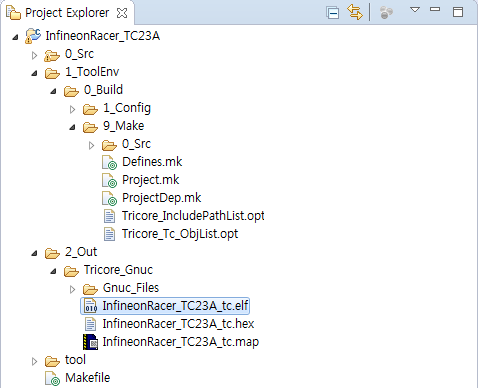

* Build error 발생시 **추가사항** 의 **Build - Error181** 참고

### UDEVisualPlatfrom 을 이용해 실행 파일 버닝, TeraTerm 을 동작 확인

* Build를 통해 생성한 elf 파일을 *AppKit* 에 다운로드 하고 TeraTerm을 이용해 Shell 환경 실행

* UDEVisualPlatfrom 을 실행하여 **File** >> **Open Workspace...** 클릭

 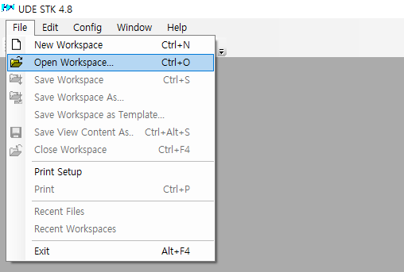

* *BIFACES Workspase/InfineonRacer_TC23A/tool/AppKit_TC23x.wsx* 파일 열기

 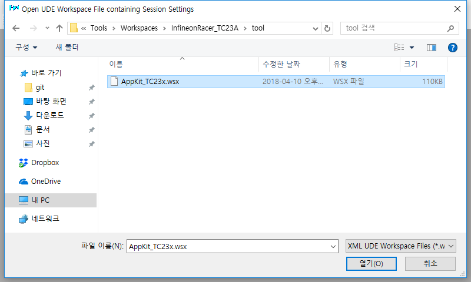

* 다음과 같은 창이 뜨면 **확인** 클릭 후 **New** 클릭

 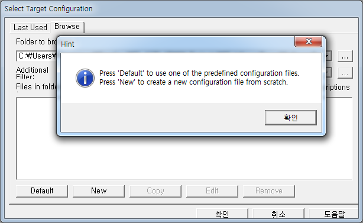

* *Use a default target configuration* 체크 후 하단의 폴더트리에서 **TriCore** >> **Infineon** >> **TC237 Application Kit** >> **Application Kit with TC237** 선택 후 **마침** 클릭

 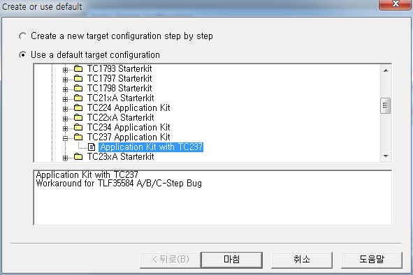

* _*.cfg_ 파일 저장 후 **확인** 클릭

* 상단의 **File** >> **Load Program** 클릭 후 빌드한 Elf 파일 선택 (*2_Out/Tricore_Gnuc/Gnuc_Files/InfineonRacer_TC23A_tc.elf* )

 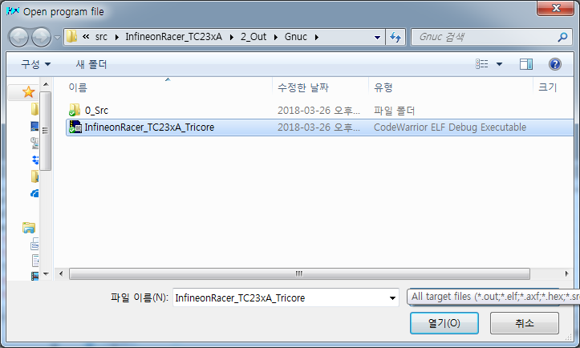

* Elf 파일 경로 확인 후 **OK** 클릭
(경로가 빌드 후 생성된 *2_Out/Tricore_Gnuc/Gnuc_Files/InfineonRacer_TC23A_tc.elf* 파일로 설정되어 있는지 확인)

 

* *AppKit* 를 USB로 Host PC와 연결한 후 **File** >> **Connect Target System..** 클릭
(Host PC와 첫 연결 시 드라이버 다운로드가 진행됨)

 

* *UDE - FLASH/OTP Memory Programming Tool* 창에서 *Program all* 버튼 클릭

 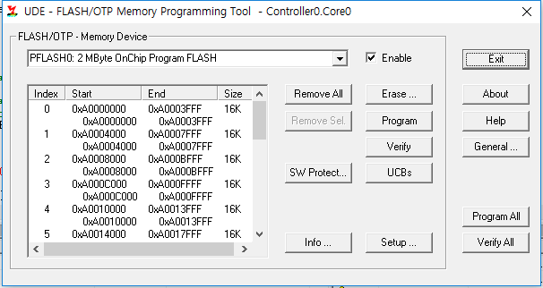

* *Execute Memtool Command* 창에서 *Results: success* 와 같이 뜨면 *AppKit* 에 프로그래밍이 완료됨, **Exit** 를 클릭하여 *UDE - FLASH/OTP Memory Programming Tool* 창과 *Execute Memtool Command* 창을 닫음

 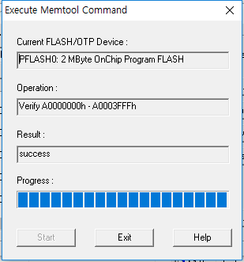

* **Debug** >> **Start Program Execution** 을 클릭하면 *AppKit* 에 다운로드 된 프로그램이 실행됨

 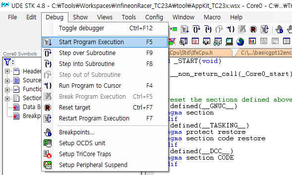

* 프로그램을 실행했을 때 *AppKit* 의 TFT 화면
    - TFT 화면의 *Beep OFF* 터치를 하면 *Beep ON* 으로 바뀌며 Beeper 가 동작하는지 확인
  
 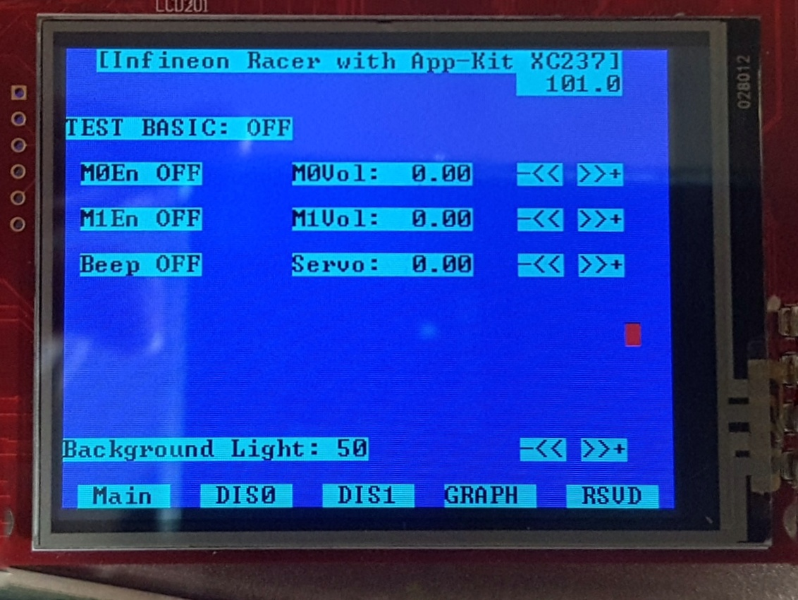

* **File** >> **Disconnect Target System..** 클릭하여 Host PC와 *AppKit* 와의 연결을 해제

 

* *AppKit* COM port 활성화(첫 연결시 필요)
    * 장치관리자 실행
    * **범용 직렬 버스 컨트롤러** >> **Infineon DAS JDS COM** 우클릭 한 뒤 **속성(R)** 클릭

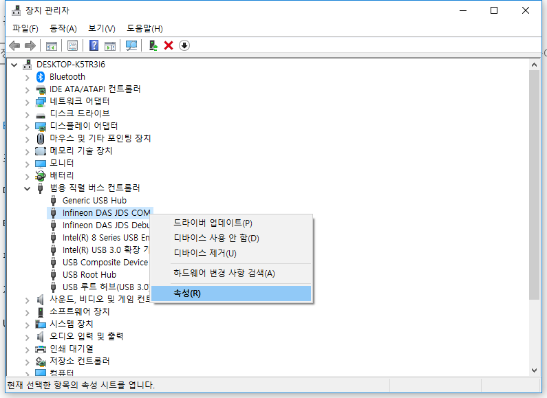

    * *고급* 탭에서 **VCP 드라이버 설치** 체크 후 **확인** 클릭

 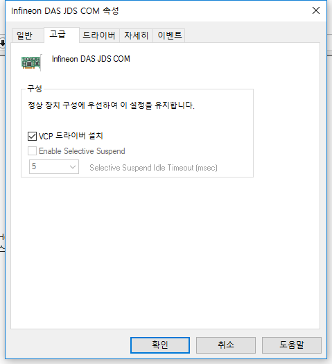

    * *AppKit* 와 Host PC의 USB 연결을 분리했다가 재연결 한 뒤 *장치관리자* 에서 등록되는 COM port의 번호 확인 (재연결시 드라이버가 자동으로 설치됨)

 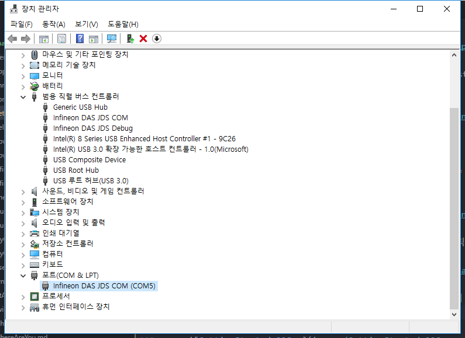

* *TeraTerm* 실행 후 *Serial* 체크, *Port:* 에 *Infineon DAS COM (COMn)* 선택 후 **OK** 클릭

 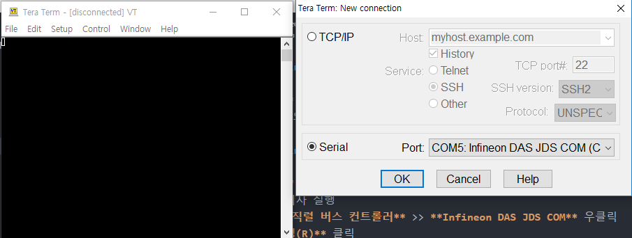

* **Setup** >> **Serial port...** 클릭

 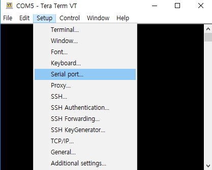

* *Buad rate* 을 *115200* 으로 설정하고 *OK* 클릭

 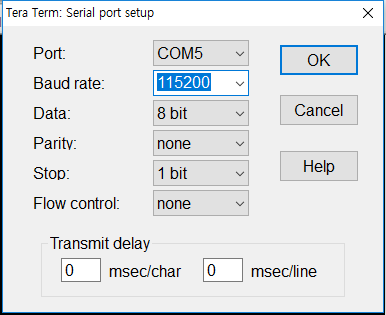

* *TeraTerm VT* 창에서 enter 를 입력하면 *Shell>* 이 화면에 나타남! 여기에 *info* 를 입력하고 enter를 입력하면 아래의 사진과 같이 **Welcome to Infineon Racer Shell** 확인 가능

 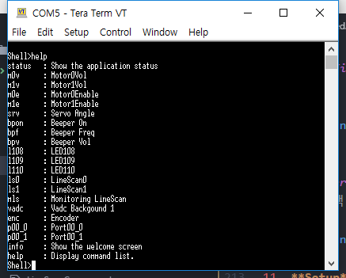


## TFT, Shell 을 이용한 동작 확인

* LED, Beeper 등의 Peripheral 장치의 동작 확인

* DC motor, Servo, Encoder, Line scan camera, Digital input port 의 경우 *MotorKit* 사용을 통해 쉽게 주변장치 구성 가능
  - *MotorKit* 와 *AppKit* 의 하드웨어 연결은 [ConnectionGuide](ConnectionGuide.md)를 통해 확인 가능

### 기본적인 TFT 및 Shell 사용법

**TFT**(Thin Film Transistor) 는 Display를 구성하는 전기소자로 본 문서에서 터치가 가능한 LCD 화면을 통칭함
LCD및 터치 기능을 통해 *InfineonRacer* 에서 제공하는 Peripheral 장치들을 제어하고 상태 확인 가능

* Main 화면에서는 DC motor, Servo, Encoder, Beeper, TFT의 제어 및 상태 확인 가능

 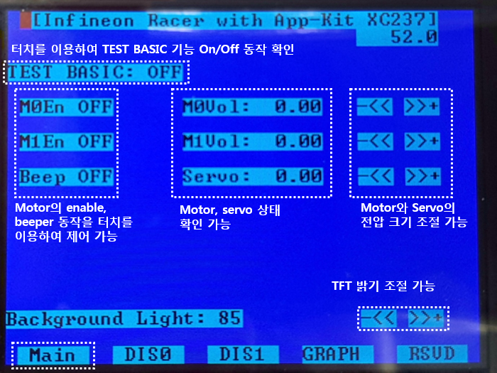


* DIS1 화면에서는 CPU load를 포함한 주변장치의 상태 확인 가능
(Main 화면에서 DIS1 화면으로 넘어가기 위해서는 하단의 *DIS1* 을 터치)

 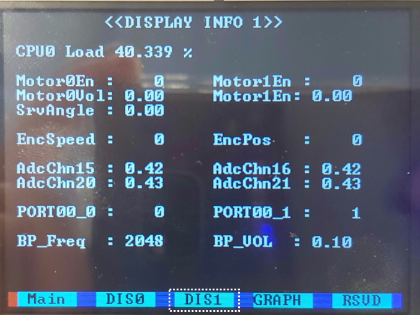

**Shell** 은 사용자가 입력한 명령어를 해석하여 *AppKit* 가 동작할 수 있도록 해주는 역할을 함(자세한 내용은 [MyOwnTerminal](MyOwnTerminal.md) 참고)
TFT와 마찬가지로 명령어를 통해 *InfineonRacer* 에서 제공하는 Peripheral 장치들을 제어하고 상태 확인 가능

* *help* 명령어를 통해 사용가능한 명령어 확인 가능

    ```
    Shell>help
    status   : Show the application status
    m0v      : Motor0Vol
    m1v      : Motor1Vol
    m0e      : Motor0Enable
    m1e      : Motor1Enable
    srv      : Servo Angle
    bpon     : Beeper On
    bpf      : Beeper Freq
    bpv      : Beeper Vol
    l108     : LED108
    l109     : LED109
    l110     : LED110
    ls0      : LineScan0
    ls1      : LineScan1
    mls      : Monitoring LineScan
    vadc     : Vadc Backgound 1
    enc      : Encoder
    p00_0    : Port00_0
    p00_1    : Port00_1
    info     : Show the welcome screen
    help     : Display command list.
    ```

* 특정 명령어셋의 사용법(syntax)을 확인하기 위해서는 *"(명령어) ?""* 를 입력 후 enter를 입력한다.

     ```
    Shell>bpon ?
      Syntax     : bpon 0/1
    Shell>bpf ?
      Syntax     : bpf float-value
    Shell>bpv ?
      Syntax     : bpv frac-value
    Shell>
    ```

* 상세한 내용은  [MyOwnTerminal](MyOwnTerminal.md) 문서와 [*AsclinShellInterface.c*](../src/InfineonRacer_TC23A/0_Src/AppSw/Tricore/SnsAct/AsclinShellInterface.c) 코드 참고


### Beeper

* TFT 의 *Beep OFF* 를 터치하여 Beeper 동작 확인 가능

* *bpon* 명령어를 통해 Beeper의 On/Off 제어 가능
    ```
    Shell>bpon ?
      Syntax     : bpon 0/1
    Shell>bpon
      Beeper On:    0 # Beeper 가 울리지 않음
    Shell>bpon 1
      Beeper On:    1 # Beeper 가 울림
    Shell>bpon 0
      Beeper On:    0 # Beeper 가 울리지 않음
    ```

    **< Beeper On 일 때 TFT >**

 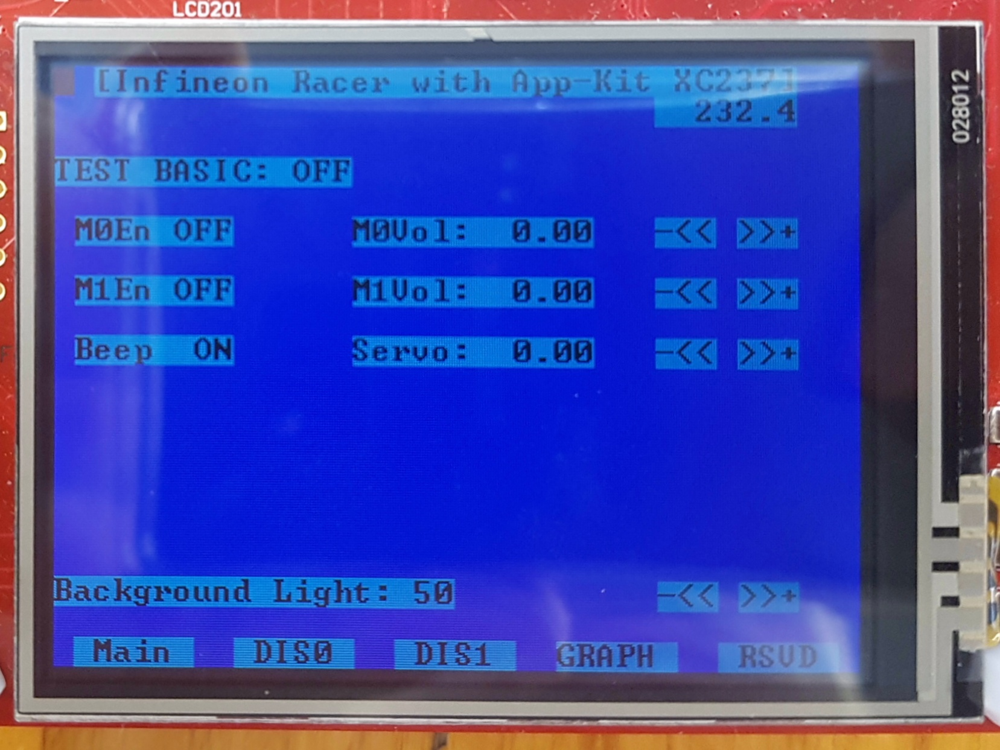

* *bpf* 명령어를 통해 beeper 소리의 높이(frequency)를 조절할 수 있다.
    * froat_value: 100.0 ~ 10000.0

    ```
    Shell>bpf ?
      Syntax     : bpf float-value
    Shell>bpon 1
      Beeper On:    1         # Beeper 가 울림
    Shell>bpf 100
      Beeper Freq:   100.0    # Beeper음의 frequency가 점 증가
    Shell>bpf 500             #
      Beeper Freq:   500.0    #
    Shell>bpf 10000           #
      Beeper Freq: 10000.0    #
    Shell>bpon 0
      Beeper On:    0         # Beeper 가 울리지 않음
    ```

* *bpv* 명령어를 통해 beeper 소리의 크기(voltage)를 조절할 수 있다.
    * frac_value: 0.00 ~ 0.99

    ```
    Shell>bpv ?
      Syntax     : bpv frac-value
    Shell>bpon 1
      Beeper On:    1         # Beeper 가 울림
    Shell>bpv 0
      Beeper Volume: 0.00     # Beeper의 소리가 점점 커짐
    Shell>bpv 0.5             #
      Beeper Volume: 0.50     #
    Shell>bpv 1               #
      Beeper Volume: 0.99     #
    Shell>bpon 0
      Beeper On:    0         # Beeper 가 울리지 않음
    ```

* TFT의 DIS1 화면을 통해 Beeper의 소리의 높이(frequency)와 크기(voltage) 확인 가능

    ```
    Shell>bpon 1
      Beeper On:    1
    Shell>bpf 1000
      Beeper Freq:  1000.0
    Shell>bpv 0.2
      Beeper Volume: 0.20
    Shell>bpon 0
      Beeper On:    0
    ```


 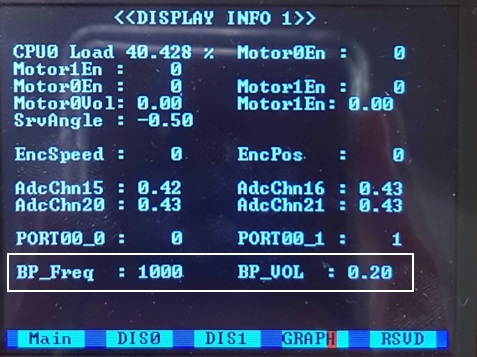

### LED

* *l108*, *l109*, *l110*  명령어를 통해 TFT 우측에 붙어있는 LED D108, D109, D110을 동작시킬 수 있다.

    ```
    Shell>l108 ?
      Syntax     : l108 0/1
    Shell>l108 0
      Led108:    0    # D108 On
    Shell>l109 1
      Led109:    1    # D108 Off
    Shell>l110 0
      Led110:    0    # D108 On
    ```

    **< D108 On, D109 Off, D110 On >**


 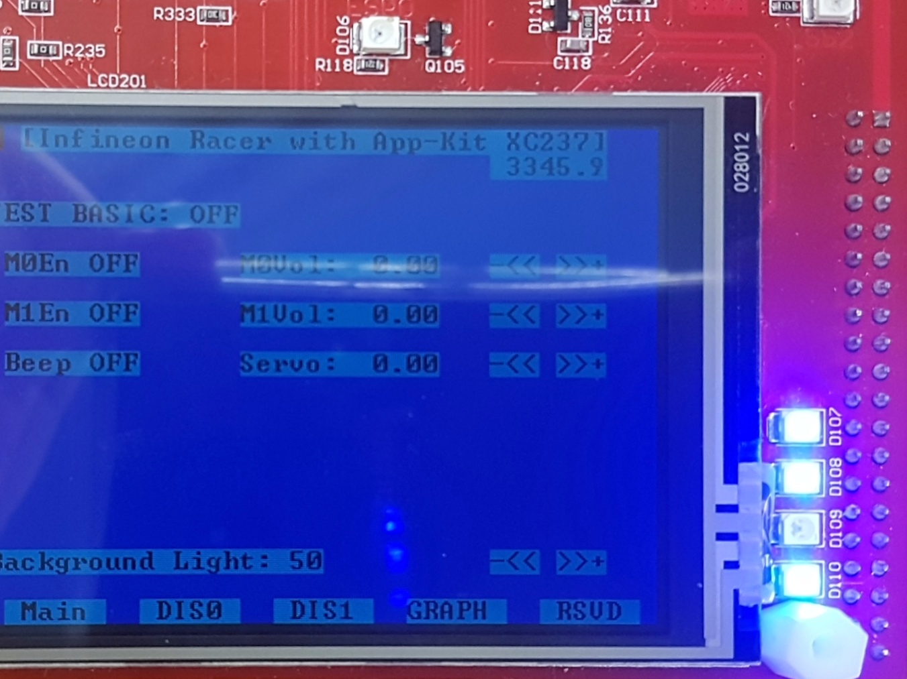


### DC motor

* *m0v*, *m0e* 명령어를 이용해 모터 제어와 상태 확인 가능
    * frac_value: -1.0 ~ 1.0

* *m1v* , *m1e* 명령어와 연결되어 있는 motor사용을 위해서는 [MotorKit 하드웨어 변경](https://github.com/realsosy/InfineonRacer/blob/master/docs/ConnectionGuide.md#hardware-modification-of-motor-driver-kit) 필요

    ```
    Shell>m0v ?
      Syntax     : m0v frac-value
    Shell>m0e ?
      Syntax     : m0e 0/1
    Shell>m0e 1                     # DC motor 동작 가능하도록 설정
      Motor0En:    1
    Shell>m1e 1                     
      Motor1En:    1
    Shell>m0v -0.2                   # Motor에 인가되는 전압을 제어
      Motor0Vol: -0.20 fraction      
    ```

* TFT에서 **M1En ON** 을 누르면 **M1En OFF** 로 변경

* *-<<* 와 *>>+* 를 이용해서 0.05 단위로 DC Motor 제어가 가능

 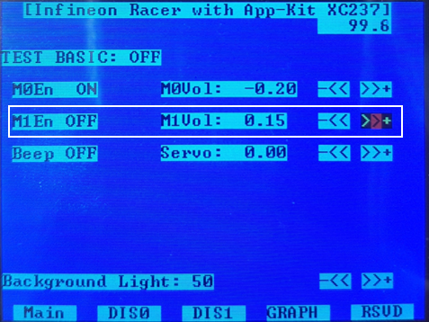

### Servo

* *srv* 명령어를 입력해 동작 확인이 가능
    * frac_value: -1.0 ~ 1.0

    ```
    Shell>srv ?
      Syntax     : srv frac-value
    Shell>srv 0.5
      SrvAngle: 0.50 fraction
    Shell>srv -0.5
      SrvAngle: -0.50 fraction
    ```

* TFT에서 *-<<* 와 *>>+* 를 이용해서 0.05 단위로 Servo 제어가 가능

 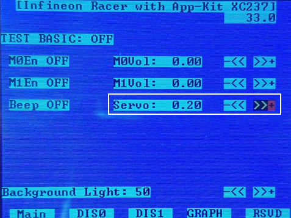


### Line scan camera

* Line scan camera는 2개의 채널을 제공하며 각각 *ls0* , *ls1* 명령어를 통해서 값 확인이 가능

    ```
    Shell>ls0 ?
      Syntax     : ls0
    Shell>ls0
      LineScan0 results
     1752, 1752, 1734, 1738, 1742, 1745, 1748, 1748, 1748, 1750, 1750, 1749, 1749, 1749, 1748, 1747, 1747, 1746, 1730, 1737, 1742, 1744, 1747, 1748, 1750, 1749, 1751, 1750, 1751, 1752, 1752, 1752, 1751, 1734, 1738, 1743, 1745, 1747, 1748, 1750, 1749, 1750, 1751, 1751, 1751, 1752, 1752, 1733, 1738, 1740, 1742, 1742, 1743, 1744, 1744, 1746, 1747, 1749, 1751, 1751, 1752, 1752, 1733, 1719, 1730, 1736, 1741, 1744, 1747, 1748, 1748, 1748, 1748, 1747, 1747, 1746, 1746, 1746, 1746, 1746, 1746, 1747, 1745, 1746, 1746, 1746, 1748, 1749, 1751, 1751, 1752, 1751, 1750, 1733, 1720, 1710, 1704, 1700, 1697, 1695, 1694, 1693, 1692, 1691, 1692, 1691, 1692, 1690, 1689, 1690, 1690, 1690, 1690, 1690, 1690, 1712, 1721, 1730, 1738, 1743, 1746, 1748, 1750, 1748, 1748, 1747, 1746, 1746
    Shell>ls1
      LineScan1 results
     1753, 1754, 1753, 1735, 1739, 1741, 1743, 1744, 1746, 1746, 1746, 1747, 1747, 1747, 1748, 1748, 1748, 1748, 1749, 1748, 1750, 1752, 1752, 1753, 1753, 1753, 1752, 1752, 1753, 1754, 1753, 1754, 1754, 1752, 1751, 1752, 1753, 1753, 1753, 1754, 1754, 1753, 1751, 1753, 1754, 1754, 1756, 1755, 1754, 1735, 1741, 1745, 1747, 1750, 1750, 1751, 1752, 1750, 1748, 1753, 1754, 1755, 1754, 1753, 1752, 1752, 1752, 1753, 1753, 1754, 1754, 1755, 1752, 1753, 1754, 1754, 1755, 1755, 1753, 1751, 1751, 1750, 1750, 1749, 1749, 1749, 1749, 1751, 1756, 1752, 1753, 1755, 1753, 1752, 1735, 1739, 1743, 1746, 1749, 1752, 1751, 1752, 1751, 1748, 1749, 1749, 1748, 1748, 1748, 1748, 1748, 1748, 1747, 1748, 1748, 1748, 1750, 1752, 1752, 1753, 1753, 1753, 1754, 1735, 1722, 1732, 1737, 1743
    ```

* SerialPlot 프로그램을 이용해 실시간 값 확인 가능
    * *mls* 명령어를 통해 주기적으로 line scan camera의 값을 받아올 수 있음

    ```
    Shell>mls ?
      Syntax     : mls period_ms
    Shell>mls 100 # 100msec 주기로 line scan camera 값을 불러옴
      mls: 100
    Shell> 1749, 1752
     1749, 1753
     1750, 1753
     1732, 1752
     1745, 1743
     1748, 1747
     1749, 1749
     1751, 1750
     1750, 1751
     1750, 1752
     1750, 1753
     1750, 1753
     (...)

    ```

* *SerialPlot* 을 실행하고 아래 이미지와 같이 포트 설정 후 **Open** 클릭

 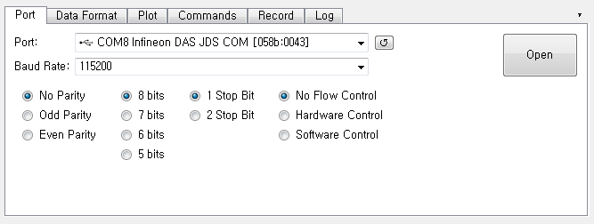
 
* 아래와 같이 Command 를 입력하고 Send를 입력하면 실시간으로 Line scan camera의 raw 데이터 확인 가능(LineScan0 만 사용)

 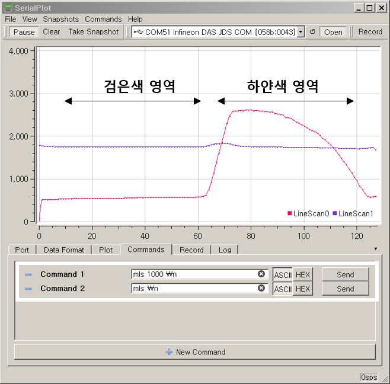


### Encoder

* *enc* 명령어를 통해 동작 확인이 가능

    ```
    Shell>enc ?
      Syntax     : enc
    Shell>enc
      Encoder speed: 1610612736, position: -1060059186, direction: 0
    Shell>enc
      Encoder speed: 1073741824, position: -1059935370, direction: 0
    Shell>enc
      Encoder speed: 1073741824, position: -1060233742, direction: 0
    Shell>enc
      Encoder speed:     0, position: -1060724977, direction: 0
    ```

* TFT 화면을 이용해 확인 가능

 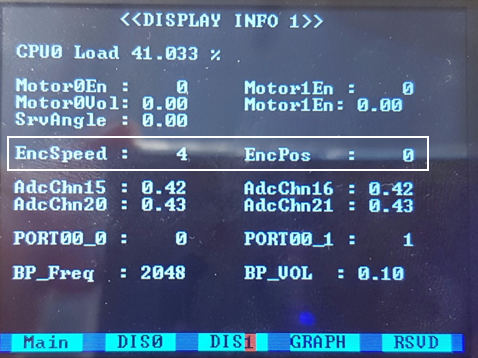

### Digital I/O

* P00_0 과 P00_1 에 연결되어있는 Digital 신호를 읽어옴

    ```
    Shell>p00_0 ?
      Syntax     : p00_0
    Shell>p00_0
      Port00_0:    0
    Shell>p00_1 ?
      Syntax     : p00_1
    Shell>p00_1
      Port00_1:    1
    ```

* TFT 화면을 이용해 확인 가능

 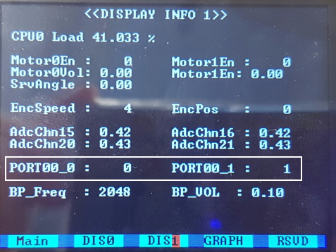


## 추가적인 설명

### Build  error - php.exe 실행 문제

* 빌드시 컴파일을 위한 Make 파일 생성이 안될 경우 빌드 에러 발생
* **BIFACES** 가 설치된 경로에서 *C:\Tools\BifacesTools\Php* 로 이동하여 *php.exe* 실행
* 정상적으로 실행 되었을 때
  
  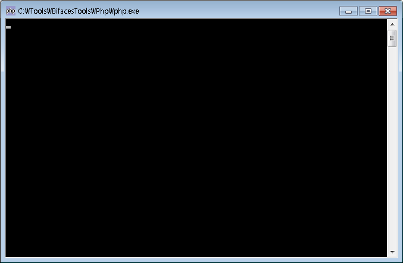

* *php.exe* 파일이 실행은 되지만 아래 사진과 같이 에러가 발생
 
  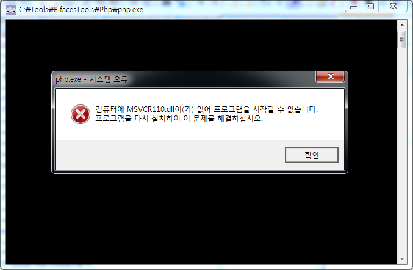

    * [msvcr110.dll 파일을 다운로드](https://drive.google.com/open?id=1PNwUwMD-6SpE53mg-y7Iv8WzPXUfSWsH)
    * 다운 받은 파일을 *C:\Windows\SysWOW64* 폴더(운영체제 Windows 64bit 기준)에 저장
    * 다시 php.exe 파일을 실행하여 실행이 되는지 확인 (정상적으로 실행이 되면 검은 도스창이 뜬다) 후 다시 빌드 실행

* *php.exe* 파일이 실행되지 않을 경우
  
  

    * 설치된 백신 프로그램(ex. 알약)을 종료시키고 **BIFACES** 를 다시 설치
    * 다시 *php.exe* 파일을 실행하여 실행이 되는지 확인 후 다시 빌드 실행
