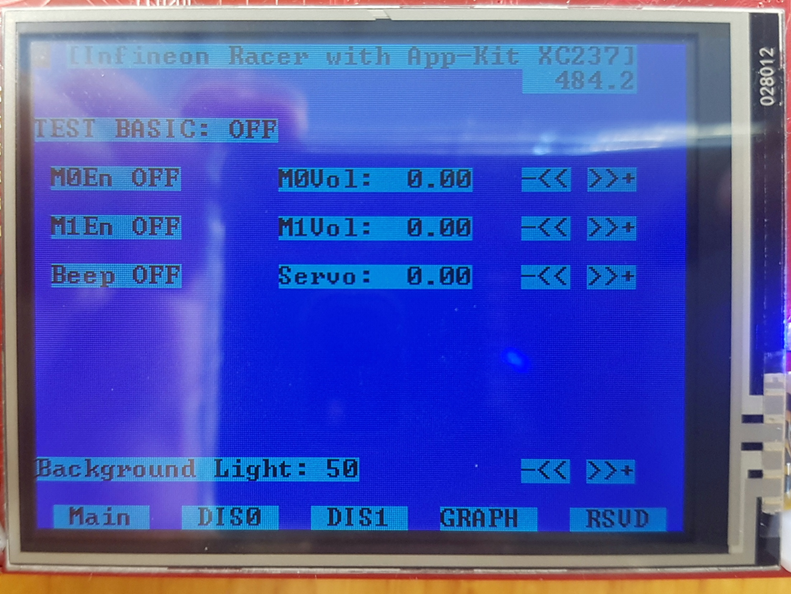
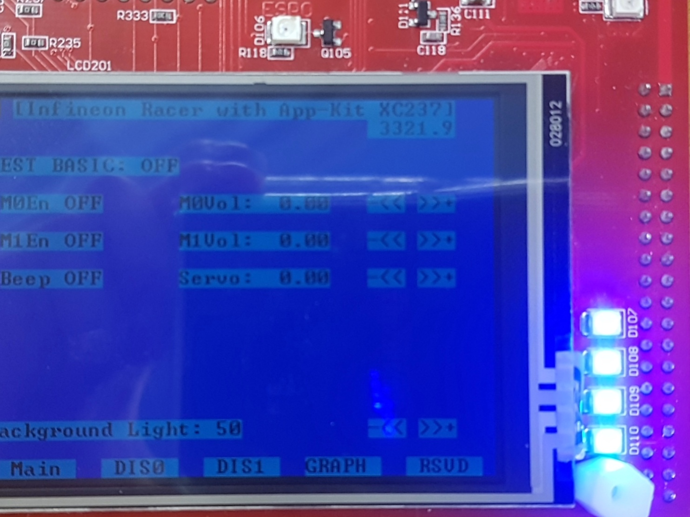
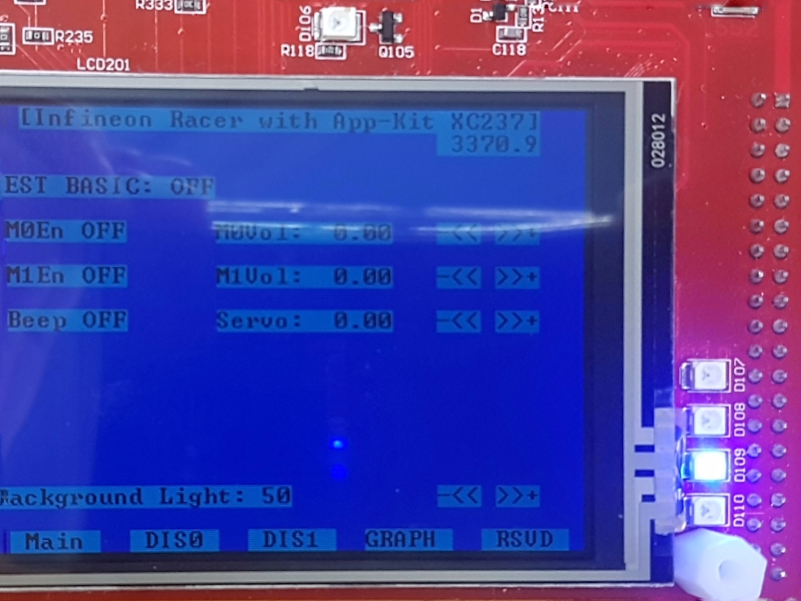

# Getting Started

## Objectives
* 개발환경을 설치하고
* InfineonRacer 코드를 다운 받아 빌드하고
* 각종 IO를 연결하여 동작 여부를 확인한다.

## References
* 개발환경 관련


## Example Description
1. 개발환경 구축
* 개발환경 구축을 위해 Tricore tool chain(compiler)와 UDE(Universal Debugger Engine)가 포함되어 있는 *HighTec*  설치
* 인피니언에서 제공하는 *BIFACES* build environment 설치
* Serial 통신 및 Shell 환경 구축을 위한 TeraTerm 설치
2. *BIFACES* 를 통하여 소스코드 빌드
3. 예제 동작 확인
    * *Application Kit TC2X7 V1.0* 보드(이하 *AppKit*)를 이용한 LED, Beeper, TFT 예제 동작
    * *DC Motor Control Kit* 보드(이하 *MotorKit*)를 이용한 Motor, Encoder, LineScanCamera 예제 동작

---
## 1. 개발환경 설치
### 1.1 HighTec Installation
* Dependency: [Java SE Development Kit](http://www.oracle.com/technetwork/java/javase/downloads/jdk8-downloads-2133151.html) **(32bit)**

1. [Tricore tool chain 홈페이지](http://free-entry-toolchain.hightec-rt.com/index.php)에서 개인 정보 입력 후 Generate License File & Download 버튼 클릭
    * 이때 입력한 개인정보는 HighTec 다운로드 완료 후 License 인증 시 필요

    

2. *free_tricore_entry_tool_chain.zip* 다운로드 후 압축 해제
3. 압축 해제된 파일 중 *setup.exe* 를 실행 후 설치 진행
    

   (HighTec 설치 진행 중 **UDEVisualPlatfrom** 과 **CDM Driver Package HighTec** 가 설치됨)
4. 설치 완료 후 **Eclipse.exe** *(C:\HIGHTEC\ide\eclipse-v1.6.1)* , **UDEVisualPlatfrom.exe** *(C:\Program Files (x86)\pls\UDE Starterkit 4.8)* 실행 확인

### 1.2 BIFACES Installation
* BIFACES [Download](추후입력)
1. 위 링크를 통해 다운 받은 압축파일 *(BIFACES_V1_0_0_Win32.zip)* 압축 해제


2. BIFACES_V1_0_0.exe 실행


3. *Select Components* 에서 *Full installation for Win32* 선택 후 설치 진행

    


4. 설치 완료 후 **StartBifaces.bat** *(C:\Tools\BifacesTools)* 실행 확인


#### 1.3 TeraTerm Installation
1. [TeraTerm](https://ttssh2.osdn.jp/) 공식 홈페이지에 접속하여 다운로드 및 설치 진행
2. *Select Components* 에서 *Standard installation* 선택 후 설치 진행

    

3. 설치 완료 후 **ttermpro.exe** *(C:\Program Files (x86)\teraterm)* 실행 확인

        

---
## 2. InfineonRacer Project Build
### 2.1 Project download and import
1. [InfineonRacer](https://github.com/realsosy/InfineonRacer) 홈페이지 에서 **Clone or download** >> **Download ZIP** 클릭 후 *InfineonRacer-master.zip* downloasd 후 압축 해제

   


2. *BIFACES* 실행 (**StartBifaces.bat** *(C:\Tools\BifacesTools)* 실행)  


3. Workspace 설정
    * 소스코드를 포함한 프로젝트를 관리 할 폴더 설정

    


4. 다운로드 받은  *InfineonRacer* 프로젝트 Import
    * **File** >> **Import** 클릭

    


5. **General** >> **Existing Projects into Workspace** 선택 후 **Next >** 클릭

    


6. **Select root directory** 에서 **Browse...** 클릭, *1.* 에서 압축 해제한 폴더의 *src* 파일 *(~\InfineonRacer-master\src)* 선택 후 **확인** 클릭

    


7. *Projects* 탭에서 **InfineonRacer_TC23A** 체크박스 선택, *Options* 탭에서 **Copy projects into workspace** 체크박스 선택 후 **Finish** 클릭
    * 다른 프로젝트는 *InfineonRacer* 에서 다루는 각각의 [모듈기능](https://github.com/realsosy/InfineonRacer#dive-into-aurix-world-using-infineonracer) 으로 나누어져 있음

      

    * *Project Explorer* 를 통해 Import 된 프로젝트를 확인할 수 있음
    (Welcom 창은 닫으면 됨)

    


### 2.2 Build
0. Build 전 Complier 설정
    *Project explorer*  창에서 **InfineonRacer_TC23A** >> **1_ToolEnv** >> **0_Build** >> **1_Config** >> **Config_Tricore_Gnuc** 안에 있는 **Config_Gnuc.mk** 파일을 더블클릭 하면 편집 가능한 Edit창이 나옴

1. *Project explorer* 를 통한 build
    1.1 *Project Explorer* 창에서 Build 할 프로젝트를 우클릭 한 뒤 **Build Project** 클릭

    

    1.2 Build 후 결과
         - *0_Build* 폴더에 **9_Make** 폴더 생성
         - **2_Out** 폴더 생성
         - *2_Out/Tricore_Gnuc/Gnuc_Files* 에 **.elf** 파일과 **.hex** 파일 그리고 **.map** 파일 생성

    


2. *Make Target* 기능을 통한 build
    2.1 우측 *Make Target* 탭에서 *InfineonRacer_TC23A* 우클릭 한 뒤 **New...** 클릭

    

    2.2 *Target name* 에 *all* 을 입력하고 **OK** 를 클릭하면 프로젝트 하위에 *all* 파일 생성 확인

    
    (추가로 지원되는 build option은 *InfineonRacer_TC23A/tool/Makefile* 에서 확인 가능)

    2.3 *all* 더블클릭 하여 build 수행 후 *1.2* 와 같이 파일들이 생성되었는지 확인

    


---
## 3. 프로그램 다운로드 및 예제 파일 실행
### 3.1 UDEVisualPlatfrom 을 이용해 실행 파일 Flashing, TeraTerm 을 동작 확인
* Build를 통해 생성한 elf 파일을 *AppKit* 에 다운로드 하고 TeraTerm을 이용해 Shell 환경 실행

1. UDEVisualPlatfrom 을 실행하여 **File** >> **Open Workspace...** 클릭

    


2. *BIFACES Workspase/InfineonRacer_TC23A/tool/AppKit_TC23x.wsx* 파일 열기

    


3. Elf 파일 경로 확인 후 **OK** 클릭
(경로가 빌드 후 생성된 *2_Out/Tricore_Gnuc/Gnuc_Files/InfineonRacer_TC23A_tc.elf* 파일로 설정되어 있는지 확인)

    


4. *AppKit* 를 USB로 Host PC와 연결한 후 **File** >> **Connect Target System..** 클릭
(Host PC와 첫 연결 시 드라이버 다운로드가 진행됨)

    


5. *UDE - FLASH/OTP Memory Programming Tool* 창에서 *Program all* 버튼 클릭

    


6. *Execute Memtool Command* 창에서 *Results: success* 와 같이 뜨면 *AppKit* 에 프로그래밍이 완료됨, **Exit** 를 클릭하여 *UDE - FLASH/OTP Memory Programming Tool* 창과 *Execute Memtool Command* 창을 닫음

    


7. **Debug** >> **Start Program Execution** 을 클릭하면 *AppKit* 에 다운로드 된 프로그램이 실행됨

    

    프로그램을 실행했을 때 *AppKit* 의 TFT 화면

    


8. **File** >> **Disconnect Target System..** 클릭하여 Host PC와 *AppKit* 와의 연결을 해제

    


9. *AppKit* COM port 활성화(첫 연결시 필요)
* 9.1 장치관리자 실행
* 9.2 **범용 직렬 버스 컨트롤러** >> **Infineon DAS JDS COM** 우클릭 한 뒤 **속성(R)** 클릭

    

* 9.3 *고급* 탭에서 **VCP 드라이버 설치** 체크 후 **확인** 클릭

    

* 9.4 *AppKit* 와 Host PC의 USB 연결을 분리했다가 재연결 한 뒤 *장치관리자* 에서 등록되는 COM port의 번호 확인 (재연결시 드라이버가 자동으로 설치됨)

    


10. *TeraTerm* 실행 후 *Serial* 체크, *Port:* 에 *Infineon DAS COM (COMn)* 선택 후 **OK** 클릭

    


11. **Setup** >> **Serial port...** 클릭

    


12. *Buad rate* 을 *115200* 으로 설정하고 *OK* 클릭

    


13. *TeraTerm VT* 창에서 enter 를 입력하면 *shell>* 이 화면에 나타남! 여기에 *Help* 를 입력하고 enter를 입력하면 아래의 사진과 같이 사용할 수 있는 명령어 셋과 설명이 나타남

    


### 3.2 Shell 환경 활용 동작 확인
* Shell은 사용자가 입력한 명령어를 해석하여 *AppKit* 가 동작할 수 있도록 해주는 역할을 함
    (자세한 내용은 [MyOwnTerminal](MyOwnTerminal.md) 참고)
* 본 예제에서는 직렬 통신으로 구현된 Shell 환경을 이용해 *AppKit* 의 Peripheral 장치 동작을 확인함
    * Peripheral 장치: TFT, LCD, Beeper

**0. Shell 사용 방법**
* *info* 명령어를 통해 Shell 정보 확인 가능, **3.1** 의 *13.* 과정을 통해 전체 명령어 셋 확인 가능

        ```
        Shell>info


        ******************************************************************************
        *******  Welcome to Infineon Racer Shell                               *******
        ******************************************************************************
        *******  Software Version Date : 2018/ 1/30                            *******
        *******  Software Version      :  1.00                                 *******
        *******  iLLD version          : 1.0.1.4.0                            *******
        *******  GNUC Compiler         : 4.9r4                                 *******
        *******  Author                : Wootaik Lee (CI-ARCLab)               *******
        ******************************************************************************
        Real-time: 00:00:30
        CPU Frequency: 200000000 Hz
        SYS Frequency: 100000000 Hz
        STM Frequency: 100000000 Hz
        Shell>help
        status   : Show the application status
        m0v      : Motor0Vol
        m1v      : Motor1Vol
        m0e      : Motor0Enable
        m1e      : Motor1Enable
        srv      : Servo Angle
        bpon     : Beeper On
        bpf      : Beeper Freq
        bpv      : Beeper Vol
        l108     : LED108
        l109     : LED109
        l110     : LED110
        ls0      : LineScan0
        ls1      : LineScan1
        mls      : Monitoring LineScan
        vadc     : Vadc Backgound 1
        enc      : Encoder
        p00_0    : Port00_0
        p00_1    : Port00_1
        info     : Show the welcome screen
        help     : Display command list.
        ```

* 특정 명령어셋의 사용법(syntax)을 확인하기 위해서는 *"(명령어) ?""* 를 입력 후 enter를 입력한다.

     ```
    Shell>bpon ?
      Syntax     : bpon 0/1
    Shell>bpf ?
      Syntax     : bpf float-value
    Shell>bpv ?
      Syntax     : bpv frac-value
    Shell>
    ```
* 상세한 내용은  [MyOwnTerminal](MyOwnTerminal.md) 문서와 [*AsclinShellInterface.c*](../src/InfineonRacer_TC23A/0_Src/AppSw/Tricore/SnsAct/AsclinShellInterface.c) 코드 참고


**1. Beeper 예제**
* *bpon* 명령어를 통해 beeper를 동작시킬 수 있다.
    ```
    Shell>bpon ?
      Syntax     : bpon 0/1
    Shell>bpon
      Beeper On:    0 # Beeper 가 울리지 않음
    Shell>bpon 1
      Beeper On:    1 # Beeper 가 울림
    Shell>bpon 0
      Beeper On:    0 # Beeper 가 울리지 않음
    ```


    **< Beeper On 일 때 TFT >**

    


    **< Beeper Off 일 때 TFT >**

    


* *bpf* 명령어를 통해 beeper 소리의 높이(frequency)를 조절할 수 있다.
    *  froat_value: 100.0 ~ 10000.0

    ```
    Shell>bpf ?
      Syntax     : bpf float-value
    Shell>bpon 1
      Beeper On:    1         # Beeper 가 울림
    Shell>bpf 100
      Beeper Freq:   100.0    # Beeper음의 frequency가 점 증가
    Shell>bpf 500             #
      Beeper Freq:   500.0    #
    Shell>bpf 800             #
      Beeper Freq:   800.0    #
    Shell>bpf 1000            #
      Beeper Freq:  1000.0    #
    Shell>bpf 10000           #
      Beeper Freq: 10000.0    #
    Shell>bpon 0
      Beeper On:    0         # Beeper 가 울리지 않음
    ```


* *bpv* 명령어를 통해 beeper 소리의 크기(voltage)를 조절할 수 있다.
    *  frac_value: 0.00 ~ 0.99

    ```
    Shell>bpv ?
      Syntax     : bpv frac-value
    Shell>bpon 1
      Beeper On:    1         # Beeper 가 울림
    Shell>bpv 0
      Beeper Volume: 0.00     # Beeper의 소리가 점점 커짐
    Shell>bpv 0.2             #
      Beeper Volume: 0.20     #
    Shell>bpv 0.4             #
      Beeper Volume: 0.40     #
    Shell>bpv 0.6             #
      Beeper Volume: 0.60     #
    Shell>bpv 0.8             #
      Beeper Volume: 0.80     #
    Shell>bpv 1               #
      Beeper Volume: 0.99     #
    Shell>bpon 0
      Beeper On:    0         # Beeper 가 울리지 않음
    ```


**2. LED 예제**
* *l108*, *l109*, *l110*  명령어를 통해 TFT 우측에 붙어있는 LED D108, D109, D110을 동작시킬 수 있다.

    ```
    Shell>l108 ?
      Syntax     : l108 0/1
    Shell>l108 0
      Led108:    0    # D108 On
    Shell>l109 0
      Led109:    0    # D109 On
    Shell>l110 0
      Led110:    0    # D111 On
    ```

    **< D108 On, D109 On, D110 On >**

    


    ```
    Shell>l108 1
      Led108:    1    # D108 Off
    Shell>l109 0
      Led109:    0    # D109 On
    Shell>l110 1
      Led110:    1    # D110 Off
    ```

    **< D108 Off, D109 On, D110 Off >**

    


    ```
    Shell>l108 0
      Led108:    0    # D108 On
    Shell>l109 1
      Led109:    1    # D108 On
    Shell>l110 0
      Led110:    0    # D108 On
    ```

    **< D108 On, D109 Off, D110 On >**

    


### 3.3 MotorKit 활용 예제
* *MotorKit* 와 *AppKit* 의 하드웨어 연결은 [ConnectionGuide](ConnectionGuide.md)를 통해 확인 가능
* 본 예제에서는 *3.2* 와 마찬가지로 DC motor, Servo motor, Encoder, Line scan camera, IR sensor 를 Shell 을 통해서 확인

**1. DC Motor**
* 아래와 같이 명령어를 입력해 동작 확인이 가능
    * frac_value: -1.0 ~ 1.0
* *m1v* , *m1e* 명령어와 연결되어 있는 motor사용을 위해서는 [MotorKit 하드웨어 변경](https://github.com/realsosy/InfineonRacer/blob/master/docs/ConnectionGuide.md#hardware-modification-of-motor-driver-kit) 필요

    ```
    Shell>m0v ?
      Syntax     : m0v frac-value
    Shell>m0e ?
      Syntax     : m0e 0/1
    Shell>m0e 1
      Motor0En:    1
    Shell>m0v 0.2
      Motor0Vol: 0.20 fraction
    Shell>m0v 0.0
      Motor0Vol: 0.00 fraction
    Shell>m0v -0.2
      Motor0Vol: -0.20 fraction
    Shell>m0v 0.0
      Motor0Vol: 0.00 fraction
    Shell>m0e 0
      Motor0En:    0
    ```

**2. Servo motor**
* 아래와 같이 명령어를 입력해 동작 확인이 가능
    * frac_value: -1.0 ~ 1.0

    ```
    Shell>srv ?
      Syntax     : srv frac-value
    Shell>srv 0.5
      SrvAngle: 0.50 fraction
    Shell>srv -0.5
      SrvAngle: -0.50 fraction
    ```


**3. Line scan camera**
* Line scan camera는 2개의 채널을 제공하며 각각 *ls0* , *ls1* 명령어를 통해서 값 확인이 가능

    ```
    Shell>ls0 ?
      Syntax     : ls0
    Shell>ls0
      LineScan0 results
     1752, 1752, 1734, 1738, 1742, 1745, 1748, 1748, 1748, 1750, 1750, 1749, 1749, 1749, 1748, 1747, 1747, 1746, 1730, 1737, 1742, 1744, 1747, 1748, 1750, 1749, 1751, 1750, 1751, 1752, 1752, 1752, 1751, 1734, 1738, 1743, 1745, 1747, 1748, 1750, 1749, 1750, 1751, 1751, 1751, 1752, 1752, 1733, 1738, 1740, 1742, 1742, 1743, 1744, 1744, 1746, 1747, 1749, 1751, 1751, 1752, 1752, 1733, 1719, 1730, 1736, 1741, 1744, 1747, 1748, 1748, 1748, 1748, 1747, 1747, 1746, 1746, 1746, 1746, 1746, 1746, 1747, 1745, 1746, 1746, 1746, 1748, 1749, 1751, 1751, 1752, 1751, 1750, 1733, 1720, 1710, 1704, 1700, 1697, 1695, 1694, 1693, 1692, 1691, 1692, 1691, 1692, 1690, 1689, 1690, 1690, 1690, 1690, 1690, 1690, 1712, 1721, 1730, 1738, 1743, 1746, 1748, 1750, 1748, 1748, 1747, 1746, 1746
    Shell>ls1
      LineScan1 results
     1753, 1754, 1753, 1735, 1739, 1741, 1743, 1744, 1746, 1746, 1746, 1747, 1747, 1747, 1748, 1748, 1748, 1748, 1749, 1748, 1750, 1752, 1752, 1753, 1753, 1753, 1752, 1752, 1753, 1754, 1753, 1754, 1754, 1752, 1751, 1752, 1753, 1753, 1753, 1754, 1754, 1753, 1751, 1753, 1754, 1754, 1756, 1755, 1754, 1735, 1741, 1745, 1747, 1750, 1750, 1751, 1752, 1750, 1748, 1753, 1754, 1755, 1754, 1753, 1752, 1752, 1752, 1753, 1753, 1754, 1754, 1755, 1752, 1753, 1754, 1754, 1755, 1755, 1753, 1751, 1751, 1750, 1750, 1749, 1749, 1749, 1749, 1751, 1756, 1752, 1753, 1755, 1753, 1752, 1735, 1739, 1743, 1746, 1749, 1752, 1751, 1752, 1751, 1748, 1749, 1749, 1748, 1748, 1748, 1748, 1748, 1748, 1747, 1748, 1748, 1748, 1750, 1752, 1752, 1753, 1753, 1753, 1754, 1735, 1722, 1732, 1737, 1743
    ```

* *mls* 명령어를 통해 주기적으로 line scan camera의 값을 받아올 수 있음

    ```
    Shell>mls ?
      Syntax     : mls period_ms
    Shell>mls 100 # 100msec 주기로 line scan camera 값을 불러옴
      mls: 100
    Shell> 1749, 1752
     1749, 1753
     1750, 1753
     1732, 1752
     1738, 1753
     1742, 1754
     1745, 1754
     1746, 1754
     1748, 1754
     1748, 1755
     1750, 1736
     1731, 1720
     1736, 1731
     1741, 1737
     1745, 1743
     1748, 1747
     1749, 1749
     1751, 1750
     1750, 1751
     1750, 1752
     1750, 1753
     1750, 1753
     (...)

    ```

**4. Encoder**
* 아래의 명령어를 통해 동작 확인이 가능

    ```
    Shell>enc ?
      Syntax     : enc
    Shell>enc
      Encoder speed:     0, position:    0, direction: 0
    ```


**5. IR sensor**
* P00_0 과 P00_1 에 연결되어있는 IR Sensor의 값을 읽어옴

    ```
    Shell>p00_0 ?
      Syntax     : p00_0
    Shell>p00_0
      Port00_0:    0
    Shell>p00_1 ?
      Syntax     : p00_1
    Shell>p00_1
      Port00_1:    0
    ```


## 추가적인 설명
### TFT 활용법
*3.2*, *3.3* 에서 동작확인한 내용들은 TFT를 이용해서도 가능

**1. Main**
* Main 화면에서는 Motor, Beeper, Servo motor의 제어 및 상태 확인 가능 (TFT 화면 밝기 조절 기능 포함)
    * DC motor enable
    * Beeper On/Off
    * DC motor 제어
    * Servo motor 제어
    * DC motor, servo motor monitoring
    * TFT 밝기 조절

    

* DIS1 화면에서는 *InfineonRacer_TC23A* 에서 제공하는 모든 Peripheral 장치의 상태 확인 가능
    * DC motor
    * Servo motor
    * Encoder
    * ADC (4channel)
    * IR sensor
    * Beeper

    


* !ToDo
    * 라이센스 문제 해결법
    * BIFACES 다운로드 링크
