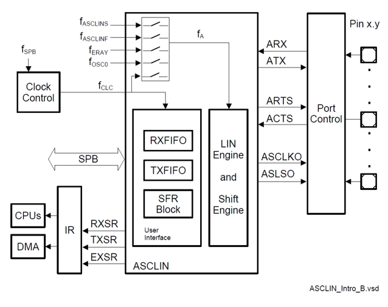
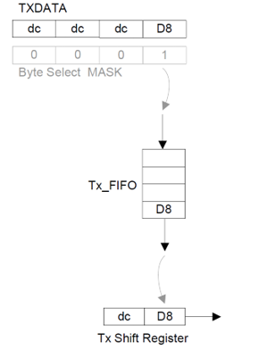
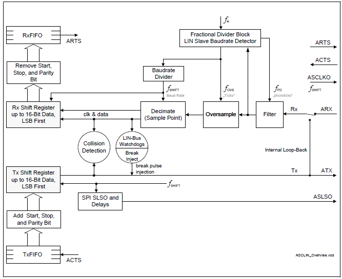
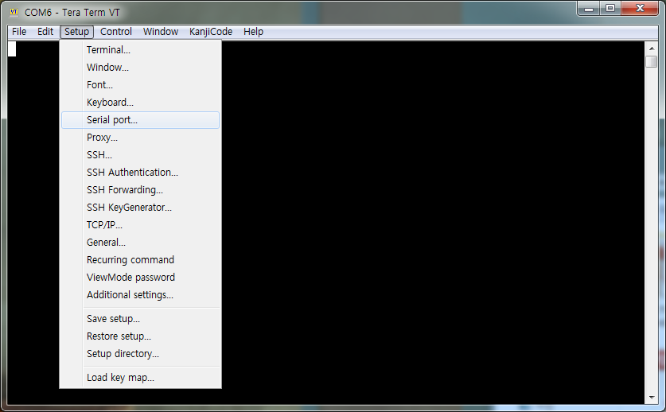

# Hello world

## 시작하는 질문

* 내가 C 프로그램을 처음 배울 때 짰던 프로그램이 "Hello World !" 였었는데, AURIX에서는 이런 프로그램을 짤 필요가 없나?
* 어 가만히 있어봐라. 프로그램을 디버깅 할 때 필요한 값을 `printf()` 해서 command 창으로 출력해서 봤었는데.... printf 를 사용할 수 없으면 어떻게 되는 거지? 변수값을 어떻게 확인하면서 디버깅하지?


"Hello World!" 너무나도 유명한 프로그램이지요?  C 프로그램을 배우는 대부분의 사람들이 이 프로그램을 다 짜보았을 것으로 생각됩니다.  AURIX 에는 모니터도 키보드도 달려 있지 않아서 C 프로그램에서 콘솔이라 부르는 입출력이 없습니다.  대신 직렬 통신 기능을 가지고 있습니다.  이 직렬 통신으로 우리가 사용하는 컴퓨터와 통신을 할 수 있고 우리는 컴퓨터에서 "Tera Term", "Putty" 와 같은 터미날 프로그램을 실행하여서 콘솔을 대신할 수 있습니다.

통신 자체의 목적으로 보면 Ethernet, USB 등과 같이 훨씬 더 고속의 안정된 프로토콜이 많이 있습니다.  그러나 모든 마이크로컨트롤러들이 내장하고 있는 가장 기본적인 직렬통신 방식이고, 이 예제를 통해서 배우는 것과 같이 터미널 프로그램을 쉽게 붙일 수 있어서 아직까지도 많이 사용되는 통신 방식 입니다. 개인적으로는 [Twinkle twinkle little star](./TwinkleTwinkleLittleStar.md)와 함께 마이크로컨트롤러를 프로그래밍 하면서 기본적으로 구성하는 프로그램 입니다

직렬통신을 통해서 접근할 수 없는 상황에서는 디버거를 사용해서 변수값을 확인하고 변경해 볼 수 있습니다.  물론 printf() 를 사용하는 것과는 용도가 다르지만, 출력을 하는 이유가 디버깅을 위한 변수확인이라면 디버거를 통해서 훨씬 효율적으로 실행할 수 있습니다.  참고로, 우리가 사용하는 `_MyBaseFramework_TC23A`를 포함한 모든 프로젝트에는 개발의 편의를 위하여 printf() 를 했을 경우 디버거의 Simulated IO 창으로 그 결과를 출력하도록 구성해 놓았습니다.

## Objectives

* Asclin를 이용한 직렬통신 구현
* 외부 터미널을 통한 입력과 출력의 확인

## References

*	TC23x TC22x Family User's Manual v1.1 - 19 ASCLIN
* iLLD_TC23A 1.0.1.4.0 - Modules/iLLD/ASCLIN

**[Example Code]**

* MyIlldModule_TC23A - AsclinAsc

## Example Description

* 터미널을 통해 다음의 기능이 동작하는지 확인한다.
  	* 프로그램 시작 시 '12345'라는 문자열을 출력
  	* 메세지를 5개 입력받을 때마다 입력받은 데이터를 출력

- 디버거의 Simulated IO를 통해 다음 기능이 동작하는지 확인한다.
  	* 일치 여부에 따라 error 또는 성공 메세지를 출력

## AURIX -related

### Asclin ( Asynchronous/Synchronous Interface )
* 빠르고(fast) 유연한(flexible) 직렬(serial) 통신 인터페이스 구축을 위한 모듈로
  	* 어떠한 signal들을,
  	* 어떠한 protocol을 통해서,
  	* 어떠한 sequence로 데이터를 처리할지를 결정해 준다.
- AURIX의 Module은 구성은 다음과 같음



### Signals

* Asclin의 signal 들은 다음과 같이 data 통신에 관한 signal,
    * Receive data input, ARX
    * Transmit data output, ATX
    * Request to send handshake output, ARTS
    * Clear to send handshake input, ACTS
- Module에 관한 signal이 존재
    * Slave select signal output, ASLSO
    * Serial clock output, ASCLK

### Protocols
* 사람과 다르게 기계들의 통신은 명확하게 미리 정한 약속에 따라 진행이 되며,
* 이 약속을 통신 **Protocol** 이라고 한다.
* Asclin은 다음과 같은 protocol들을 제공
    * ASC: 일반적인 Asclin 통신 프로토콜 (본 예제에서 사용)
    * LIN: Local interconnect network, 차량에서 느린 속도로 data를 전송할 때 사용
    * SPI: Serial Peripheral Interface, 동기화된 병렬통신을 이용할 때 사용

### Sequences
* 직렬통신은 한 번에 data를 한 bit씩 밖에 전송을 못 하기 때문에,
* 전송하고자 하는 data를 순차적으로 관리해 주는 것이 필요하며,
* Asclin은 먼저 들어온 data를 먼저 내보내는 FIFO 방식을 사용한다. (First-In-First-Out)
- 아래 그림은 TX FIFO의 처리 구조



### Communication process
* Data를 수신할 때
    1. 입력 데이터가 들어옴 (ARX)
    2. Robust한 통신을 위한 필터링 (Filter, Oversampling, Decimate)
    3. FIFO기반 unpackaging (RxFIFO)
    4. handshake 요청에 답변 (ARTS)

- Data를 송신할 때
    1. 송신하려는 데이터가 들어옴 (ATX)
    2. FIFO기반 packaging (TxFIFO)
    3. handshake 응답을 기다림 (ACTS)

* Handshake
  	- Data를 송수신할때 통신이 가능한지 상태를 주고받아 원활한 통신을 가능하게 한다.
  	- RTS는 자신의 수신버퍼 상태를 알려주는 신호이며,
  	- CTS는 상대의 수신버퍼의 상태를 받았다는 신호.
  	- 이런 신호들을 주고 받는 행위을 handshake라고 한다.
  	- 받는쪽에서 받을 준비가 됬음을 RTS를 통해서 알리고,
  	- 송신쪽에서 그 신호를 받았음을 CTS를 통해 응답한다.

- Interrupt
    * 비동기 직렬통신이기 때문에 언제 data 전송이 일어날지 알 수 없음
    * 때문에 인터럽트를 이용해 비동기 통신에 대응한다.
    * 인터럽트를 발생시킨 후 data 처리을 위한 작업을 진행



## iLLD - related

### Module Configuration

* Asclin의 모듈 초기화
    * 사용할 protocol(AsclinAsc; uart)을 정하고,
    * 송수신이 일어날 물리적 pin(P14.0, 14.1)을 고르고,
    * Data 전송 속도를 정한 뒤,
    (AURIX와 통신을 진행하는 기기와 동일하게 맞춤)
    * 통신관련 Interrupt 설정

```c
void AsclinAscDemo_init(void)
{
	//...
    // create module config
    IfxAsclin_Asc_Config ascConfig;
    IfxAsclin_Asc_initModuleConfig(&ascConfig, &MODULE_ASCLIN0);

    // set the desired baudrate
    ascConfig.baudrate.prescaler    = 1;
    ascConfig.baudrate.baudrate     = 115200;
    ascConfig.baudrate.oversampling = IfxAsclin_OversamplingFactor_4;

    // ISR priorities and interrupt target
    ascConfig.interrupt.txPriority    = ISR_PRIORITY_ASC_0_TX;
    ascConfig.interrupt.rxPriority    = ISR_PRIORITY_ASC_0_RX;
    ascConfig.interrupt.erPriority    = ISR_PRIORITY_ASC_0_EX;
    ascConfig.interrupt.typeOfService = (IfxSrc_Tos)IfxCpu_getCoreIndex();

    // FIFO configuration
    ascConfig.txBuffer     = g_AsclinAsc.ascBuffer.tx;
    ascConfig.txBufferSize = ASC_TX_BUFFER_SIZE;

    ascConfig.rxBuffer     = g_AsclinAsc.ascBuffer.rx;
    ascConfig.rxBufferSize = ASC_RX_BUFFER_SIZE;

    // pin configuration
    const IfxAsclin_Asc_Pins pins = {
        NULL_PTR,                     IfxPort_InputMode_pullUp,        // CTS pin not used
        &IfxAsclin0_RXA_P14_1_IN, IfxPort_InputMode_pullUp,        // Rx pin
        NULL_PTR,                     IfxPort_OutputMode_pushPull,     //RTS pin not used
        &IfxAsclin0_TX_P14_0_OUT, IfxPort_OutputMode_pushPull,     // Tx pin
        IfxPort_PadDriver_cmosAutomotiveSpeed1
    };
    ascConfig.pins = &pins;

    // initialize module
    IfxAsclin_Asc_initModule(&g_AsclinAsc.drivers.asc0, &ascConfig);
	// ...
}
```


### Interrupt Configuration

* 통신 간 데이터 송수신을 위한 인터럽트를 등록한다.

```c
// in ConfigurationIsr.h
#define ISR_PRIORITY_ASC_0_RX 4
#define ISR_PRIORITY_ASC_0_TX 5
#define ISR_PRIORITY_ASC_0_EX 6

#define ISR_PROVIDER_ASC_0    IfxSrc_Tos_cpu0

#define INTERRUPT_ASC_0_RX    ISR_ASSIGN(ISR_PRIORITY_ASC_0_RX, ISR_PROVIDER_ASC_0)
#define INTERRUPT_ASC_0_TX    ISR_ASSIGN(ISR_PRIORITY_ASC_0_TX, ISR_PROVIDER_ASC_0)
#define INTERRUPT_ASC_0_EX    ISR_ASSIGN(ISR_PRIORITY_ASC_0_EX, ISR_PROVIDER_ASC_0)

// in AsclinAscDemo.c
IFX_INTERRUPT(asclin0TxISR, 0, ISR_PRIORITY_ASC_0_TX)
{
    IfxAsclin_Asc_isrTransmit(&g_AsclinAsc.drivers.asc0);
}

IFX_INTERRUPT(asclin0RxISR, 0, ISR_PRIORITY_ASC_0_RX)
{
    IfxAsclin_Asc_isrReceive(&g_AsclinAsc.drivers.asc0);
}

IFX_INTERRUPT(asclin0ErISR, 0, ISR_PRIORITY_ASC_0_EX)
{
    IfxAsclin_Asc_isrError(&g_AsclinAsc.drivers.asc0);
}
```


### Module Behavior

* 통신 검증을 위한 test function 구성
    * `IfxAsclin_Asc_write`을 통한 데이터 송신
    * `IfxAsclin_Asc_read`을 통한 데이터 수신
    * 입출력 데이터를 비교하여 메세지 출력

```c
// in AsclinAscDemo.c
void AsclinAscDemo_run(void)
{
    uint32 i, errors = 0;
    g_AsclinAsc.count = 5;

    for (i = 0; i < g_AsclinAsc.count; ++i)
    {
        g_AsclinAsc.txData[i] = i + '1';    // {'1', '2', '3' ,'4' ,'5'}
        g_AsclinAsc.rxData[i] = 0;
    }

    IfxAsclin_Asc_write(&g_AsclinAsc.drivers.asc0, g_AsclinAsc.txData, &g_AsclinAsc.count, TIME_INFINITE);
    IfxAsclin_Asc_read(&g_AsclinAsc.drivers.asc0, g_AsclinAsc.rxData, &g_AsclinAsc.count, TIME_INFINITE);

    // check received data
    for (i = 0; i < 5; ++i)
    {
        if (g_AsclinAsc.rxData[i] != g_AsclinAsc.txData[i])
        {
            ++errors;
        }
    }

    if (errors)
    {
    	IfxAsclin_Asc_write(&g_AsclinAsc.drivers.asc0, g_AsclinAsc.rxData, &g_AsclinAsc.count , TIME_INFINITE);
        printf("ERROR: received data doesn't match with expected data (%lu mismatches)\n", errors);
    }
    else
    {
        IfxAsclin_Asc_write(&g_AsclinAsc.drivers.asc0, g_AsclinAsc.rxData, &g_AsclinAsc.count , TIME_INFINITE);
        printf("OK: received data matches with expected data\n");
    }

	//...
}
```


## 추가적인 설명

### Terminal을 통한 송수신 확인

1. Teraterm을  실행하여 board가 연결된 port와 connect


2. Serial 통신을 위한 설정이 필요 (Setup > Serial port)



3. Board에서 설정한 통신 스펙과 맞춰준다. (baud rate만 바꾸면 됨)


4. `IfxAsclin_Asc_write`로 보낸 데이터가 출력되는 것을 확인할 수 있다.


### Simulated I/O를 통한 메세지 확인

1. 만약 board와 디버거가 연결되어 실행되고 있다면,


2. 설정해둔 `printf()` 메세지가 출력되는 것을 확인할 수 있다.


