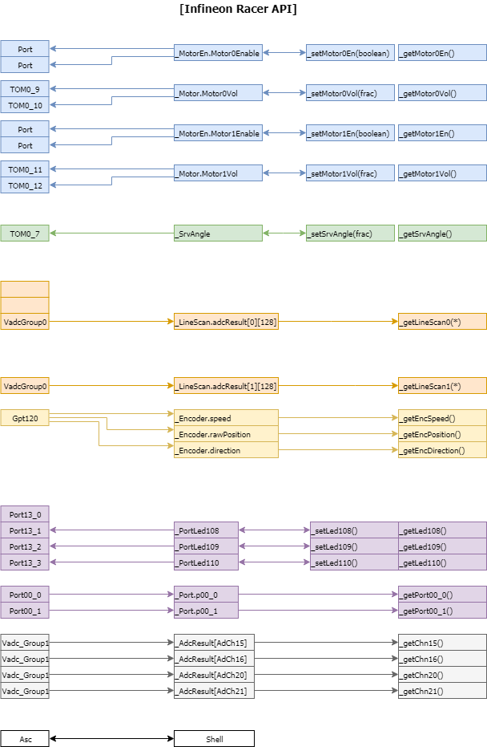

# InfineonRacer User Guide

## Objectives

* 사용자 관점에서 InfineonRacer를 이해하고 활용할 수 있는 능력을 기른다.

## References
* ​

##SW Architecture 
* ​
  


### 선택적으로 소스코드 빌드하기

* Release/Test...


## Basic Module Structure & API




## Schedule

* ​

```c
void appTaskfu_init(void){
	BasicLineScan_init();
	BasicPort_init();
    BasicGtmTom_init();
    BasicVadcBgScan_init();
    BasicGpt12Enc_init();
    AsclinShellInterface_init();

    tft_app_init(1);
    perf_meas_init();

#ifdef CODE_ERT
    IR_Controller_initialize();
#else
    InfineonRacer_init();
#endif
}

void appTaskfu_1ms(void)
{
	task_cnt_1m++;

}


void appTaskfu_10ms(void)
{
	task_cnt_10m++;
	if(task_cnt_10m%2 == 0){ /* Every 20msec */
		BasicLineScan_run();
		InfineonRacer_detectLane();
		BasicPort_run();
		BasicGtmTom_run();
		BasicVadcBgScan_run();

		if(IR_Ctrl.basicTest == FALSE){ /* Skip when test Basic Functions */
			#ifdef CODE_ERT
				IR_Controller_step();
			#else
				InfineonRacer_control();
			#endif
		}
		AsclinShellInterface_runLineScan();
	}
}

void appTaskfu_100ms(void)
{
	task_cnt_100m++;
	if(task_cnt_100m % REFRESH_TFT == 0){ /* REFRESH_TFT = 2, Every 200msec */
		tft_app_run();
	}
}

void appTaskfu_1000ms(void)
{
	task_cnt_1000m++;
}

void appTaskfu_idle(void){
	AsclinShellInterface_run();
	perf_meas_idle();

}

void appIsrCb_1ms(void){
	BasicGpt12Enc_run();
}
```


## Algorithm: Hand-Code vs. ERT
* configuration 

```c
/* AppSw/Tricore/Cfg_Illd/Configuration.h */
	/* 중간 생략 */
/* 다음 3개중의 하나만 정의해서 사용*/
#define CODE_HAND			// Hand code : default
//#define CODE_ERT			// Using embedded coder
//#define CODE_SCILAB		// Using SciLab
	/* 중간 생략 */
```

```c
/* in AppSw/Tricore/Main/Release/AppTaskFu.c */

void appTaskfu_10ms(void)
{
    #ifdef CODE_ERT
	    IR_Controller_step();
    #else
    	InfineonRacer_control();
    #endif
}
```


## Configuration

### Module Configuration


### Interrupt Configuration


## Modules

### Service 1: BasicStm


### Service 2: AsclinShellInterface


### Service 3: TFT


### IO: Port


### IO: VadcBgScan


### IO: BasicLineScan


### IO: BasicGtmTom


### IO: BasicGpt12Enc


