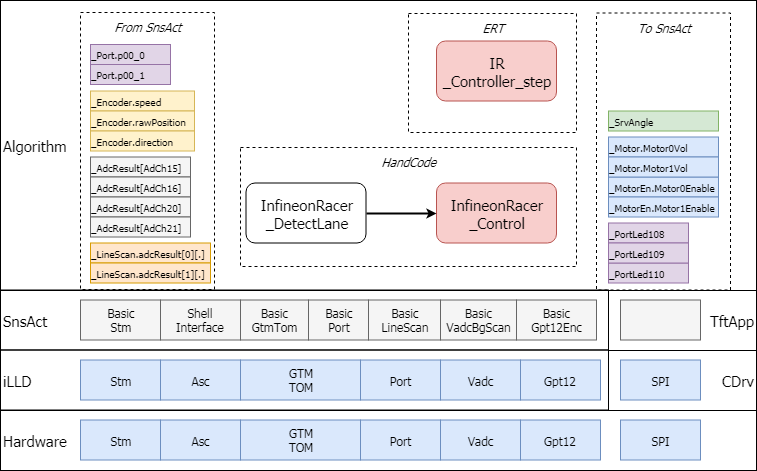
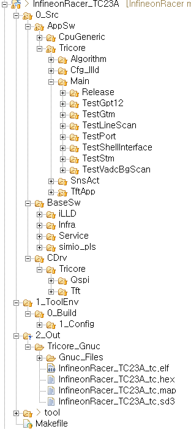
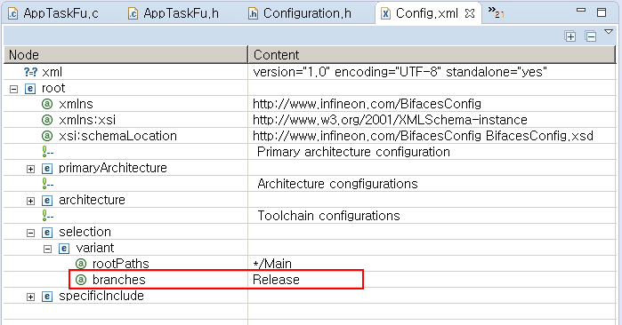
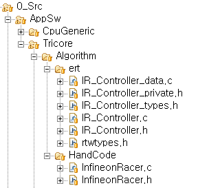
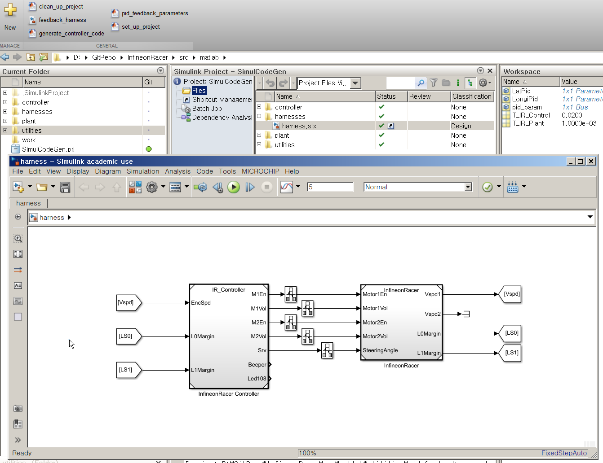

# InfineonRacer User Guide

## Objectives

* 사용자 관점에서 InfineonRacer를 이해하고 활용할 수 있는 능력을 기른다.

## References
* ./docs/PinsApi.xlsx

## SW Architecture

* InfineonRacer SW Platform은 다음의 그림과 같은 3개의 계층으로 구성되어 있다.
  	- iLLD 와 CDrv: 최하단 계층으로 AURIX의 저수준 입출력 기능을 담당하는 드라이버 계층
  	- SnsAct 와 TftApp: 센서와 액츄에이터의 추상화 모델 제공과 편의 서비스 제공
        + BasicGtmTom: DC Motor, Servo, Beeper
        + BasicPort: On-board LED 와 Digital Input, DC Motor Driver 활성화
        + BasicLineScan: LineScan Camera(TSL1401)
        + BasicVadcBgScan: Analog Input
        + BasicGpt12Enc: Encoder
        + BasicStm: Static Cyclic Scheduler
        + ShellInterface: 직렬통신과 사용자 Shell 환경 제공
        + TftApp: TFT의 MMI (Man-Machine Interface) 제공
    - Algorithm: 센서정보로 인지하고 동작을 결정하는 제어
        + SnsAct 계층에서 추상화된 정보를 활용(BasicModule API 참고)
        + 수동 코드와 자동 코드 (Mathwork의 Embedded Real-Time Target) 선택적 활용 가능 (Algorithm: Hand-Code vs. ERT 참고)




* 각 계층은 폴더와 파일명으로 형상관리
    - Algorithm 계층: AppSw/Tricore/Algorithm/
    - SnsAct 계층: AppSw/Tricore/SnsAct/
    - iLLD 계층: BaseSw/
    - Tft 관련
        + AppSw/Tricore/TftApp 과 CDrv





* 사용자가 간단하게 사용할 수 있는 스케쥴러를 제공 (Scheduler 참고)
	  - 해당 모듈의 동작 주기와 순서 조정 가능

* 하나의 프로젝트에서 모듈 시험 코드와 최종 릴리즈 코드를 동시에 개발하며 관리할 수 있도록 구성 (선택적으로 소스코드 빌드하기 참고)


## 선택적으로 소스코드 빌드하기

모듈화된 프로그램의 개발시 모듈 단위로 개발하고 이 모듈들을 통합하여 전체 프로그램을 구성하게 된다.  각 모듈별로 프로젝트를 구성하면 프로젝트의 갯수가 너무 많아지고, 그렇다고 한개의 프로젝트에서 해당 모듈만 시험하게 만들려면 소스코드에서 많은 부분을 변경하여야 한다.   소프트웨어 통합 단계 이후에도 기능 개선이나 디버깅의 목적으로 특정 모듈, 혹은 특정 함수들만 선택적으로 실행해 보고 싶은 경우가 빈번하게 발생한다.  

이러한 경우에 **BIFACES** 가 제공하는 **Selection** 기능을 활용하면 한개의 프로젝트를 사용하여 선택적으로 소스코드를 빌드하고 실행할 수 있다.

다음과 같은 방법으로 선택적 빌드가 가능하다.

* 시험마다 변경되어야 하는 부분 파일 단위로 추출
* 대체되는 부분을 디렉토리 단위로 병렬적으로 구성
* Config.xml에서 selection/variant 항목 수정
* 빌드후 실행

InfineonRacer의 경우를 예로 설명하면

* 시험마다 변경되는 부분

일반적으로 모듈을 하나 개발할 경우 모듈의 .c/.h 파일이 사용되고, 이것을 Scheduler에 등록하여 실행하게 된다.  그러므로 Scheduler의 실행과 관련되는 AppTaskFu.c/.h 파일과 Main.c/h 파일만 시험마다 변경할 필요가 있게된다.

* 대체되는 부분을 디렉토리 단위로 병렬적으로 구성

BasicModule 의 시험과 관련되는 파일들을 /AppSw/Tricore/Main 디렉토리 밑에 시험의 이름과 관련되는 이름으로, 예를 들어 TestStm, TestGtm 등, 디렉토리로 만들고 병렬적으로 구성한다.  각 디렉토리 밑에는 이전단계에서 추출한 AppTaskFu.c/.h 과 Main.c/.h 파일이 각각 들어있게 된다.

* Config.xml 에서 selection 항목 수정

/Main 디렉토리 밑에 병렬적으로 디렉토리가 존재하므로 이 디렉토리를 `rootPahts`로 지정해 주고, 그 밑의 특정 디렉토리 이름을 `branches` 로 지정해 주면 된다.  아래 예에서는 Release 디렉토리 밑에 있는 파일들만 선택되고 Main 디렉토리 밑에 있는 다른 디렉토리의 파일들은 무시된다.

* 빌드 후 실행

위와 같은 경우에서는 Release 디렉토리 밑에 있는 파일들과 /Main 디렉토리 이외에 있는 다른 모든 소스코드들이 결합되어 실행파일, `InfineonRacer_TC23A_tc.elf` 파일을 만들게 된다.  최종 실행파일의 위치와 이름이 변경되지 않았으므로 디버거의 설정도 변경할 필요 없이 동일하게 사용할 수 있는 장점을 갖게 된다.




## Basic Module Structure & API

* 8bit, 16bit 급 마이크로컨트롤러를 활용하기 위해서는
    - 데이터북을 보고 각 서브시스템 특징을 이해하고
    - 메모리 공간상의 레지스터 맵에 직접 프로그래밍 하였다.
* AURIX와 같은 32bit 급 마이크로컨트롤러는 전통적인 방법으로 개발하기는 어렵다.
    - 데이터북을 모두 읽고 일을 하기에는 너무 분량이 많고
    - 서브시스템이 막강하여 다양한 기능을 수행할 수 있으므로 다양한 사용예들이 존재하고
    - 레지스터의 개수가 너무 많다

* BasicModule의 역할: iLLD를 활용하여 센서 및 액츄에이터를 추상화 하자.
    - 개발자의 수고를 덜어주기 위하여 잘 다듬어져 있는 iLLD를 제공하고 있다.
    - 물론 iLLD를 활용해서 사용예에 맞도록 설정하고 필요한 함수를 찾아서 호출해야 하지만, 레지스터를 직접 프로그래밍하는 것과는 비교할 수 없을 정도로 노력을 덜어준다.
* 센서와 액츄에이터의 값을 언제든지 접근 가능한 변수와 이 변수를 읽고 쓰는 함수를 제공한다.
    - API 변수명: `IR_SnsName`, `IR_ActName`
    - API 함수명: `IR_getSnsName()`, `IR_setActName(type)`
    - 내부동작함수: `BasicModuleName_init(void)`, `BasicModuleName_run(void)`
    - iLLD를 이와 같이 추상화하여 사용자는 해당 센서와 액츄에이터의 값을 쉽게 접근할 수 있게 된다.


| Sensor Actuator  | BasicModule | IR_Variables                     | Range            | Methods                 |                     |
| ---------------- | ----------- | -------------------------------- | ---------------- | ----------------------- | ------------------- |
| Motor0           | GtmTom      | IR_Motor.Motor0Vol               | -1.0 ~ 1.0       | IR_setMotor0Vol(float)  | IR_getMotor0Vol()   |
| Motor0           | Port        | IR_MotorEn.Motor0Enable          | 0/1              | IR_setMotor0En(boolean) | IR_getMotor0En()    |
| Motor1           | GtmTom      | IR_Motor.Motor1Vol               | -1.0 ~ 1.0       | IR_setMotor1Vol(float)  | IR_getMotor1Vol()   |
| Motor1           | Port        | IR_MotorEn.Motor1Enable          | 0/1              | IR_setMotor1En(boolean) | IR_getMotor1En()    |
| Servo            | GtmTom      | IR_SrvAngle                      | -1.0 ~ 1.0       | IR_setSrvAngle(float)   | IR_getSrvAngle()    |
| Beeper           | GtmTom      | IR_Beeper.On                     | 0/1              | IR_setBeeperOn(boolean) | IR_getBeeperOn()    |
|                  |             | IR_Beeper.Frequency              | 100.0~10000.0    | IR_setBeeperFreq(float) | IR_getBeeperFreq()  |
|                  |             | IR_Beeper. Volume                | 0.0 ~ 0.99       | IR_setBeeperVol(ufrac)  | IR_getBeeperVol()   |
| Led108           | Port        | IR_Port.led108                   | 0: ON, 1: OFF    | IR_setLed108(boolean)   | IR_getLed108()      |
| Led109           | Port        | IR_Port.led109                   | 0: ON, 1: OFF    | IR_setLed109(boolean)   | IR_getLed109()      |
| Led110           | Port        | IR_Port.led110                   | 0: ON, 1: OFF    | IR_setLed110(boolean)   | IR_getLed110()      |
| Port00.0         | Port        | IR_Port.p00_0                    | 0/1              |                         | IR_getPort00_0()    |
| Port00.1         | Port        | IR_Port.p00_1                    | 0/1              |                         | IR_getPort00_1()    |
| AdCh15           | VadcBgScan  | IR_AdcResult[AdCh15]             | 0.0 ~ 1.0 (0~5V) |                         | IR_getChn15()       |
| AdCh16           | VadcBgScan  | IR_AdcResult[AdCh16]             | 0.0 ~ 1.0 (0~5V) |                         | IR_getChn16()       |
| AdCh20           | VadcBgScan  | IR_AdcResult[AdCh20]             | 0.0 ~ 1.0 (0~5V) |                         | IR_getChn20()       |
| AdCh21           | VadcBgScan  | IR_AdcResult[AdCh21]             | 0.0 ~ 1.0 (0~5V) |                         | IR_getChn21()       |
| LineScan Camera0 | LineScan    | IR_LineScan.adcResult\[0\]\[\*\] | 0~4096           |                         | IR_getLineScan0(*)  |
| LineScan Camera1 | LineScan    | IR_LineScan.adcResult\[1\]\[\*\] | 0~4096           |                         | IR_getLineScan1(*)  |
| Encoder          | Gpt12Enc    | IR_Encoder.speed                 |                  |                         | IR_getEncSpeed()    |
|                  |             | IR_Encoder.rawPosition           |                  |                         | IR_getEncPosition() |
|                  |             | IR_Encoder.direction             |                  |                         | IR_getEncDirection  |


## Scheduler

* InfineonRacer 는 다음과 같은 Static Cyclic Scheduler를 가지고 있다.
* Release 의 예를 살펴보면 다음과 같이
    - 초기화 `appTaskfu_init(void)`
    - `appTaskfu_1ms(void)`,  `appTaskfu_10ms(void)`,  `appTaskfu_100ms(void)`,  `appTaskfu_1000ms(void)` , `appTaskfu_idle(void)`  테스크를 가지고 있다.
    - 그리고 1msec 의 Stm Interrupt 함수 내부에서 실행되는 `appIsrCb_1ms(void)` 가 있다.
* 해당되는 주기에 순서에 맞춰서 각 함수를 이곳에 프로그래밍 하면 된다.

```c
void appTaskfu_init(void){
	BasicLineScan_init();
	BasicPort_init();
    BasicGtmTom_init();
    BasicVadcBgScan_init();
    BasicGpt12Enc_init();
    AsclinShellInterface_init();

    tft_app_init(1);
    perf_meas_init();

#ifdef CODE_ERT
    IR_Controller_initialize();
#else
    InfineonRacer_init();
#endif
}

void appTaskfu_1ms(void)
{
	task_cnt_1m++;

}


void appTaskfu_10ms(void)
{
	task_cnt_10m++;
	if(task_cnt_10m%2 == 0){ /* Every 20msec */
		BasicLineScan_run();
		InfineonRacer_detectLane();
		BasicPort_run();
		BasicGtmTom_run();
		BasicVadcBgScan_run();

		if(IR_Ctrl.basicTest == FALSE){ /* Skip when test Basic Functions */
			#ifdef CODE_ERT
				IR_Controller_step();
			#else
				InfineonRacer_control();
			#endif
		}
		AsclinShellInterface_runLineScan();
	}
}

void appTaskfu_100ms(void)
{
	task_cnt_100m++;
	if(task_cnt_100m % REFRESH_TFT == 0){ /* REFRESH_TFT = 2, Every 200msec */
		tft_app_run();
	}
}

void appTaskfu_1000ms(void)
{
	task_cnt_1000m++;
}

void appTaskfu_idle(void){
	AsclinShellInterface_run();
	perf_meas_idle();

}

void appIsrCb_1ms(void){
	BasicGpt12Enc_run();
}
```


## Algorithm: Hand-Code vs. ERT
### Hand-Code

* 사용자에게 참고 목적으로 간단하게 2개의 함수로 예제를 제공
    - `InfineonRacer_detectLand()`: 좌우의 Line Scan Camera 로 부터 각각 128 개의 정보를 읽어들여 좌우측 여백을 계산
    - `InfineonRacer_control()`: 여백 정보를 고려하여 조향각도와 주행속도를 결정
* 사용자의 목적에 맞게 함수와 변수를 추가하고, 스케쥴러에 등록하여 사용

```c
typedef struct{
	sint32 Ls0Margin;
	sint32 Ls1Margin;
	boolean basicTest;
}InfineonRacer_t;

InfineonRacer_t IR_Ctrl  
		={64, 64, FALSE  };

void InfineonRacer_detectLane(void){
	/* IR_LineScan.adcResult 의 정보를 읽어들여서
	 * IR_Ctrl.Ls0Margin, IR_Ctrl.Ls1Margin 정보를 계산한다
	 */
}

void InfineonRacer_control(void){
	/* IR_Ctrl.Ls0Margin, IR_Ctrl.Ls1Margin 정보를 읽어들여서
	 * 좌우 여백을 고려하여 조향각도와 주행속도를 결정하고 출력한다
	 */
}
```

### ERT

* Model-based 기법으로 제어기 개발 예제 제공
* Hand-code 의 `InfineonRacer_control()` 부분만 조건부 컴파일 하도록 구성
    - Mathwork 사의 Embedded Real-time Target을 사용할 경우 두번째 CODE_ERT 만 정의
    - 향후 [SCILAB](http://scilab.io/)의 Auto-code generation 도 지원할 예정

```c
/* in AppSw/Tricore/Cfg_Illd/Configuration.h */
	/* 중간 생략 */
/* 다음 3개중의 하나만 정의해서 사용*/
#define CODE_HAND			// Hand code : default
//#define CODE_ERT			// Using embedded coder
//#define CODE_SCILAB		// Using SciLab
	/* 중간 생략 */
```

```c
/* in AppSw/Tricore/Main/Release/AppTaskFu.c */

void appTaskfu_10ms(void)
{
    #ifdef CODE_ERT
	    IR_Controller_step();
    #else
    	InfineonRacer_control();
    #endif
}
```




* ERT Autocode Generation Example
    - InfineonRacer/src/matlab/SimulCodeGen.prj
    - harness.slx 를 열면 다음과 같이 간단한 구조의 제어기와 차량 모델을 확인할 수 있습니다.
    - 상단의 generate_controller_code 를 실행하면 /AppSw/Tricore/Algorithm/ert 디렉토리 밑에 Infineon Racer Controller 모델 부분의 코드가 자동으로 생성




## Configuration

* SnsAct 계층의 Basic Module에 관한 설정 정보는 /AppSw/Tricore/Cfg_Illd 디렉토리 밑에있는 다음 3개의 파일로 한다.

### Module Configuration

* `Configuration.h` 파일

* Sensor Actuator IO 핀 정보

```c
//...
#define LED108						IfxPort_P13_1
//...
#define M11_INH						IfxPort_P02_0
#define M12_INH						IfxPort_P00_2
//...
#define TSL1401_SI					IfxPort_P14_6
#define TSL1401_CLK					IfxPort_P14_7
#define TSL1401_AO_1				9
//...
```

* Encoder Emulation 여부

    * 만약 이것이 정의 되면 Encoder Emulation 신호가 발생된다. (P02.6, P02.7, P02.8)  

```c
/* Encoder Emulation for Gpt12Enc Test */
#define ENCODER_EMUL
```

* TFT 관련 설정

    * TFT와 연결된 HW 설정 정보들이므로 사용자는 변경할 필요는 없다.

* Algorithm 코드 설정 정보  

```c
/* 다음 3개중의 하나만 정의해서 사용*/
#define CODE_HAND			// Hand code : default
//#define CODE_ERT			// Using embedded coder
//#define CODE_SCILAB			// Using SciLab
```

### TFT Configuration

* `conio_cfg.h` 파일

    * TFT 관련된 정적 설정 정보


### Interrupt Configuration

* 사용하는 인터럽트와 우선순위 설정 정보

* SnsAct 관련 인터럽트들

```c
#define INTERRUPT_STM_INT0          ISR_ASSIGN(ISR_PRIORITY_STM_INT0, ISR_PROVIDER_STM_INT0)                            /**Define the System Timer interrupt priority.  */
#define INTERRUPT_INCRINC_ZERO      ISR_ASSIGN(ISR_PRIORITY_INCRENC_ZERO, ISR_PROVIDER_INCRENC_ZERO)               /**Define the  Incremental encoder zero interrupt priority.  */

#define INTERRUPT_ASC_0_RX    ISR_ASSIGN(ISR_PRIORITY_ASC_0_RX, ISR_PROVIDER_ASC_0)                 /**Define the ASC0 receive interrupt priority.  */
#define INTERRUPT_ASC_0_TX    ISR_ASSIGN(ISR_PRIORITY_ASC_0_TX, ISR_PROVIDER_ASC_0)                 /**Define the ASC0 transmit interrupt priority.  */
#define INTERRUPT_ASC_0_EX    ISR_ASSIGN(ISR_PRIORITY_ASC_0_EX, ISR_PROVIDER_ASC_0)                 /**Define the ASC0 error interrupt priority.  */
```

* TFT 관련 인터럽트들

```C
#define ISR_PRIORITY_CPUSRV0        2  /**< \brief Define the conio periodic interrupt priority must be lower than QSPIx priorities.  */
#define ISR_PRIORITY_QSPI0_ER       12  /**< \brief Define the Qspi0 error interrupt priority.  */
#define ISR_PRIORITY_BACKLIGHT      15  /**< \brief Define the TOMx_x compare match interrupt priority.  */
#define ISR_PRIORITY_QSPI0_TX       31  /**< \brief Define the Qspi0 transmit interrupt priority.  */
#define ISR_PRIORITY_QSPI0_RX       51  /**< \brief Define the Qspi0 receive interrupt priority.  */
#define ISR_PRIORITY_OS_TICK        64  /**< \brief Define the TFT refresh interrupt priority.  */
#define ISR_PRIORITY_PERF_MEAS      255 /**< \brief Define the TOMx_x interrupt priority.  */
```


## Modules


### IO: BasicPort

#### Functions

* LED's(Application Kit on board)
* Port: Digital Input for User
* Motor Driver Inhibit

#### Files

* BasicPort.c/.h

#### Notes

* Nothing special


### IO: BasicVadcBgScan

#### Functions

* Analog Input for User

#### Files

* BasicVadcBgScan.c/.h

#### Notes

* AN15 번은 Group 1, Channel 3
    * AN12 번 부터는 Vadc Group 1 번에 할당되어 있음
    * 15 - 13 => 3번 Channel 로 관리됨

###

### IO: BasicLineScan

#### Functions

* Line Scan Camera 2 개

#### Files

* BasicLineScan.c/.h

#### Notes

* SI, CLK는 두 Line Scan Camera 공통으로 사용
    * P14.6, P14.7
    * Port 출력과 waitTime 함수로 신호 발생
* AO 출력은 각각 AN9, AN10 채널로 입력
    * VadcAutoScan 모드로 2채널 동작
* 128 지점의 스캔 신호(2채널)를 얻는데 걸리는 시간 : 약 850usec
    * 129 clock * 6usec/clock
    * clock 의 주기를 더 단축할 수 있지만 감도가 떨어짐
    * 조명 조건에 따라서 clock 주기를 조정할 수 있음
* 개발의 편의를 위하여 다양한 모니터링 방법 제공
    * 디버깅 단계: Array View 이용
    * 실차 튜닝 단계: Shell 명령어(**mls**: monitoring line scan)와 SerialPlot 이용


### IO: BasicGtmTom

#### Functions

* DC Motor PWM 신호: 2 개
* Servo
* Beeper: 정상 혹은 이상 동작등의 상황을 사용자가 확인할 수 있도록

#### Files

* BasicGtmTom.c/.h

#### Notes

**[DC Motor PWM]**

* Frequency: 10KHz
    * DC 모터의 시정수와 드라이버 IC의 스위칭 속도에 따라 조정 가능

**[Servo]**

* Period: 10msec
    * Servo 의 특성에 따라 조정 가능
* On-time: 0.5~2.5 msec
    * 0.5: -90 Degree
    * 2.5: +20 Degree

**[Beeper]**

* Frequency, Volume 조정 가능
    * Default Frequency: 2048 Hz
    * Default Volume: 10%

###

### IO: BasicGpt12Enc

#### Functions

* Encoder (2^N PPR)

#### Files

* BasicGpt12Enc.c/.h

#### Notes

* 위치만 측정하는 것이 아니라 필터링된 속도도 함께 구할 수 있다.

* iLLD의 특성상 2^N PPR(Pulse Per Revolution) 의 Encoder 만 사용가능하다.

* 시험을 위하여 Encoder 신호를 Emulation 할 수도 있다.

  ​

### Service 1: BasicStm

#### Functions

* Scheduler Tick 발생

#### Files

* BasicStm.c/.h

#### Notes

* Period: 1ms


### Service 2: AsclinShellInterface

#### Functions

* 직렬 통신을 이용한 Shell 제공

#### Files

* AsclinShellInterface.c/.h

#### Notes

* 속도: 115200 bps

  * 주변환경에 따라서 속도 조정 가능


### Service 3: TFT

#### Functions

* MMI 제공

#### Files

* /TftApp 디렉토리 폴더의 파일들

#### Notes

* Graphic 출력
* Touch Screen 제공
* 필요에 따사 사용자가 사용할 수 있는 Text 창과 Graph 창 제공
