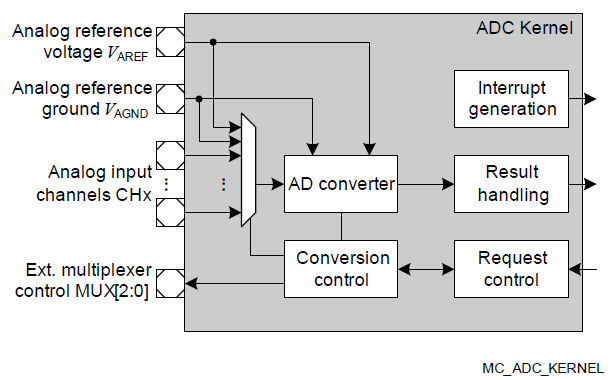
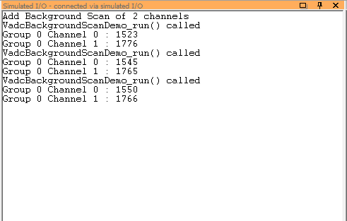
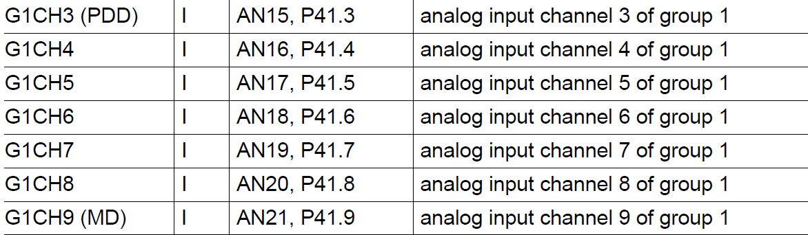
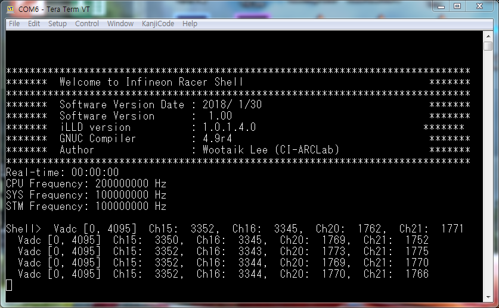

# Multi channel voltmeter

## 시작하는 질문

* ADC 라는 것은 알겠는데, AURIX에는 VADC라고 되어 있네? **Versatile** 이라고? 이것은 또 뭐냐?

아날로그 신호를 디지탈 값으로 바꿔주는 장치를 ADC(Analog-to-Digital Converter)라고 부르고 대부분의 마이크로컨트롤러들은 이 모듈을 가지고 있습니다.  ADC를 이야기 할 때 채널의 갯수, 변환속도, 그리고 분해능 등이 중요한 스펙(Specification) 입니다.  아날로그 변환값을 CPU에서 사용하기 위해서는 다음의 몇가지 사항에 대해서 프로그래밍을 해줘야 합니다.

* 변환한 값은 어느 곳에 **어떻게 보관**할 것인지?
* 언제 **샘플링** 할 것인지?

ADC 하드웨어가 이 두 가지 사항에 대해서 어떻게 지원해 주는지에 따라 소프트웨어는 확연하게 다른 방식으로 구성되어 집니다.  하드웨어에서 이 사항을 충실하게 지원해 주면 ADC 모듈의 **설정**에 관심을 가지고 세심하게 프로그래밍 해야 하고, 그렇지 않다면 설정은 간단하지만 샘플링 마다 관련된 동작을 **반복적으로 실행**해야만 합니다.

AURIX의 VADC는 위의 두가지 사항을 충실하게 지원해 주고 있습니다.  그래서 그냥 ADC라고 부르지 않고 **다재다능한(Versatile)** ADC라고 부르는 것입니다.  VADC를 사용하면, 설정할 때는 심사숙고해야 하지만, 사용할 때는 일반 변수를 읽어들이는 것처럼 쉽게 처리할 수 있습니다.


------

## Objectives

* VADC의 기본 구조를 이해하고,
* VADC의 내부 블럭별 설정 방법을 이해하고,
* Background Scan 모드로 동작시키는 방법을 익힌다.

## References

* TC23x TC22x Family User's Manual v1.1 - Chap27 VADC
* iLLD_TC23A_1_0_1_4_0 - Modules/iLLD/VADC

**[Example Code]**

* MyIlldModule_TC23A - VadcBackgoundScan
* InfineonRacer_TC23A - TestVadcBgScan

-----

## Example Description

* AN0 와 AN1 의 아날로그 전압을 디지탈로 변환하여 읽어들인다.
    * 두채널의 아날로그 전압값을 전압계로 읽어들이는 것과 마찬가지로 동작한다.


## Background 정보

* Analog to digital conveter
    * ADC는 아날로그 측정 값을 디지털 값으로 출력하는 전자 회로
    * 아날로그 입력신호는 오디오, 비디오, 온도 등 매우 종류가 다양
    * 자동차에서 아날로그 값으로 측정하는 센서가 많기 때문에
    * AURIX에서는 여러 채널의 아날로그 값을 측정할 수 있는 멀티채널 방식을 적용


- Multi channel ADC
    * 여러 채널을 변환하기 위해서 복수개의 ADC를 사용하는 것 보다는,
    * 한 개의 ADC모듈을 사용하여 analog MUX를 적용하는 것이 더 경제적
    * 대신 ADC는 하나의 모듈이 여러 채널을 제어하기 위해서 복잡한 구조를 갖게 됨


## AURIX - related

* ​2개의 converter group과 14개의 input channel
    * 각 그룹은 독립적으로 작동하는 ADC kernel
    * 그룹별로 14채널의 전용 아날로그 input multiplexer를 보유
    * 어떤 채널을 어떤 타이밍(sample)에 어떤 우선순위(arbitration)을 갖고 스캔을 할지 제어 가능
    (각 기능들의 의미와 설정은 다음장에서)
    * 이번 장에서는 background scan을 이용하여 데이터를 받아올 것이다.


* Backgound scan
    * 가장 낮은 우선순위를 지님
    * 모든 그룹의 모든 채널에 scan 권한이 있음
    * 채널별 할당 된 핀으로 부터 아날로그 voltage 값을 취득
    * 다른 명령없이도 스캔한 값을 지속적으로 디지털 값으로 변환
    * 각각 채널은 독립적으로 동작한다.
    * 사용자가 컨버팅된 값을 이용하기 위해선 그 result가 어떻게 처리되는지 이해할 필요가 있다.


- Result handling
    * 여러 입력을 동시에 받기 때문에 체계적인 처리과정 없이는 데이터 손실이 발생할 수 있음
    * 각 채널에 병렬적으로 사용가능한 16개의 result register와 1개의 global register가 존재하며,
    * Wait-for-read mode를 사용하여 overwrite에 의한 데이터 손실을 방지한다.

**[참고]** Wait-for-read mode란?
  - Target result register가 read 가능한 상태가 될 때까지 컨버팅을 정지시키는 모드





## iLLD - related

### Module Configuration

* VADC 모듈은 작은 모듈들의 집합: 구조적인 사고로 접근할 필요가 있다.
* 상위단에서 하위단까지 단계별 설정이 필요
  1. ADC configuration
  2. Group configuration
  3. Channel configuration
* 설정은 개별적인 구조체와 계측적인 명명법을 사용한 method로 구분하여 구현되어 있다.

**[참고]** Demo 코드에서는 채널 설정 부분이 설정영역이 아니라 실행영역에 프로그래밍 되어 있다.

* 실행하면서 채널의 설정을 바꿔야 하는 경우 demo 코드처럼 실행하는 것이 맞으나,
* 대부분의 제어시스템에서는 초기화 단계에서 모듈과 함께 실행하는 것이 옳다고 판단되어,
* 다음과 같이 초기화 단계에서 실행되도록 수정하였다.


```c
//in VadcBackgroundScanDemo.c
void VadcBackgroundScanDemo_init(void)
{
    // ADC module configuration 초기화
    IfxVadc_Adc_Config adcConfig;
    IfxVadc_Adc_initModuleConfig(&adcConfig, &MODULE_VADC);
    IfxVadc_Adc_initModule(&g_VadcBackgroundScan.vadc, &adcConfig);


    // ADC configuration을 바탕으로 Group configuration 구조체화
    IfxVadc_Adc_GroupConfig adcGroupConfig;
    IfxVadc_Adc_initGroupConfig(&adcGroupConfig, &g_VadcBackgroundScan.vadc);

    // Group 0에 관련된 세부 설정 세팅
    adcGroupConfig.groupId = IfxVadc_GroupId_0;
    adcGroupConfig.master  = adcGroupConfig.groupId;

    // enable background scan source
    adcGroupConfig.arbiter.requestSlotBackgroundScanEnabled = TRUE;

    // enable background auto scan
    adcGroupConfig.backgroundScanRequest.autoBackgroundScanEnabled = TRUE;

    // enable all gates in "always" mode (no edge detection)
    adcGroupConfig.backgroundScanRequest.triggerConfig.gatingMode = IfxVadc_GatingMode_always;

    // 변경된 설정을 적용하기 위해 다시 초기화
    IfxVadc_Adc_initGroup(&g_VadcBackgroundScan.adcGroup, &adcGroupConfig);


    // channel configuration
    uint32 chnIx;

	// 구조체화 하여 세부설정 세팅
	IfxVadc_Adc_ChannelConfig adcChannelConfig[2];

	// 2개의 Channel에 각각 세팅
	for (chnIx = 0; chnIx < 2; ++chnIx)
	{
		IfxVadc_Adc_initChannelConfig(&adcChannelConfig[chnIx], &g_VadcBackgroundScan.adcGroup);

		adcChannelConfig[chnIx].channelId         = (IfxVadc_ChannelId)(0 + chnIx);
		adcChannelConfig[chnIx].resultRegister    = (IfxVadc_ChannelResult)(0 + chnIx); // use register #0 and 1 for results
		adcChannelConfig[chnIx].backgroundChannel = TRUE;

		// Channel configuration 초기화
		IfxVadc_Adc_initChannel(&adcChannel[chnIx], &adcChannelConfig[chnIx]);

		// background scan에 추가
		unsigned channels = (1 << adcChannelConfig[chnIx].channelId);
		unsigned mask     = channels;
		IfxVadc_Adc_setBackgroundScan(&g_VadcBackgroundScan.vadc, &g_VadcBackgroundScan.adcGroup, channels, mask);
	}

	// start scan
	IfxVadc_Adc_startBackgroundScan(&g_VadcBackgroundScan.vadc);
}

```


### Interrupt Configuration

* Background 스캔은 ADC 동작을 모두 자동으로 실행하도록 설정
    * 그러므로 ADC 변환과 관련해서 인터럽트를 발생해서 실행해야 하는 동작은 없음
    * 사용자의 필요에 의해서 추가적으로 인터럽트를 발생시킬 수는 있음


### Module Behavior

* 새로운 valid data가 갱신될 경우 valid flag 신호가 나옴
- Signal을 기준으로 결과값을 저장


```c
//in VadcBackgroundScanDemo.c
void VadcBackgroundScanDemo_run(void)
{
	uint32 chnIx;

	for (chnIx = 0; chnIx < 2; ++chnIx)
	{
		volatile unsigned     group   = adcChannel[chnIx].group->groupId;
		volatile unsigned     channel = adcChannel[chnIx].channel;

		// wait for valid result
		volatile Ifx_VADC_RES conversionResult;

		// conversionResult.B.VF; 유효데이터임을 알려주는 valid flag
		do
		{
			conversionResult = IfxVadc_Adc_getResult(&adcChannel[chnIx]);
		} while (!conversionResult.B.VF);

		uint32 actual = conversionResult.B.RESULT;
	}
}
```
* 저장된 결과는 main loop에서 0.5초의 주기로 출력된다.

```c
// in Cpu0_Main.c
int core0_main(void)
{
  // 중략

  while (TRUE)
  {
      VadcBackgroundScanDemo_run();
      wait(TimeConst_100ms*5);
  }

return 0;
}
```
* 디버거와 연결이 되어있다면 Simulated I/O 창을 통해 확인할 수 있다.




## 추가적인 설명

### In InfineonRacer; TestVadcBgScan

* AN15, 16, 20, 21에서 들어오는 input을 사용할 것이다.
- Board에는 이미 pin과 converter가 맵핑되어있다.
* User manual을 통해 사용해야하는 group과 channel을 확인



* Channel configuration 초기화 때 이 설정값을 입력

```c
// in BasicVadcBgScan.c
static uint32 adcChannelNum[ADC_CHN_MAX] = {
		3, 4, 8, 9  // AN15, AN16, AN20, AN21
};

for (chnIx = 0; chnIx < ADC_CHN_MAX; ++chnIx)
{
		IfxVadc_Adc_initChannelConfig(&adcChannelConfig, &g_VadcBackgroundScan.adcGroup);

		adcChannelConfig.channelId         = (IfxVadc_ChannelId)(adcChannelNum[chnIx]);
		adcChannelConfig.resultRegister    = (IfxVadc_ChannelResult)(adcChannelNum[chnIx]);
		adcChannelConfig.backgroundChannel = TRUE;

		// 생략
}
```

* Default 분해능은 12bit이기 때문에 결과값은 0~4095의 수치로 나올 것이다.
- 직관적인 사용을 위해 nomalization하여 저장한다.

```c
// in BasicVadcBgScan.c
void BasicVadcBgScan_run(void)
{
    uint32                    chnIx;
    // wait for valid result
    volatile Ifx_VADC_RES conversionResult;

        // check results
        for (chnIx = 0; chnIx < ADC_CHN_MAX; ++chnIx)
        {
            do
            {
                conversionResult = IfxVadc_Adc_getResult(&g_VadcBackgroundScan.adcChannel[chnIx]);
            } while (!conversionResult.B.VF);

			IR_AdcResult[chnIx] = (float32) conversionResult.B.RESULT / 4095;

        }
}
```
* 스케쥴러를 이용해 1초마다 결과를 출력한다

```c
// in AppTaskFu.c
void appTaskfu_1000ms(void)
{
	task_cnt_1000m++;
	if(task_cnt_1000m == 1000){
		task_cnt_1000m = 0;
	}
	IfxStdIf_DPipe_print(&g_AsclinShellInterface.stdIf.asc, "  Vadc [0, 4095]");
	IfxStdIf_DPipe_print(&g_AsclinShellInterface.stdIf.asc, "  Ch15: %5d,",(uint32) (IR_getChn15()*4096));
	IfxStdIf_DPipe_print(&g_AsclinShellInterface.stdIf.asc, "  Ch16: %5d,",(uint32) (IR_getChn16()*4096));
	IfxStdIf_DPipe_print(&g_AsclinShellInterface.stdIf.asc, "  Ch20: %5d,",(uint32) (IR_getChn20()*4096));
	IfxStdIf_DPipe_print(&g_AsclinShellInterface.stdIf.asc, "  Ch21: %5d"ENDL,(uint32) (IR_getChn21()*4096));
}
```
* Data pipe를 이용하므로 터미널을 통해 확인할 수 있다.




------

## 마치며...

관련 설정을 하면서 무척 놀랐을 것입니다.  '고작 두채널의 정보를 읽어들이는데 이렇게 많은 사항을 고려하고 길게 프로그래밍해야 하나?' 하고 말입니다.  시작하며 이야기 했던 것 처럼, VADC는 뛰어난 기능을 가진 ADC 입니다.  그 기능을 활용하기 위해서 앞서 강조한 바와 같이 섬세하게 설정해 준 것입니다.  일단 이렇게 섬세하게 설정해 주면 VADC는 우리를 배신(?)하지 않습니다.  빠른 속도로 값을 변환하여 언제든지 읽을 수 있게 만들어 줍니다.

이제 여러 채널의 아날로그 전압을 읽어들일 수 있게 되었습니다.  약간 과장하면 Multi Channel Voltmeter를 가지게 되었다고 말할 수 있습니다.  이 전압값을 적절하게 스케일 하면 이 전압을 만들어 냈었던 센서의 측정값으로 변경할 수도 있습니다.
