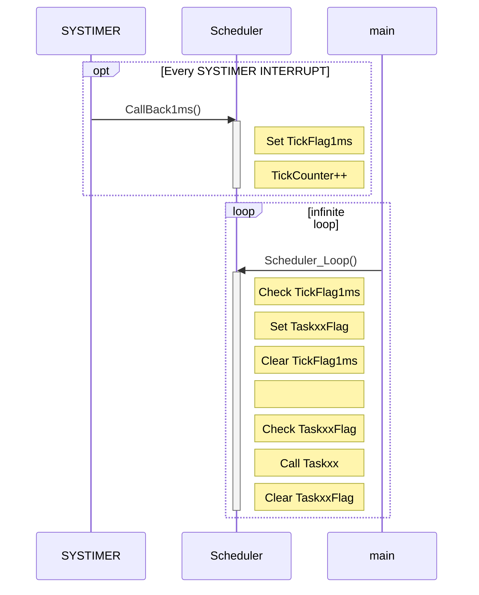
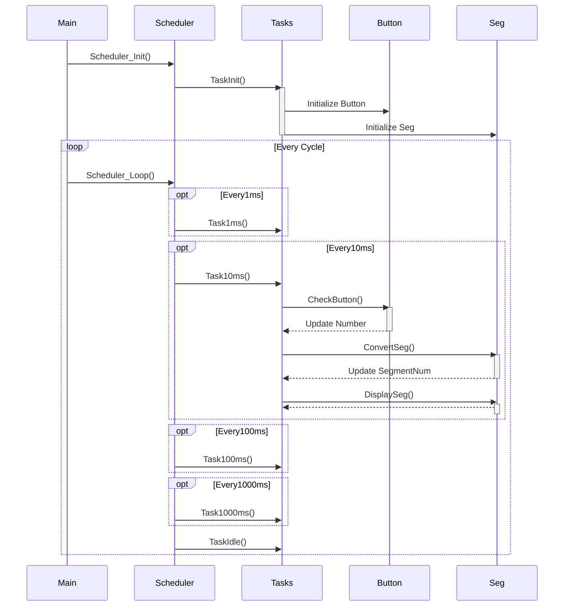

# Multiple infinite loops

## Objectives
*

## References
*

## Example Description 
*

## Hardware
* ​

## iLLD - related
*

## 추가적인 설명

### 간단한 Scheduler 활용하기

*   Scheduler 란 개발자가 원하는 조건(주기, 혹은 이벤트)에 따라서 해당하는 Task 를 실행시키는 프로그램이다.
*   infinite-loop 와 SystemTimer를 조합하여 프로그램의 실행을 흐트러트리지 않는 작은 Scheduler 를 만들 수 있다.

#### 사용자 측면

*   Main 함수에서 
    *   초기화 함수 Scheduler_Init() 함수를 호출하고
    *   Scheduler_Loop() 함수를 무한루프에서 호출한다.
*   Scheduler_Init() 함수는 TaskInit() 함수를 호출한다.
    *   사용자는 TaskInit() 함수에 필요한 초기화 동작에 대한 프로그래밍을 한다.
*   Scheduler_Loop() 함수는 설정된 주기 정보에 따라 Task 들을 호출한다.
    *   사용자는 실행주기에 맞는 Task에 해당 동작을 프로그래밍 한다.


```mermaid
sequenceDiagram
	Main ->> Scheduler: Scheduler_Init()
	loop Every Cycle
		Main ->> Scheduler: Scheduler_Loop()
        opt Every1ms
        	Scheduler ->> Tasks: Task1ms()
        end
        opt Every10ms
        	Scheduler ->> Tasks: Task10ms()
        end
        opt Every100ms
        	Scheduler ->> Tasks: Task100ms()
        end
        opt Every1000ms
        	Scheduler ->> Tasks: Task1000ms()
        end
       	Scheduler ->> Tasks: TaskIdle()

```

#### Scheduler 구현

*   SystemTimer 를 사용하여 가장 기본이 되는 주기신호를 발생시킨다.  일반적으로 이것을 Tick 이라 부른다.
    *   이 시스템 타이머를 사용하여 Tick Counter 변수를 기본 주기로 계속 증가시키고, 설정한 범위를 지나가면 다시 0이 되도록 동작시킨다.
*   SchedulerLoop() 함수에서는 Tick Counter 변수값을 참고하여 각 Task 의 주기를 관리하고 해당 주기에 따라 사용자의 Task 들을 호출한다.
*   SystemTimer 와 SchedulerLoop() 사이에는 Flag를 하나 사용하여 동기화 시킨다.
*   이와 같이 구현함으로써 ISR로 인한 실행 지연등을 최소화한 상태로 주기적인 사용자 Task 를 실행시킬 수 있게 된다.




```c
static uint32_t TickCounter = 0;
static bool TickFlag1ms = false;
static bool Task1msFlag = false;
static bool Task10msFlag = false;

static void TaskInit(void);
static void TaskIdle(void);
static void Task1ms(void);
static void Task10ms(void);

void CallBack1ms(){
	TickFlag1ms = true;
	TickCounter++;
	if(TickCounter == 10000){
		TickCounter = 0;
	}
}

void StaticScheduler_Init(void){
	TaskId1ms = SYSTIMER_CreateTimer(1000, SYSTIMER_MODE_PERIODIC, CallBack1ms, NULL);
	TaskInit();
	SYSTIMER_StartTimer(TaskId1ms);
}

void StaticScheduler_Loop(void){
	if(TickFlag1ms == true){
		if(TickCounter%1 == 0){
			Task1msFlag = true;
		}
		if(TickCounter%10 == 1){
			Task10msFlag = true;
		}
		/* 중간생략 */
        TickFlag1ms = false;
	}

	if(Task1msFlag == true){
		Task1ms();
		Task1msFlag = false;
	}

	if(Task10msFlag == true){
		Task10ms();
		Task10msFlag = false;
	}
	/* 중간생략 */
	TaskIdle();
}
```

#### 사용예 

*   간단한 Scheduler 를 사용하 SevenSegLab을 재구성하면 다음과 같다.



