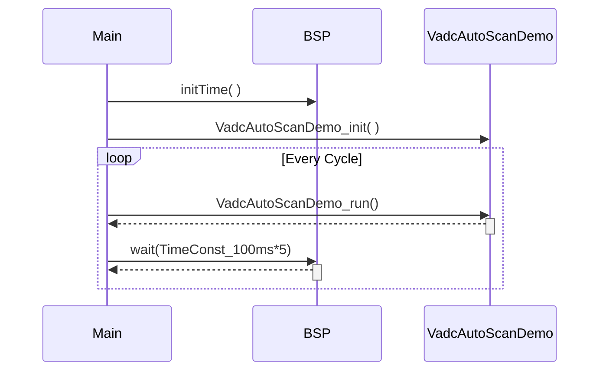
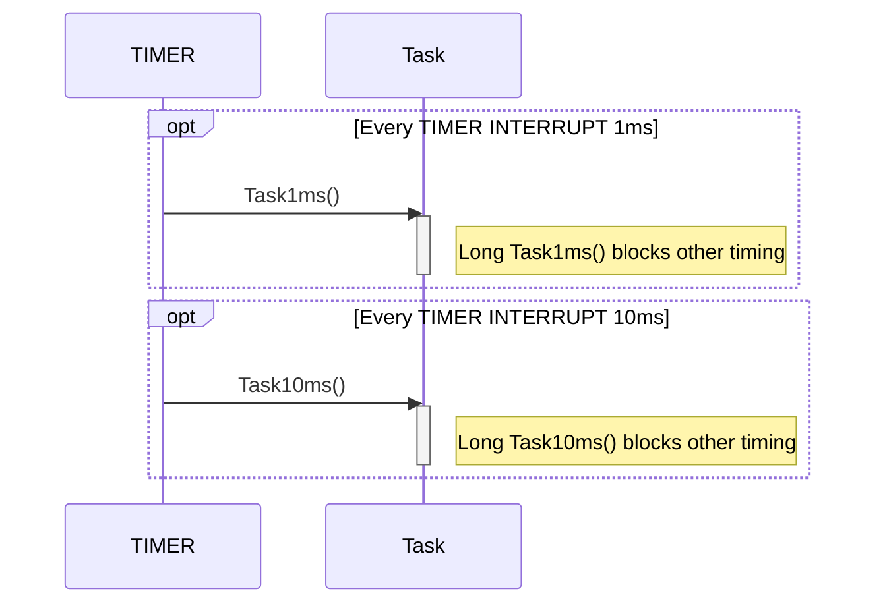
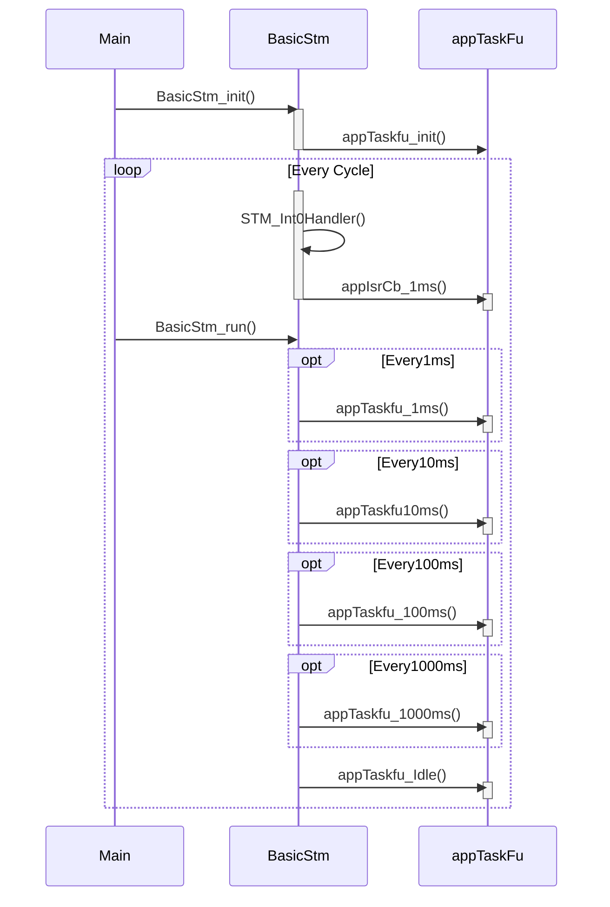
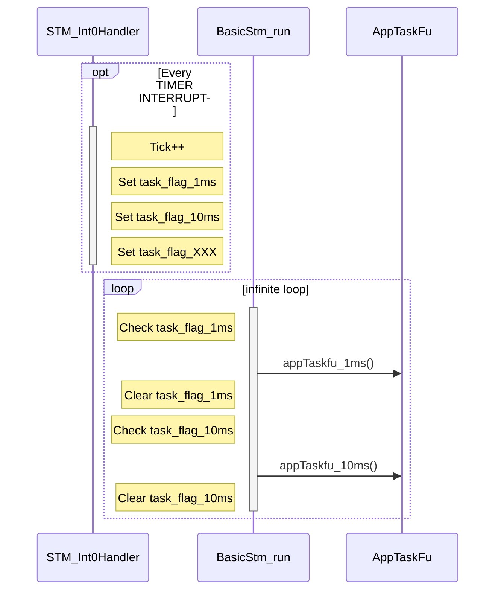

# Multiple infinite loops

## 시작하는 질문

* 실제 마이크로컨트롤러 프로그램을 구성할 때는 **여러개의 수행 주기를 가진 일들을 동시에 실행** 해야 하는데 어떻게 구성할 수 있지?


맞습니다. 임베디드 시스템, 특히 제어시스템의 경우에는 복수개(Multiple)의 주기를 갖는 여러가지 일(Task)들을 동시에 실행해야 합니다.  이런 역할을 해주는 전문적인 프로그램, RTOS(Real-Time OS),을  사용하면 가능합니다.  그러나 여러가지 일을 동시에 실행 시킬 때도 

* 인터럽트 처럼 하던 일을 중단 하고 다른 일을 하느냐 (선점형, Preemptive 방식)
* 아니면 하던 일이 끝날 때까지 기다렸다가 바로 시작하느냐 (비선점형, Non-preemptive 방식) 

으로 분류할 수 있습니다.  선점형 방식이 여러가지 면에서 성능이 좋습니다만, 이 좋은 성능을 사용하려면 선점을 함으로써 발생되는 문제를 방지하기 위하여 올바른 설계를 해야하고, RTOS에서 제공하는 서비스 들을 정확하게 알고 사용해야 합니다.  이 내용은 [OSEK-Certified ErikaOS & RT-Druid](./OsekCertificedErikaOsRtDruid.md) 에서 구체적으로 살펴보도록 하겠습니다.

대안적인 방법이 있습니다.  RTOS 처럼 성능이 좋지는 않지만, 예전 부터 현장의 엔지니어들이 애용하던 방법입니다.  주기적인 인터럽트를 발생시켜주는 인터럽트 하나와 간단한 함수 몇가지를 구성하면 쓸만한 스케쥴러를 만들 수 있습니다.


## Objectives

* BSP에서 제공하는 시간지연 함수 활용 방법을 익힌다.
* 시스템타이머를 사용하여 실행주기가 다른 여러개의 함수들을 실행시킬 수 있는 방법을 익힌다.

## References

**[Example Code]**

* MyIlldModule_TC23A - VadcAutoScan
* InfineonRacer_TC23A - TestStm


## Infinite-loop을 활용한 실행

* **MyIlldModule_TC23A - VadcAutoScan**  예제의 main 함수를 살펴보자.

```c
#include "SysSe/Bsp/Bsp.h"
#include "VadcAutoScanDemo.h"
  /* 중간 생략 */

int core0_main(void)
{
  /* 중간 생략 */
  IfxCpu_enableInterrupts();

  /* Demo init */
  VadcAutoScanDemo_init();

  initTime(); // Initialize time constants

  while (TRUE)
  {
    VadcAutoScanDemo_run();
    wait(TimeConst_100ms*5);  /* Waste CPU time for 500ms */
  }
}
```

  ​

* main 함수에 있는 Infinite-loop 에서 필요한 실행 코드들을 순차적으로 무한반복으로 실행하도록 구성되어 있다. 

* 전체 실행 주기를 맞추기 위해서 wait()함수를 만들어 loop 의 끝부분에서 실행하도록 되어 있다.

    * `initTime( )`함수를 호출하여 `TimeConst_100ms`를 초기화 한다.
    * `wait(TimeConst_100ms*5)`를 실행하여 약 500msec 의 시간지연을 발생시킨다.

* wait 함수(delay 함수)의 문제점1 : CPU Time의 낭비 

    * 이 예제에서 CPU는 다른 코드를 실행할 필요가 없으므로 문제가 없지만, 
    * 복잡한 다른 일을 실행해야 한다면 귀중한 CPU의 시간을 낭비

* wait 함수(delay 함수)의 문제점2 : 서로다른 여러 주기의 일을 실행시킬 수 없음

    * 간단하게 한 주기의 일을 시킬 경우에는 문제가 없지만,
    * 복잡한 여러 주기의 일을 실행시킬 경우에는 loop을 복잡하게 구성해야 한다.

[참고용 mermaid diagram source]



## 여러개의 Timer Interrupt 활용한 주기적 실행


* Timer interrupt을 사용하여서 특정 함수(혹은 태스크)를 개별적인 주기마다 수행 시킬 수 있다.

  ```c
  void ISR_Timer_1ms(void){
      /* 중간생략*/
      Task1ms();
  }

  void ISR_Timer_10ms(void){
      /* 중간생략*/
      Task10ms();
  }
  ```

* 특정 함수(혹은 태스크)가 Interrupt context로 실행된다.


    * 위의 예에서  `Task1ms()` , `Task10ms()`
    
    * 간단한 함수, 즉 실행시간이 길지 않을 경우에는 문제가 없지만, 
    
    * 복잡한 연산이나 반복등으로 실행시간이 길다면 다른 Interrupt의 실행을 방해할 수 있게 된다.

[참고용 mermaid diagram source]



## 간단한 Scheduler 활용하기

*   Scheduler 란 개발자가 원하는 조건(주기, 혹은 이벤트)에 따라서 해당하는 Task 를 실행시키는 프로그램이다.
*   infinite-loop 와 Hardware Timer(Stm)를 조합하여 프로그램의 실행을 흐트러트리지 않는 작은 Scheduler 를 만들 수 있다.

#### 사용자 측면

*   Main 함수에서 
    *   Scheduler 초기화 함수(`BasicStm_init( )`)를 호출하고
    *   무한루프에서 Scheduler Loop() 함수(`BasicStm_run( )`)를 호출한다.
*   Scheduler 초기화 함수는 Task 초기화 함수 (`appTaskFu_init()`)를 호출한다.
    *   사용자는 Task 초기화 함수에 필요한 초기화 동작을 프로그래밍 한다.
*   Scheduler Loop() 함수는 설정된 주기 정보에 따라 Task 들(`appTaskFu_xxxs`)을 호출한다.
    *   사용자는 실행주기에 맞는 Task에 해당 동작을 프로그래밍 한다.
*   Interrupt Context로 실행되어야 하는 부분은 Callback 함수 영역(`appIsrCb_1ms()`)에 프로그래밍 한다.

[참고용 mermaid diagram source]



#### Scheduler 구현

*   Stm 를 사용하여 가장 기본이 되는 주기신호를 발생시킨다.  일반적으로 이것을 Tick 이라 부른다.
    *   이 시스템 타이머를 사용하여 Tick 변수 (`g_Stm.counter`)를 기본 주기로 계속 증가시키고, 설정한 범위를 지나가면 다시 0이 되도록 동작시킨다.
*   Scheduler_Loop() 함수에서는 Tick Counter 변수값을 참고하여 각 Task 의 주기를 관리하고 해당 주기에 따라 사용자의 Task 들을 호출한다.
*   SystemTimer 와 SchedulerLoop() 사이에는 Flag를 하나 사용하여 동기화 시킨다.
*   이와 같이 구현함으로써 ISR로 인한 실행 지연등을 최소화한 상태로 주기적인 사용자 Task 를 실행시킬 수 있게 된다.

[참고용 mermaid diagram source]



```c
/******** BasicStm.c ***********/

void STM_Int0Handler(void)
{
    g_Stm.counter++;
    if(g_Stm.counter == 1000){
    	g_Stm.counter = 0;
    }

    task_flag_1m = TRUE;

    if(g_Stm.counter % 10 == 0){
    	task_flag_10m = TRUE;
    }
		/* 중간생략 */
    appIsrCb_1ms();
}

void BasicStm_run(void)
{
	if(task_flag_1m == TRUE){
		appTaskfu_1ms();
		task_flag_1m = FALSE;
	}

	if(task_flag_10m == TRUE){
		appTaskfu_10ms();
		task_flag_10m = FALSE;
	}
		/* 중간생략 */

	appTaskfu_idle();
}

```


```c
/*************** AppTaskFu.c *****************/
IFX_EXTERN boolean task_flag_1m;
IFX_EXTERN boolean task_flag_10m;
/* 중간생략 */
void appTaskfu_1ms(void);
void appTaskfu_10ms(void);
/* 중간생략 */
void appIsrCb_1ms(void);

void appTaskfu_1ms(void)
{
	/* 중간생략 */
}
void appTaskfu_10ms(void)
{
	/* 중간생략 */
    BasicLineScan_run();
    InfineonRacer_detectLane();
}

```
