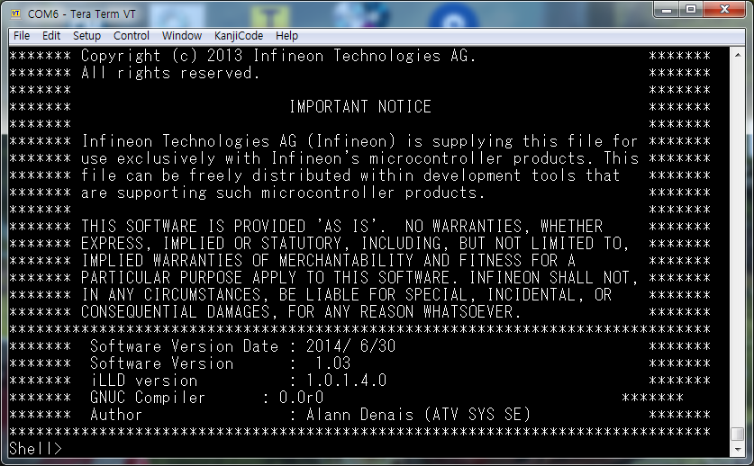
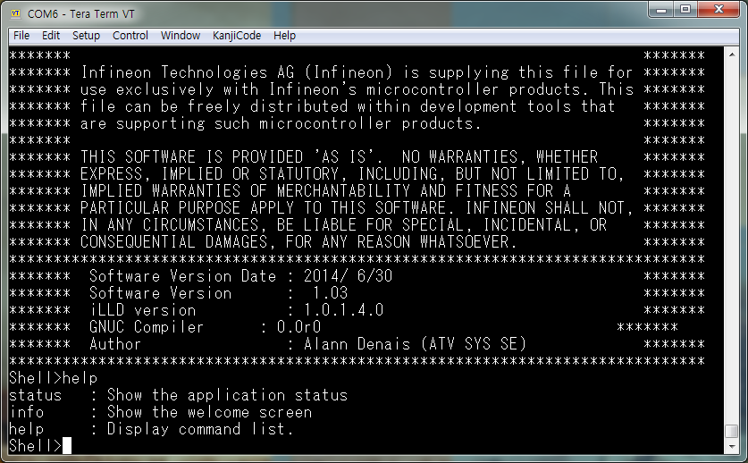

 때 매우 유용하게 사용할 수 있습니다.

(참고) 일반적인 네트워크, 이더넷이나 USB, SCI 등, 를 사용하지 않는 자동차의 제어시스템에서는 CAN 네트워크를 통하여 접속할 수 있는 환경을 구성합니다.  자동차 업계에서는 이런 접속 환경을 용도에 맞게 더욱 세분화 하여서 전용 프로그램을 별도로 사용하기도 합니다.


## Objectives

* Shell의 유용성을 이해하고 구성하는 방법을 익힌다.


## References

* iLLD_TC23A_1_0_1_4_0 - Modules/Service software/System Engineering/Communication/Shell
* iLLD_TC23A_1_0_1_4_0 - Modules/Service software/Standard interface: Data Pipe
* [Hello World](./HelloWorld.md)

**[Example Code]**

* MyIlldModule_TC23A - AsclinShell
* InfineonRacer_TC23A - TestShellInterface


## Example Description

다음의 기능을 수행하는 쉘을 구성한다.

* Booting 시, 혹은 "info"  명령 입력시 초기화면(Welcome 화면)을 출력한다.
* "status" 명령 입력시 시스템의 정보를 출력한다.
* "help" 명령 입력시 도움말을 출력한다.


## Background 정보

* 하드웨어 추상화 계층 (Hardware Abstraction Layer)
  * 물리적인 하드웨어와 실행되는 소프트웨어 사이에 존재
  * 하드웨어를 제어하기 위한 중간계층으로 하드웨어에 연관되어 설계
  * 사용자 입장에서 응용프로그램을 동작시키기 위해 하드웨어에 일일히 대응하지 않아도 됨


- Shell의 계층적 구조
  * 통신모듈인 경우 한 하드웨어에서 여러 종류의 통신방식을 제공하고,
  * 모듈과 프로토콜에 따라 대응을 해 줘야하기 때문에,
  * 사용자 입장에서 일관된 인터페이스로 통신하기 위해 한단계의 추상화 과정을 더 거침
  * Standard interface > Data Pipe를 통해 통신 계층을 한번 더 추상화
    - Shell을 통해서 송신 혹은 수신되는 data들을 data-pipe interface를 통해 관리


* Standard interface
  * 추상화를 통해 프로그램 구성을 도와주는 iLLD 내부 인터페이스 모듈


## AURIX - related

* 이번 예제에서 쉘은 아래 계층으로 Asc 모듈을 사용

## iLLD - related

### Shell 개요

- Asc 통신을 이용하여 사용자가 입력하는 명령을 확인하고 이에 따라 관련된 명령을 수행
  * Call-back 함수인 Command 함수를 구성하여 사용자가 입력하는 명령을 수행
  * Data-pipe를 통하여 사용자가 입력하는 명령어를 수신
  * 미리 정의된 Command에 따라서 명령을 수행


* Command
  * Call-back 함수로 구현되며,
  * {이름(call), 도움말, &data, &handler} 의 형태로 정의,
  * Shell을 통해 들어온 data가 call을 만족할 때 handler함수를 실행하는 구조.


- 동작에 관하여 아래 command 코드를 살펴보면
  * 사용자가 shell을 통해 "help"라는 입력을 준다면 data-pipe interface를 통하여 그 입력을 수신: ```g_AsclinShellInterface```
  * 그 후 정의된 "help"에 맞는 handler 함수를 수행: ```Ifx_Shell_showHelp```


```c
  // in AsclinShellInterface.c
  const Ifx_Shell_Command AppShell_commands[] = {
      {"status", "   : Show the application status", &g_AsclinShellInterface,       &AppShell_status,    },
      {"info",   "     : Show the welcome screen",   &g_AsclinShellInterface,       &AppShell_info,      },
      {"help",   SHELL_HELP_DESCRIPTION_TEXT,        &g_AsclinShellInterface.shell, &Ifx_Shell_showHelp, },
      IFX_SHELL_COMMAND_LIST_END
  };
  ```
* Terminal에 연결 후 실행하거나 info 명령어를 넣었을 때 나오는 화면
  

* "help" command를 입력하면 설정된 함수에 의해 다음과 같이 표시된다.
  


### Module Configuration

* Asc 통신 관련 초기화 생략

- 추상화 계층을 통해 시리얼 통신과 shell을 연결

```c
// in AsclinShellInterface.c
void initSerialInterface(void)
{
    {
        IfxAsclin_Asc_Config config;
        IfxAsclin_Asc_initModuleConfig(&config, &MODULE_ASCLIN0);

	// 중간 생략

        IfxAsclin_Asc_initModule(&g_AsclinShellInterface.drivers.asc, &config);

        // 초기화한 asc 설정을 data pipe와 connect
        IfxAsclin_Asc_stdIfDPipeInit(&g_AsclinShellInterface.stdIf.asc, &g_AsclinShellInterface.drivers.asc);
    }

	// 중간 생략

}
```

* Shell interface 초기화

```c
// in AsclinShellInterface.c
void AsclinShellInterface_init(void)
{

	//중간 생략

    {
        Ifx_Shell_Config config;
        Ifx_Shell_initConfig(&config);

        // 어떤 통신으로 데이터를 주고 받을 것인가
        config.standardIo     = &g_AsclinShellInterface.stdIf.asc;

        // 어떤 command를 사용할 것인가
        config.commandList[0] = &AppShell_commands[0];

        Ifx_Shell_init(&g_AsclinShellInterface.shell, &config);
    }
}
```

### Interrupt Configuration

* 인터럽트가 일어나면 data pipe 모듈을 통해 처리

```c
// in AsclinShellInterface.c
IFX_INTERRUPT(ISR_Asc_0_rx, 0, ISR_PRIORITY_ASC_0_RX);

void ISR_Asc_0_rx(void)
{
    IfxCpu_enableInterrupts();
    IfxStdIf_DPipe_onReceive(&g_AsclinShellInterface.stdIf.asc);
}

// rx 인터럽트와 유사
IFX_INTERRUPT(ISR_Asc_0_tx, 0, ISR_PRIORITY_ASC_0_TX);
IFX_INTERRUPT(ISR_Asc_0_ex, 0, ISR_PRIORITY_ASC_0_EX);
```


### Shell 동작

```c
// in AsclinShellInterface.c
void AsclinShellInterface_run(void)
{
    Ifx_Shell_process(&g_AsclinShellInterface.shell);
}
```
**[주의]**

* 이러한 서비스는 본래의 제어를 방해해선 안되며,
* Schedule의 비는 시간에 동작해야 한다.
* 각각의 command 역시 같은 맥락에서 최대한 짧고 간결하게, 꼭 필요한 동작만.


## 추가적인 설명

### In InfineonRacer

* STM을 바탕으로 스케줄러를 구성하고 idle 시간에 shell interface를 동작

```c
//in BasicStm.c
void BasicStm_run(void)
{

	if(task_flag_1m == TRUE){
		appTaskfu_1ms();
		task_flag_1m = FALSE;
	}

	if(task_flag_10m == TRUE){
		appTaskfu_10ms();
		task_flag_10m = FALSE;
	}

	if(task_flag_100m == TRUE){
		appTaskfu_100ms();
		task_flag_100m = FALSE;
	}

	if(task_flag_1000m == TRUE){
		appTaskfu_1000ms();
		task_flag_1000m = FALSE;
	}

	appTaskfu_idle();

}

//in AppTaskFu.c
void appTaskfu_idle(void){

    AsclinShellInterface_run();

}
```

* 연결된 차량의 state를 관측할 수 있도록 shell command를 구성
  * 차량의 servo motor angle을 확인
  * "srv"라는 command를 shell을 통해 입력
  * ```AppShell_srv```를 통하여 servo motor angle을 출력


```c
//in AsclinShellInterface.c
const Ifx_Shell_Command AppShell_commands[] = {
	// 중간 생략

    {"srv", "      : Servo Angle", &g_AsclinShellInterface, &AppShell_srv,    },

	// 중간 생략
};

boolean AppShell_srv(pchar args, void *data, IfxStdIf_DPipe *io)
{
	float32 vol;
	if (Ifx_Shell_matchToken(&args, "?") != FALSE)
    {
        IfxStdIf_DPipe_print(io, "  Syntax     : srv frac-value"ENDL);
    }
    else
    {
    	if(Ifx_Shell_parseFloat32(&args, &vol) == TRUE){
    		IR_setSrvAngle(vol);
    	}
    	IfxStdIf_DPipe_print(io, "  SrvAngle: %4.2f fraction"ENDL, IR_getSrvAngle());
    }

    return TRUE;

}

```
* 그렇다면 차량의 analog 데이터는 어떤 식으로 board 안으로 들어오는 것이지?

- 답은 앞으로 진행할 예제들을 통해 얻을 수 있다.

## 마치며...

목표 지점에 빨리 도달해야 겠다는 욕심으로 최종 결과물에만 집중하게 됩니다.  작은 일이면, 그리고 그 일을 한번만 할 것이라면, 좌우를 살피지 않고 앞만 보고 달려가는 것이 최선입니다.  그러나, 작지 않은 일이어서 중간에 몇번 쉬어야 하는 일이라면, 그리고 그 일을 계속 반복적으로 할 것이라면, 달려가기 전에 한번 생각해 보아야 합니다.  '일을 어떻게 나누어야지?', '이 일을 좀 더 효율적으로 할 수 있는 방법은 없을까?' 등등의 고민을 해야 합니다.  반복적으로 해야 하는 일이라면 효율적인 환경과 도구를 만들어 두는 것이 결과적으로는 더욱 빨리 최종 결과물을 만들 수 있는 방법입니다.

'Shell' 이 바로 그런 도구 입니다.  최종 결과물의 핵심 기능은 아니지만, 좋은 결과물을 만들어 낼 때 활용할 수 있는 좋은 도구가 됩니다.  이 프로젝트에서도 'Shell'을 적극적으로 사용할 것입니다.  귀찮지만, 그 수고러움은 편의성으로 충분히 보상됩니다.

