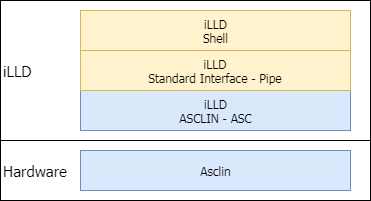

# My own terminal

## 시작하는 질문

* 터미날(Terminal), 쉘(Shell), 이런 것들이 뭐지?  이것이 왜 필요하지?


Window로 컴퓨터를 처음 접한 세대에게는 좀 낯설은 단어일 수 있습니다.  Window 로 대표되는 GUI 환경으로 컴퓨터를 사용하기 이전 시대에는 검은색 텍스트 창에 키보드로 타이핑을 하면서 컴퓨터를 사용했었습니다.  물론 그 시대에는 마우스도 없었습니다.  화려하지는 않지만, GUI 처럼 직관적이지는 않지만 지금 GUI로 하는 모든 조작을 다 했었습니다.  몇몇 작업들은 지금도 GUI 보다 텍스트 기반의 환경으로 하는 것이 훨씬 효율적입니다.  그중에 대표적인 것이 프로그래밍 입니다.  현재의 프로그래밍 작업환경은 예전의 텍스트 환경으로 했던 것들을 여러개의 윈도우를 사용해서 잘 정리해서 보여주는 것입니다.  내부적으로는 역시 텍스트 기반의 정보들이 움직이고 있습니다.  대표적으로 eclipse 의 console 창이 컴파일을 포함한 빌드 과정을 이러한 방식으로 보여주는 것입니다.

Window 의 cmd과 powershell, Linux의 sh, bash 같은 텍스트 기반의 사용환경을 쉘이라고 부릅니다.  이 쉘에서 제공하는 명령어들을 사용해서 컴퓨터를 조작할 수 있게 됩니다.  파일과 디렉토리 조작, 때로는 간단한 스크립트 언어를 제공해서 프로그래밍을 할 수도 있어서, 컴퓨터를 편하게 사용할 수 있는 기본 환경이 됩니다.  네트워크나 통신으로 원격으로 다른 컴퓨터의 쉘에 접속하여 조작하는 환경을 터미날이라 부릅니다.  Tera term, 혹은 putty 와 같은 터미날 프로그램이 많이 사용되고 있습니다.

컴퓨터의 쉘과 같은 환경이 임베디드 시스템에서도 꼭 필요할까요?  꼭 필요하지는 않습니다.  개발 단계에서는 터미날 보다 전용 디버거를 사용하는 것이 훨씬 효율적입니다.  그러나 시스템 시험단계, 혹은 유지보수를 하는 단계에서는 디버거를 연결하는 것이 어렵거나 불가능 할 수 있습니다.  이런 경우에는 통신을 통하여 기본적인 조작을 할 수 있는 쉘을 사용할 수 있도록 하는 것이 바람직 합니다.  결론적으로 쉘을 꼭 프로그래밍 할 필요는 없습니다.  그러나 몇몇 환경에서는 약간의 노력(?)을 들여서 쉘을 구성해 놓는 다면, 향후 시스템을 운영할 때, 유지보수 할 때 매우 유용하게 사용할 수 있습니다.

(참고) 일반적인 네트워크, 이더넷이나 USB, SCI 등, 를 사용하지 않는 자동차의 제어시스템에서는 CAN 네트워크를 통하여 접속할 수 있는 환경을 구성합니다.  자동차 업계에서는 이런 접속 환경을 용도에 맞게 더욱 세분화 하여서 전용 프로그램을 별도로 사용하기도 합니다.


## Objectives

* Shell의 유용성을 이해하고 구성하는 방법을 익힌다.


## References

* iLLD_TC23A_1_0_1_4_0 - Modules/ Service software/ System Engineering/ Communication/ Shell
* iLLD_TC23A_1_0_1_4_0 - Modules/ Standard interface/ Standard interface: Data Pipe
* [Hello World](./HelloWorld.md)

**[Example Code]**

* MyIlldModule_TC23A - AsclinShell
* InfineonRacer_TC23A - TestShellInterface


## Example Description 

다음의 기능을 수행하는 쉘을 구성한다.

* Booting 시, 혹은 "info"  명령 입력시 초기화면(Welcome 화면)을 출력한다.
* " status" 명령 입력시 시스템의 정보를 출력한다.
* "help" 명령 입력시 도움말을 출력한다.


## Background 정보

* Shell 의 계측적 구조



  

> 직렬 통신 계층을 Pipe 계층을 통해서 한번더 추상화
>
> ​	통신이 꼭 ASC일 필요는 없습니다. USB, LIN 등 다른 직렬 통신과 연결될 수도, 그러므로 중간에 StdIf-DPipe 계층을 사용
>
> 참고) 이런 용도로 하드웨어의 의존성을 좀 더 줄여서 추상화 시켜놓은 계층이 iLLD 의 Standard Interface 계층, 다른 예 Timer 


## AURIX - related

* 쉘은 아래 계층으로 Asc 모듈을 사용하고 있습니다.


## iLLD - related

### Module Configuration

* ASC  통신관련 초기화 생략

  ​


```c
void initSerialInterface(void)
{
    {   /** - Serial interface */
        IfxAsclin_Asc_Config config;
        IfxAsclin_Asc_initModuleConfig(&config, &MODULE_ASCLIN0);
		// 중간 생략       
        IfxAsclin_Asc_initModule(&g_AsclinShellInterface.drivers.asc, &config);

        /* Connect the standard asc interface to the device driver*/
        IfxAsclin_Asc_stdIfDPipeInit(&g_AsclinShellInterface.stdIf.asc, &g_AsclinShellInterface.drivers.asc);
    }
		// 중간 생략       
}

void AsclinShellInterface_init(void)
{
	//중간 생략
    /** - Initialise the serial interface and the console */
    initSerialInterface();
	//중간 생략

    /** - Simple print using IfxStdIf_DPipe_print API */
    IfxStdIf_DPipe_print(&g_AsclinShellInterface.stdIf.asc, ENDL "Hello world!  => print using IfxStdIf_DPipe_print()"ENDL);

	//중간 생략
    /** - Initialise the shell interface  */
    {
        Ifx_Shell_Config config;
        Ifx_Shell_initConfig(&config);
        config.standardIo     = &g_AsclinShellInterface.stdIf.asc;
        config.commandList[0] = &AppShell_commands[0];

        Ifx_Shell_init(&g_AsclinShellInterface.shell, &config);
    }
}

const Ifx_Shell_Command AppShell_commands[] = {
    {"status", "   : Show the application status", &g_AsclinShellInterface,       &AppShell_status,    },
    {"info",   "     : Show the welcome screen",   &g_AsclinShellInterface,       &AppShell_info,      },
    {"help",   SHELL_HELP_DESCRIPTION_TEXT,        &g_AsclinShellInterface.shell, &Ifx_Shell_showHelp, },
    IFX_SHELL_COMMAND_LIST_END
};
```


### Interrupt Configuration

```c
IFX_INTERRUPT(ISR_Asc_0_rx, 0, ISR_PRIORITY_ASC_0_RX);

void ISR_Asc_0_rx(void)
{
    IfxCpu_enableInterrupts();
    IfxStdIf_DPipe_onReceive(&g_AsclinShellInterface.stdIf.asc);
}

void ISR_Asc_0_tx(void){ /* rx 인터럽트와 유사하게 */ }
void ISR_Asc_0_ex(void){ /* rx 인터럽트와 유사하게 */ }

```


### Shell 동작

```c
void AsclinShellInterface_run(void)
{
    /** Handle the shell interface */
    Ifx_Shell_process(&g_AsclinShellInterface.shell);
}
```

> * 중요한 이야기... 이런 서비스는 제어일을 방해하면 안됩니다.  그러므로 schedule 상으로 idle 같이 노는 시간에 서비스를 해줘야 합니다.
> * 그리고 각 명령들, 이 예에서는 AppShell_status, AppShell_info 등, 이 실행시간이 너무 길면 제어 스케쥴링을 흐트러 놓을 수 있습니다.  짧고 간결하게, 꼭 필요한 동작만


## 추가적인 설명

> InfineonRacer 에서 명령어 한두개 정도 선택해서 어떤 방식으로 설계되었는지 설명해 주세요.


## 마치며...

