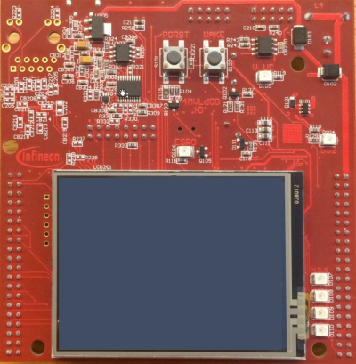
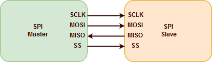
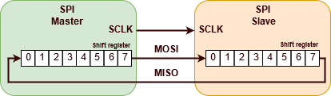
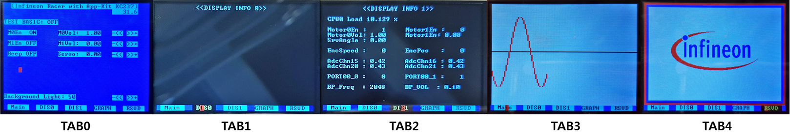

# TFT as modern Man-Machine Interface

## 시작하는 질문

* Application Kit에 TFT 가 부착되어 있네?  이것을 사용해서 필요한 정보를 출력하고, 사용자가 조정하는 정보들을 입력 받으면 폼나겠는 걸?  그런데 관련 정보는 어디서 찾을 수 있지?  AURIX 사용자 메뉴얼에도 TFT 모듈이라는 것은 없는데...

사용자에게 필요한 정보를 보여주고 입력을 받는 장치를 MMI, Man-Machine Interface, 라고 부릅니다.  기존에 스위치와 LED의 조합으로 보여주던 정보들을 그래픽 LCD와 터치 기능으로 MMI를 구성하는 사례들을 점점 많이 볼 수 있습니다.  

보기가 좋다고 개발하는 사람들도 편해지기만 한 것은 아닙니다.  TFT LCD를 구동하기 위해서 전용 하드웨어를 개발해야 하고, 이 하드웨어를 구동하는 소프트웨어도 구성해야 합니다.  Application Kit 의 경우에는 Xilinx의 FPGA를 사용하여 드라이버를 구성하고, SPI 통신으로 AURIX와 인터페이스 하도록 구성되어 있습니다.  그러므로 AURIX 쪽에서는 하드웨어의 구성에 대한 구체적인 정보를 알 필요는 없이 SPI 통신으로 주고 받는 정보의 형태들만 이해하면 됩니다.  이것도 예제 코드로 잘 구성되어 있어서 관련 함수의 호출만 이해하면 TFT를 사용하는 것에는 문제가 없습니다.  하드웨어에 대한 구체적인 정보를 모르더라도, 소프트웨어 라이브러리만 이해 한다면 필요한 기능을 마음껏 사용할 수 있는 것! 이것이 라이브러리의 매력 입니다.  

------

## Objectives

* TFT 드라이버를 이용하여 LCD 와 터치 기능을 이용할 수 있는 Man-Machine Interface를 구현할 수 있습니다.

## References

* TC23x TC22x Family User's Manual v1.1 - Chap 20 QSPI

**[Example Code]**

* InfineonRacer_TC23A - TftApp

------


## Example Description

* TFT 드라이버를 이용하여 Text, Bar, Menu, Graph 등을 LCD에 출력하고, 터치 스크린으로 정보를 입력할 수 있습니다.


## Background 정보

* Graphic User Interface (GUI)

  * 개념

    * 사용자가 텍스트 기반 인터페이스 대신 그래픽 아이콘 및 보조 표식과 같은 **시각적 표시기**를 통해 전자 장치와 상호작용할 수 있는 **사용자 인터페이스** 유형입니다.

  * 장점

    * 프로그램이 동작할 때 **내부 변수**를 쉽게 **관측**할 수 있습니다.
    * 추가적인 **Debugger**가 필요없습니다.
    * 간단하게 **입력을 바꿀 수 있고**, 그 때마다 다시 프로그램을 다운로드 할 필요가 없습니다.


* Application Kit TC2X7의 GUI 하드웨어 구성요소: 터치 스크린

  

  * 사용자 **입력**: 스크린 감압 센서
    * 사용자의 터치 입력을 받기 위한 스크린 감압 센서가 존재합니다.
    * 사용자가 스크린을 누르면 터치 스크린 controller (ADS7843E) 가 압력받은 위치를 알려줍니다.
  * 사용자 **출력**: TFT 스크린
    * Text, Graph, Picture, .. 등 다양한 그래픽 요소들을 출력할 수 있습니다.
  * 터치 스크린과 마이크로프로세서는 **SPI 통신**으로 정보를 주고 받습니다.


- AURIX 기반 GUI 소프트웨어 라이브러리: Conio TFT
  - Conio TFT driver
    - 사용자가 직접 구현하기 어려운 Display 기능이나 터치 스크린 정보를 받아오는 기능을 손쉽게 이용할 수 있도록 함수가 구현되어 있습니다.
  - Conoi TFT driver를 사용하기 위해 필요한 files
    - 0_Src/CDrv/Tricore/Qspi
    - 0_Src/CDrv/Tricore/Tft
  - GUI를 구성하기 필요한 application files
    - 0_Src/AppSw/Tricore/TftApp

      ​


#### 추가 설명

- SPI 통신 (Serial Peripheral Interface)

    - SPI 통신은 동기화된 시리얼 통신 방법입니다.

    - 주로, 근거리 통신에 사용됩니다.

    - 1980년대 모토롤라에 의해 개발되었습니다.

    - 특징으로는 Master-Slave 구조의 양방향 구조이며, 하나의 Master와 다수 개의 Slave가 존재하게 됩니다.

    - SPI는 four-wire 시리얼 버스라고도 불리는 데, 그 이유는 통신에 총 4개의 선을 사용하기 때문입니다. (SCLK: Serial Clock, MOSI: Master Output Slave Input, MISO: Master Input Slave Output, Slave Select)

      

    - 데이터 저장 및 전송을 위해 shift register가 사용됩니다.
      


## iLLD - related

* AURIX 기반 GUI 구성 예제

  * 많은 내용을 담기에는 Display 크기에 한계가 있습니다.
  * 그러한 한계를 해결하기 위하여 여러 개의 TAB으로 GUI를 구성할 수 있습니다. 본 예제 코드에서는 5개의 TAB으로 화면을 구성하였습니다.
  * 각 TAB은 화면 하단 TAB 메뉴를 터치함으로써 선택할 수 있습니다.

* 하단 TAB 메뉴 구성
  * **TAB0:** 초기 화면이자 하단 TAB  메뉴 중 **[Main]**을 터치했을 때 나타나는 화면입니다. 터치를 통해 motor를 켜고 끄고, 구동 속도를 높이는 등 간단한 설정을 할 수 있습니다.
  * **TAB1:** 하단 TAB  메뉴 중 **[DIS0]**를 터치했을 때 나타나는 화면입니다. 이 TAB에는 Text를 출력할 수 있도록 구성되어 있습니다.
  * **TAB2:** 하단 TAB  메뉴 중 **[DIS1]**을 터치했을 때 나타나는 화면입니다. 이 TAB에는 내부변수를 모니터링하는 예제로 구성되어 있습니다. 현재 motor의 속도, ADC의 값, Port에서 출력되는 값 등이 예시로 출력됩니다.
  * **TAB3:** 하단 TAB  메뉴 중 **[GRAPH]**를 터치했을 때 나타나는 화면입니다. 내부 변수를 시간 축에 대해 실시간으로 plot하도록 구성된 예제입니다.
  * **TAB4:** 하단 TAB  메뉴 중 **[RSVD]**를 터치했을 때 나타나는 화면입니다. 그래픽을 출력할 수 있도록 설정되어 있으며, 그림 파일을 불러와서 출력하는 예제입니다.

  

* 예제의 폴더 구조

  * **app**
    * GUI를 구성하는 함수를 호출합니다. 
    * 이 때, 크게 두 가지 함수 호출 방법을 모두 사용합니다.
      * 일정 시간마다 주기적으로 함수를 호출하는 방법이 있습니다. 
      * 스크린을 터치했을 때 인터럽트로 호출하는 방법이 있습니다.
    * 각 TAB에 관련된 함수들은 **tabs** 하단에 개별적으로 정의되어 있습니다. (tab__#.h, tab_#.c)
  * **tab_config**
    * 하단 TAB 메뉴를 구성할 수 있습니다.
  * **tabs**
    * 각 TAB의 GUI를 구성하기 위한 함수들이 개별적으로 정의되어 있습니다. 
    * 인터럽트 형식으로 호출되는 함수들은 Handler 형태로 정의되어 있습니다.


### Module Configuration

```c
// Cpu0_Main.c
int core0_main(void)
{
	// 기타 Configuration 생략

    // 터치 스크린을 사용하기 위한 Port 설정
    // CS to 터치
    IfxPort_setPinModeInput(touch_USE_CHIPSELECT.pin.port, touch_USE_CHIPSELECT.pin.pinIndex, IfxPort_Mode_inputPullUp);
    // CS to tft
    IfxPort_setPinModeInput(TFT_USE_CHIPSELECT.pin.port, TFT_USE_CHIPSELECT.pin.pinIndex, IfxPort_Mode_inputPullUp);
    // INT from 터치
    IfxPort_setPinModeInput(touch_USE_INT.port, touch_USE_INT.pinIndex, IfxPort_Mode_inputPullUp);

  // 생략
}


// tft_app.c
// 각 TAB의 Display 모드와 구조를 설정을 한다
const TCONIODMENTRY conio_displaymode_list[CONIO_MAXDISPLAYS] =
{
    // 구조: {Display mode의 이름, Display Info}
    // TAB_CONFIG: 화면 하단 TAB 메뉴를 구성
    // TAB0, TAB1, TAB2는 글자를 출력할 수 있도록 TEXTMODE로 설정
    // TAB3, TAB4는 그래픽요소를 출력할 수 있도록 GRAPHICMODE_16COLOR 설정
    { DISPLAY_TAB_CONFIG, {(uint8 *) & display_menu_config, (uint8 *) & displaycolor_menu_config, TEXTMODE, WHITE, TERMINAL_MAXX, 1, 0, 0} },
    { DISPLAY_TAB0, {(uint8 *) & display_tab0, (uint8 *) & displaycolor_tab0, TEXTMODE, WHITE, TERMINAL_MAXX, TERMINAL_MAXY-1, 0, 0} },
    { DISPLAY_TAB1, {(uint8 *) & display_tab1, (uint8 *) & displaycolor_tab1, TEXTMODE, WHITE, TERMINAL_MAXX, TERMINAL_MAXY-1, 0, 0} },
    { DISPLAY_TAB2, {(uint8 *) & display_tab2, (uint8 *) & displaycolor_tab2, TEXTMODE, WHITE, TERMINAL_MAXX, TERMINAL_MAXY-1, 0, 0} },
    { DISPLAY_TAB3, {(uint8 *) & display_tab3, 0, GRAPHICMODE_16COLOR, WHITE, TERMINAL_MAXX, TERMINAL_MAXY, 0, 0} },
    { DISPLAY_TAB4, {(uint8 *) & display_tab4, 0, GRAPHICMODE_16COLOR, WHITE, TERMINAL_MAXX, TERMINAL_MAXY, 0, 0} }
};

void tft_app_init (uint8 RtcRunning)
{
    IfxSrc_init(&TFT_UPDATE_IRQ, ISR_PROVIDER_CPUSRV0, ISR_PRIORITY_CPUSRV0);
    IfxSrc_enable(&TFT_UPDATE_IRQ);

    // Handler를 통해 스크린을 터치했을 때 특정 function을 호출시킬 수 있다
    // conio_driver에 각 TAB의 handler의 pointer를 저장한다
	// tab_config_handler
    conio_driver.p_tab_config = (TDISPLAYENTRY *)&tab_config_list[0];

    // tab0_handler
    conio_driver.p_tab0_menulist = (TDISPLAYENTRY *)&tab0_menulist[0];

    // tab1_handler
    conio_driver.p_tab1_list = (TDISPLAYENTRY *)&tab1_DIS0list[0];

    // tab2_handler
    conio_driver.p_tab2_list = (TDISPLAYENTRY *)&tab2_DIS1list[0];

    // low-level driver initialization
    tft_init ();                //initializes tft driver
    touch_init ();
    conio_init ((const pTCONIODMENTRY)conio_displaymode_list);

#ifdef TFT_OVER_DAS
    conio_driver.pdasmirror = &das_buffer[0];   //a buffer is available for PC sharing
    conio_driver.dasstatus = 0; //we can update
#endif

    // 각 TAB을 초기화
    // tab0_init
    tab0_init();

    // tab1_init
    tab1_init();

    // tab2_init
    tab2_init();

    // tab3_init
    tab3_init();

    // tab4_init
    tab4_init();

    tft_ready = TRUE;
}


// tab_config.c
// 화면 하단 TAB 메뉴를 구성하기 위한 Handler
// TAB의 갯수만큼 'tab_config_list' 배열의 entry 갯수를 설정
// TDISPLAYENTRY 형식의 구조체를 이용하여 TAB을 추가, 제거, 수정
// standard display color, select display color, x_min, x_max, y, 터치됬을 때 function, 0, input func, "TAB 이름"
TDISPLAYENTRY tab_config_list[6] = {
  {(CYAN << 4) | BLACK, (BLACK << 4) | YELLOW, 1, 6, (TERMINAL_MAXY-1), &tab_select_tab_0, 0, &tab_input, " Main "},      // tab 0
  {(CYAN << 4) | BLACK, (BLACK << 4) | YELLOW, 9, 14, (TERMINAL_MAXY-1), &tab_select_tab_1, 0, &tab_input, " DIS0 "},   // tab 1
  {(CYAN << 4) | BLACK, (BLACK << 4) | YELLOW, 17, 22, (TERMINAL_MAXY-1), &tab_select_tab_2, 0, &tab_input, " DIS1 "},  // tab 2
  {(CYAN << 4) | BLACK, (BLACK << 4) | YELLOW, 25, 30, (TERMINAL_MAXY-1), &tab_select_tab_3, 0, &tab_input, "GRAPH "},   // tab 3
  {(CYAN << 4) | BLACK, (BLACK << 4) | YELLOW, 33, 38, (TERMINAL_MAXY-1), &tab_select_tab_4, 0, &tab_input, " RSVD "},    // tab 4
  {0, 0, 0, 0, 0, 0, 0, 0, " "}
};
```


### Module Behavior

* app
  * GUI를 구성하는 함수를 호출합니다. 

```c
// tft_app.c

// 일정 시간마다 주기적으로 함수를 호출
extern void tft_app_run(void){
	// Operating time
	float32 tmp = getCpuSeconds();
	tmp = tmp + REFRESH_TFT*0.1;
	setCpuSeconds(tmp);

	// tab0_run
	tab0_run();

	// tab1_run
	tab1_run();

	// tab2_run
	tab2_run();

	// tab3_run
	tab3_run();

	// tab4_run
	tab4_run();

	IfxSrc_setRequest(&TFT_UPDATE_IRQ);    //trigger the tft lib
}

// 스크린을 터치했을 때 인터럽트로 호출
void cpu_service0Irq(void)
{
	__enable();
	if (tft_ready == 0) return;
    touch_periodic ();
    // 터치 periodic 에서 받은 x좌표, y좌표가 conio periodic의 입력이 됨
    
    // 사용자가 스크린을 터치하거나 display 내용이 바뀌었을 때 호출되는 함수
    // 위의 'tft_app_init' 함수에서 저장한 handler의 pointer가 아래 함수의 input이 된다.
    conio_periodic (touch_driver.xdisp, touch_driver.ydisp, conio_driver.p_tab0_menulist, conio_driver.p_tab_config);
    conio_driver.blinky += 1;
}
```


* TAB0
  * 초기 화면이자 하단 TAB  메뉴 중 **[Main]**을 터치했을 때 나타나는 화면입니다. 
  * 터치를 통해 motor를 켜고 끄고, 구동 속도를 높이는 등 간단한 설정을 할 수 있습니다.

```c
// tab_0.c

// tab0의 handler
// 스크린을 터치했을 때 인터룹트 형식으로 호출되는 함수들이
// Handler의 기본 구조
// {Display color, 터치되었을 때 color, entry의 x위치 시작점, entry의 x위치 끝점, entry의 y위치.
//  터치되었을 때 동작하는 함수, 기본 display할 함수, input 함수, 출력할 test, symbol}
TDISPLAYENTRY tab0_menulist[20] = {
{(CYAN << 4) | BLACK, (BLACK << 4) | YELLOW, 2, 31, 0, &menu_select_title, &menu_display, &menu_input,"[Infineon Racer with App-Kit XC237]"},

// 생략

{(CYAN << 4) | BLACK, (BLACK << 4) | YELLOW, 0, 16, 17, &menu_select_background_light, &menu_display_background_light, &menu_input_background_light, "Background Light: "},
{(CYAN << 4) | BLACK, (BLACK << 4) | YELLOW, 30, 32, 17, &menu_select_background_lightminus, &menu_display, &menu_input, "-<<"},
{(CYAN << 4) | BLACK, (BLACK << 4) | YELLOW, 34, 36, 17, &menu_select_background_lightplus, &menu_display, &menu_input, ">>+"},

{0, 0, 0, 0, 0, 0, 0, 0, " "}  //LAST ENTRY
};

// tab0의 초기화를 위한 function
void tab0_init(void){

}

// 일정 시간마다 주기적으로 호출되는 function
void tab0_run(void){

}

// 아래는 Main 창의 맨 첫 번째 줄인 "TFT Demo for App Kit XC237"을 출력하기 위한 3개의 함수

// 기본 display할 함수
void menu_display (sint32 ind, TDISPLAYENTRY * pdisplayentry)
{
    // Display color 설정, 설정하고자 하는 color는 위의 TDISPLAYENTRY 구조체에 입력
    conio_ascii_textattr (DISPLAY_MENU, pdisplayentry->color_display); 
	// 출력될 좌표 설정, 설정하고자 하는 좌표는 위의 TDISPLAYENTRY 구조체에 입력
    conio_ascii_gotoxy (DISPLAY_MENU, pdisplayentry->xmin, pdisplayentry->y); 
    // String 출력, 출력하고자 하는 string은 위의 TDISPLAYENTRY 구조체에 입력
    conio_ascii_cputs (DISPLAY_MENU, &pdisplayentry->text[0]); 
}

// 터치되었을 때 동작하는 함수
void menu_select (sint32 ind, TDISPLAYENTRY * pdisplayentry)
{
    // 터치했을 때 color 설정, 설정하고자 하는 color는 위의 TDISPLAYENTRY 구조체에 입력
    conio_ascii_textattr (DISPLAY_MENU, pdisplayentry->color_select); 
    // 출력될 좌표 설정, 설정하고자 하는 좌표는 위의 TDISPLAYENTRY 구조체에 입력
    conio_ascii_gotoxy (DISPLAY_MENU, pdisplayentry->xmin, pdisplayentry->y); 
    // String 출력, 출력하고자 하는 string은 위의 TDISPLAYENTRY 구조체에 입력
    conio_ascii_cputs (DISPLAY_MENU, &pdisplayentry->text[0]); 
    if ((touch_driver.touchmode & MASK_touch_UP) != 0)
    {
        touch_driver.touchmode &= ~MASK_touch_UP;   //clear
        // 현 entry는 터치되었을 때 특별한 동작이 없다
    }
}

sint32 menu_input (sint32 ind, TDISPLAYENTRY * pdisplayentry)
{
    __debug ();	// input 받는 것이 없다
    return (0);
}// input 함수


// 아래는 Main 창에서 Background light를 설정하기 위한 함수

// 기본적으로 출력되는 함수
void menu_display_background_light (sint32 ind, TDISPLAYENTRY * pdisplayentry)
{
    conio_ascii_textattr (DISPLAY_MENU, pdisplayentry->color_display); // Display color 설정
    conio_ascii_printfxy (DISPLAY_MENU, pdisplayentry->xmin, pdisplayentry->y, (const uint8 *)"Background Light: %u", (unsigned int) backgroundlightsize); // xmin, y에 해당 string 출력
} 


sint32 menu_input_background_light (sint32 ind, TDISPLAYENTRY * pdisplayentry)
{
    // conio_driver를 통해 받은 background light input을 'backgroundlightsize' 변수에 저장
    // 'backgroundlightsize' 변수는 위의 display 함수에 의해 출력
    uint32 temp;
    sint32 result;
    result = sscanf ((char *) &conio_driver.scanftext[0], "%u", (unsigned int *) &temp);
    if (result != 1)
        return (-1);
    if (temp < backgroundlightmin)
        temp = backgroundlightmin;
    if (temp > backgroundlightmax)
        temp = backgroundlightmax;

    backgroundlightsize = temp;

    return (0);
} 

// 해당 위치를 눌렀을 때, Keyboard가 나타나게 되고 Keyboard input mode가 된다
void menu_select_background_light (sint32 ind, TDISPLAYENTRY * pdisplayentry)
{
    conio_ascii_textattr (DISPLAY_MENU, pdisplayentry->color_select);    //MENUE
    conio_ascii_printfxy (DISPLAY_MENU, pdisplayentry->xmin, pdisplayentry->y, (const uint8 *)"Change Light: %u", (unsigned int) backgroundlightsize);   //MENUE
    if ((touch_driver.touchmode & MASK_touch_UP) != 0)
    {
        strcpy ((char *) &conio_driver.scanfdescr[0], "Light: ");    //PREP of Keyboard Mode
        sprintf ((char *) &conio_driver.scanftext[0], "%u", (unsigned int) backgroundlightsize); //right upper value
        conio_driver.scanfx = 0;    //actual cursor
        conio_driver.dialogmode = KEYBOARDON; //Keyboard input mode
        conio_driver.input = pdisplayentry->input;
        conio_driver.inputid = ind;
        touch_driver.touchmode &= ~MASK_touch_UP;   //clear
    }
} 

// ">>+" 를 눌렀을 때 동작하는 함수
void menu_select_background_lightplus (sint32 ind, TDISPLAYENTRY * pdisplayentry)
{
    // Backgroundlight delta 만큼 'backgroundlightsize' 변수를 증가시킨다
    conio_ascii_textattr (DISPLAY_MENU, pdisplayentry->color_select);
    conio_ascii_gotoxy (DISPLAY_MENU, pdisplayentry->xmin, pdisplayentry->y);
    conio_ascii_cputs (DISPLAY_MENU, (uint8 *) ">>+");
    if ((touch_driver.touchmode & MASK_touch_UP) != 0)
    {
        touch_driver.touchmode &= ~MASK_touch_UP;   //clear
        if (backgroundlightsize < backgroundlightmax)
            backgroundlightsize += backgroundlightdelta;
    }
} 

// "-<<" 를 눌렀을 때 동작하는 함수
void menu_select_background_lightminus (sint32 ind, TDISPLAYENTRY * pdisplayentry)
{
    // Backgroundlight delta 만큼 'backgroundlightsize' 변수를 감소시킨다
    conio_ascii_textattr (DISPLAY_MENU, pdisplayentry->color_select);
    conio_ascii_gotoxy (DISPLAY_MENU, pdisplayentry->xmin, pdisplayentry->y);
    conio_ascii_cputs (DISPLAY_MENU, (uint8 *) "-<<");
    if ((touch_driver.touchmode & MASK_touch_UP) != 0)
    {
        touch_driver.touchmode &= ~MASK_touch_UP;   //clear
        if (backgroundlightsize > backgroundlightmin)
            backgroundlightsize -= backgroundlightdelta;
    }
}
```


* TAB1
  * 하단 TAB  메뉴 중 **[DIS0]**를 터치했을 때 나타나는 화면입니다. 
  * 이 TAB에는 Text를 출력할 수 있도록 구성되어 있습니다.

```c
// tab_1.c

// 사용자가 터치했을 때 호출시킬 function이 없으므로 현재 reserved 상태
TDISPLAYENTRY tab1_DIS0list[0] = {
{0, 0, 0, 0, 0, 0, 0, 0, " "}  // RESERVED ENTRY
};

// tab1의 초기화를 위한 function
void tab1_init(void){
    // string을 출력하기 위한 함수
    // input: 출력하고자 하는 TAB이름, string이 시작할 x좌표, y좌표, 출력하고자하는 string
    conio_ascii_printfxy (DISPLAY_TAB1, 10, 0, (uint8 *)"<<DISPLAY INFO 0>>"); // TAB1에 10번째 x칸, 0번째 y칸부터 "<<DISPLAY INFO 0>>"를 출력합니다.
}

//일정 시간마다 주기적으로 호출되는 function
void tab1_run(void){

}
```


* TAB2
  * 하단 TAB  메뉴 중 **[DIS1]**을 터치했을 때 나타나는 화면입니다.
  * 이 TAB에는 내부변수를 모니터링하는 예제로 구성되어 있습니다.
  * 현재 motor의 속도, ADC의 값, Port에서 출력되는 값 등이 예시로 출력됩니다.

```c
// tab_2.c

// 사용자가 터치했을 때 호출시킬 function이 없으므로 현재 reserved 상태
TDISPLAYENTRY tab2_DIS0list[0] = {
{0, 0, 0, 0, 0, 0, 0, 0, " "}  // RESERVED ENTRY
};

// tab2의 초기화를 위한 function
void tab2_init(void){
    conio_ascii_printfxy (DISPLAY_TAB2, 10, 0, (uint8 *)"<<DISPLAY INFO 1>>");
}

//일정 시간마다 주기적으로 호출되는 function
void tab2_run(void){
    
    // 관측하고 싶은 내부 변수가 text형식으로 출력된다
	conio_ascii_printfxy (DISPLAY_TAB2, 1,  2, (uint8 *)"CPU0 Load %.3f %c ", getCpuLoad(), 0x25);

	conio_ascii_printfxy (DISPLAY_TAB2, 0,  4, (uint8 *)" Motor0En : %4d     Motor1En : %4d", IR_getMotor0En(), IR_getMotor1En());
	conio_ascii_printfxy (DISPLAY_TAB2, 0,  5, (uint8 *)" Motor0Vol: %4.2f     Motor1En: %4.2f", IR_getMotor0Vol(), IR_getMotor1Vol());
	 // 생략
}
```


* TAB3
  * 하단 TAB  메뉴 중 **[GRAPH]**를 터치했을 때 나타나는 화면입니다. 
  * 내부 변수를 시간 축에 대해 실시간으로 plot하도록 구성된 예제입니다.
  * 본 예시에서 X축은 TFT operating time을 의미하고, Y축은 관측하고자 하는 값을 나타냅니다.

```c
// tab_3.c

// tab3의 초기화를 위한 function
void tab3_init(void){
	g_xLCD_old = 0;
	g_yLCD_old = TFT_YSIZE/2;

    g_xLCD_Index = 0;
    
    draw_Background();
    plot_Axis();
}

//일정 시간마다 주기적으로 호출되는 function
void tab3_run(void){

	float32 ymin, ymax;
	uint32	LCD_X, LCD_Y;

    // measuredX: 관측하고자 하는 x, 현재 TFT operating time
    // measuredY: 관측하고자 하는 y, 현재 operating time에 대한 sin함수 값
	float32	measuredX = getCpuSeconds();
	float32 measuredY = calSin(measuredX);
//	float32 measuredY = calCos(measuredX);

    // plot하고자 하는 y의 min, max 값을 저장
	ymin = -1;
	ymax = 1;

	MeastoLCD(ymin, ymax, measuredX, measuredY, &LCD_X, &LCD_Y); // LCD에 출력하기 위한 좌표로 변환하는 함수
	plotFunction(LCD_X, LCD_Y, RED); // plot하는 함수, input: LCD에 출력하기 위한 x좌표, y좌표, graph의 color
}

```


- TAB4
  - 하단 TAB  메뉴 중 **[RSVD]**를 터치했을 때 나타나는 화면입니다.
  - Infineon logo 그림이 예시로 출력됩니다.

```c
// tab_4.c

// tab4의 초기화를 위한 function
void tab4_init(void){
	drawInfineonLogo();
}

//일정 시간마다 주기적으로 호출되는 function
void tab4_run(void){

}

void graph_drawInfineonLogo(void)
{
    uint32 i, j, idx, width, height;
    uint8 color, count;

    uint32 x, y;

    width = 200;		// Infineon logo width
    height = 87;		// Infineon logo height
    x = (320 - width) / 2;
    y = (240 - height) / 2;

    idx = 0;
    color = -1;
    count = 0;

    // set blue frame
    for(i = 0; i < TFT_YSIZE - FONT_YSIZE; i++)
    {
        for(j = 0; j < TFT_XSIZE; j++)
        {
            // GRAPH TAB에 j, i에 해당하는 좌표에 빨간색을 출력
            conio_graphics_set(DISPLAY_GRAPH, j, i, RED);
        }
    }
    // set red frame
    for(i = 5; i < TFT_YSIZE - FONT_YSIZE - 5; i++)
    {
        for(j = 5; j < TFT_XSIZE - 5; j++)
        {
            // GRAPH TAB에 j, i에 해당하는 좌표에 파란색을 출력
            conio_graphics_set(DISPLAY_GRAPH, j, i, BLUE);
        }
    }
    // set white background
    for(i = 10; i < TFT_YSIZE - FONT_YSIZE - 10; i++)
    {
        for(j = 10; j < TFT_XSIZE - 10; j++)
        {
            // GRAPH TAB에 j, i에 해당하는 좌표에 하얀색을 출력
            conio_graphics_set(DISPLAY_GRAPH, j, i, WHITE);
        }
    }
    
    // paint the logo
    for(i = 0; i < height; i++)
    {
        for(j = 0; j < width; j++)
        {
            if(count == 0)
            {
                // Drawlogo.c 에서 미리 RGB 배열 형식으로 입력해둔 infineon logo 출력
                count = infineon_logo[idx++];
                color = infineon_logo[idx++];
            }
            if(color != 255)
            {	
                // GRAPH TAB에 x+j, y+height-i에 해당하는 좌표에 color를 출력
                // Logo를 그리기 위한 RGB 배열이 color에 저장되어 있다
                conio_graphics_set(DISPLAY_GRAPH, x + j, y + height - i, color);
            }
            count--;
        }
    }
}
```

------


## 마치며...

TFT를 사용해 봄으로써 Man-Machine Interface의 중요성을 조금은 체감했으리라 생각합니다. TFT와 같은 디스플레이 장치는 모니터링하고자 하는 값을 실시간으로 사용자에게 보여줄 수도 있고, 감압 입력을 받아 임베디드 시스템에 직접 입력을 줄 수도 있습니다. 이미지 출력도 가능하기 때문에 사용자가 직관적으로 결과값을 인식하고 인터페이스를 조작하는 데 도움을 줄 수 있습니다.