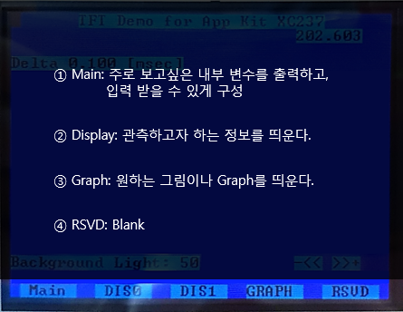
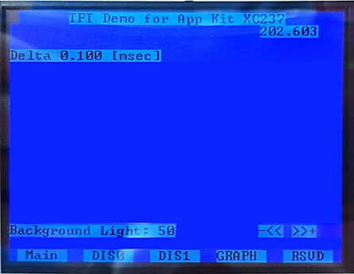
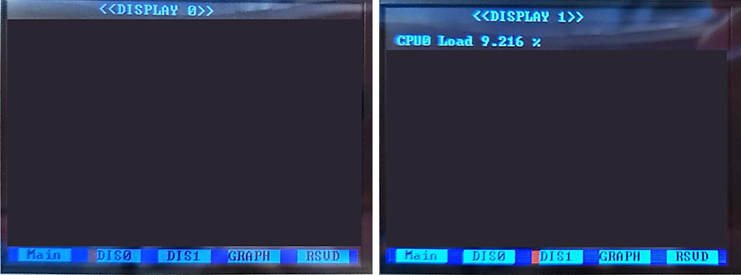
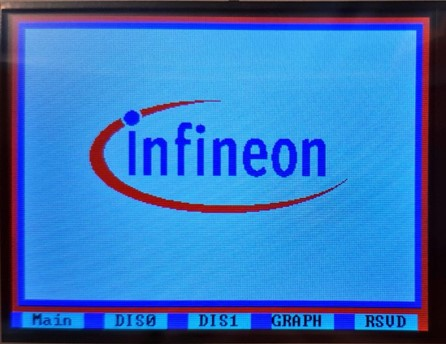

# TFT as modern Man-Machine Interface

## 시작하는 질문

* Application Kit에 TFT 가 부착되어 있네?  이것을 사용해서 필요한 정보를 출력하고, 사용자가 조정하는 정보들을 입력 받으면 폼나겠는 걸?  그런데 관련 정보는 어디서 찾을 수 있지?  AURIX 사용자 메뉴얼에도 TFT 모듈이라는 것은 없는데...

사용자에게 필요한 정보를 보여주고 입력을 받는 장치를 MMI, Man-Machine Interface, 라고 부릅니다.  기존에 스위치와 LED의 조합으로 보여주던 정보들을 그래픽 LCD와 터치 기능으로 MMI를 구성하는 사례들을 점점 많이 볼 수 있습니다.  

보기가 좋다고 개발하는 사람들도 편해지기만 한 것은 아닙니다.  TFT LCD를 구동하기 위해서 전용 하드웨어를 개발해야 하고, 이 하드웨어를 구동하는 소프트웨어도 구성해야 합니다.  Application Kit 의 경우에는 Xilinx의 FPGA를 사용하여 드라이버를 구성하고, SPI 통신으로 AURIX와 인터페이스 하도록 구성되어 있습니다.  그러므로 AURIX 쪽에서는 하드웨어의 구성에 대한 구체적인 정보를 알 필요는 없이 SPI 통신으로 주고 받는 정보의 형태들만 이해하면 됩니다.  이것도 예제 코드로 잘 구성되어 있어서 관련 함수의 호출만 이해하면 TFT를 사용하는 것에는 문제가 없습니다.  하드웨어에 대한 구체적인 정보를 모르더라도, 소프트웨어 라이브러리만 이해 한다면 필요한 기능을 마음껏 사용할 수 있는 것! 이것이 라이브러리의 매력 입니다.  

------

## Objectives

* TFT 드라이버를 이용하여 LCD 와 터치 기능을 이용할 수 있는 Man-Machine Interface를 구현할 수 있습니다.

## References

* TC23x TC22x Family User's Manual v1.1 - Chap 20 QSPI

**[Example Code]**

* MyIlldModule_TC23A - Tft

------


## Example Description

* TFT 드라이버를 이용하여 Text, Bar, Menu, Graph 등을 LCD에 출력하고, Touch screen으로 정보를 입력할 수 있습니다.


## Background 정보

* Graphic User Interface (GUI)

  * 개념

    * 사용자가 텍스트 기반 인터페이스 대신 그래픽 아이콘 및 보조 표식과 같은 **시각적 표시기**를 통해 전자 장치와 상호작용할 수 있는 **사용자 인터페이스** 유형입니다.

  * 장점

    * 프로그램이 동작할 때 **내부 변수**를 쉽게 **관측**할 수 있습니다.
    * 추가적인 **Debugger**가 필요없습니다.
    * 간단하게 **입력을 바꿀 수 있고**, 그 때마다 다시 프로그램을 다운로드 할 필요가 없습니다.

  * TC237의 TFT-LCD와 Screen감압 센서를 이용하여 GUI를 구성할 수 있습니다.

    

* Infineon TC237의 GUI 구성

  * 사용자로부터 입력을 받는 요소: Screen감압 센서
    * 사용자의 touch 입력을 받기 위한 Screen감압 센서가 존재합니다.
    * 사용자가 Screen을 누르면 touch screen controller(ADS7843E) 가 압력받은 위치를 알려줍니다.
  * 사용자에게 출력하는 요소: TFT-LCD
    * Text, Graph, Picture, .. 등 다양한 그래픽 요소들을 출력할 수 있습니다.


- TC237의 GUI를 구성하기 위한 Driver
  - Conio TFT Driver
    - 사용자가 직접 구현하기 어려운 Display 기능이나 Touch screen 정보를 받아오는 기능을 손쉽게 이용할 수 있도록 함수가 구현되어 있습니다.
  - Conoi TFT driver를 사용하기 위해 필요한 files
    - InfineonRacer_TC23A 기준
      - 0_Src/CDrv/Tricore/Qspi
      - 0_Src/CDrv/Tricore/Tft
  - GUI를 구성하기 필요한 application files
    - InfineonRacer_TC23A 기준
      - 0_Src/AppSw/Tricore/TftApp


- TFT의 I/O 설정

  - Infineon TC237의 TFT는 SPI 통신을 이용하여 AURIX와 정보를 주고 받습니다.

    - SPI 통신 (Serial Peripheral Interface)

      - SPI 통신은 동기화된 시리얼 통신 방법입니다.

      - 주로, 근거리 통신에 사용됩니다.

      - 1980년대 모토롤라에 의해 개발되었습니다.

      - 특징으로는 Master-Slave 구조의 양방향 구조이며, 하나의 Master와 다수 개의 Slave가 존재하게 됩니다.

      - SPI는 four-wire 시리얼 버스라고도 불리는 데, 그 이유는 통신에 총 4개의 선을 사용하기 때문입니다. (SCLK: Serial Clock, MOSI: Master Output Slave Input, MISO: Master Input Slave Output, Slave Select)

        

      - 데이터 저장 및 전송을 위해 shift register가 사용됩니다.
        


## iLLD - related

* MyiLLD의 GUI 구성

  * 많은 내용을 담기에는 Display 크기에 한계가 있습니다.
  * 한계를 해결하고자 5개의 탭으로 구성되어 있습니다.

  

  * TFT 구동 방식
    * iLLD 에서는 Conio Interrupt service가 주기적으로 돌면서 Display를 하고 Touch 정보를 받아옵니다.

### Module Configuration

```c
int core0_main(void)
{
	// 기타 기능 Configuration 생략

    // TFT를 사용하기 위한 Port 설정
    // CS to touch
    IfxPort_setPinModeInput(TOUCH_USE_CHIPSELECT.pin.port, TOUCH_USE_CHIPSELECT.pin.pinIndex, IfxPort_Mode_inputPullUp);
    // CS to tft
    IfxPort_setPinModeInput(TFT_USE_CHIPSELECT.pin.port, TFT_USE_CHIPSELECT.pin.pinIndex, IfxPort_Mode_inputPullUp);
    // INT from touch
    IfxPort_setPinModeInput(TOUCH_USE_INT.port, TOUCH_USE_INT.pinIndex, IfxPort_Mode_inputPullUp);
    // Background light는 Gtm TOM을 이용하여 조절한다
    // PWM Port Out 설정이 필요
    IfxPort_setPinModeOutput(BACKGROUND_LIGHT.pin.port, BACKGROUND_LIGHT.pin.pinIndex, IfxPort_OutputMode_pushPull, IfxPort_OutputIdx_alt1);

  // 생략
    
    /* Init TFT-display */
    tft_appl_init(1);	// Menu	창을 display하고 input을 받음

    /* Init the backroundlight */
    background_light_init();	// Background 의 밝기변화

    graph_drawInfineonLogo();	//인피니온 로고를 그리는 함수

   
    perf_meas_init();	// CPU load measurement를 위한 초기화

    display_io_init();	

    /* background endless loop */
    while (TRUE)
    {
    	perf_meas_idle();		// CPU load measurement를 위한 idle counter
    }

    return 0;
}

void tft_app_init (uint8 RtcRunning)
{
    // TFT Interrupt service 를 주기적으로 부르기 위한 설정
    IfxSrc_init(&TFT_UPDATE_IRQ, ISR_PROVIDER_CPUSRV0, ISR_PRIORITY_CPUSRV0);
    IfxSrc_enable(&TFT_UPDATE_IRQ);

    conio_driver.pmenulist = (TDISPLAYENTRY *)&menulist[0];	// Menu에 들어갈 entry
    conio_driver.pstdlist = (TDISPLAYENTRY *)&stdlist[0];   // Base bar에 들어갈 entry

    // TFT driver를 초기화한다
    tft_init ();                
    touch_init ();
    conio_init ((const pTCONIODMENTRY)conio_displaymode_list);
#ifdef TFT_OVER_DAS
    conio_driver.pdasmirror = &das_buffer[0];   //a buffer is available for PC sharing
    conio_driver.dasstatus = 0; //we can update
#endif

    controlmenu.cpusecondsdelta = 0.1f;
    tft_ready = TRUE;

    // LCD Background 밝기 초기화, 초기 diplay 설정
    background_light_init();
    graph_drawInfineonLogo();
    display_io_init();
}
```


### Interrupt Configuration

```c
void cpu_service0Irq(void)
{
	__enable();
	if (tft_ready == 0) return;
    touch_periodic ();
    // touch periodic 에서 받은 x좌표, y좌표가 conio periodic의 입력이 됨
    conio_periodic (touch_driver.xdisp, touch_driver.ydisp, conio_driver.pmenulist, conio_driver.pstdlist);
    conio_driver.blinky += 1;
}
```


### Module Behavior

* Main 탭 설정

  

```c
// menu.c 참조

// DISPLAYENTRY구조체의 구조
// {Display color, 터치되었을 때 color, entry의 x위치 시작점, entry의 x위치 끝점, entry의 y위치.
//  터치되었을 때 동작하는 함수, 기본 display할 함수, input 함수, 출력할 test, symbol}
const TDISPLAYENTRY menulist[19] = {
{(CYAN << 4) | BLACK, (BLACK << 4) | YELLOW, 7, 31, 0, &menu_select, &menu_display, &menu_input,"TFT Demo for App Kit XC237"},

{(CYAN << 4) | BLACK, (BLACK << 4) | YELLOW, 30, 39, 1, &menu_select_cpusec, &menu_display_cpusec, &menu_input,"cpusec"},
{(CYAN << 4) | BLACK, (BLACK << 4) | YELLOW, 0, 10, 3, &menu_select_cpusecdelta, &menu_display_cpusecdelta, &menu_input_cpusecdelta,"delta: "},

{(CYAN << 4) | BLACK, (BLACK << 4) | YELLOW, 0, 16, 17, &menu_select_background_light, &menu_display_background_light, &menu_input_background_light, "Background Light: "},
{(CYAN << 4) | BLACK, (BLACK << 4) | YELLOW, 30, 32, 17, &menu_select_background_lightminus, &menu_display, &menu_input, "-<<"},
{(CYAN << 4) | BLACK, (BLACK << 4) | YELLOW, 34, 36, 17, &menu_select_background_lightplus, &menu_display, &menu_input, ">>+"},

{0, 0, 0, 0, 0, 0, 0, 0, " "},
{0, 0, 0, 0, 0, 0, 0, 0, " "},
{0, 0, 0, 0, 0, 0, 0, 0, " "},
{0, 0, 0, 0, 0, 0, 0, 0, " "},
{0, 0, 0, 0, 0, 0, 0, 0, " "},
{0, 0, 0, 0, 0, 0, 0, 0, " "}  //LAST ENTRY
};

// 아래는 Main 창의 맨 첫 번째 줄인 "TFT Demo for App Kit XC237"을 출력하기 위한 3개의 함수
void menu_display (sint32 ind, TDISPLAYENTRY * pdisplayentry)
{
    conio_ascii_textattr (DISPLAY_MENU, pdisplayentry->color_display); // Display color 설정
    conio_ascii_gotoxy (DISPLAY_MENU, pdisplayentry->xmin, pdisplayentry->y); // 출력될 좌표 설정
    conio_ascii_cputs (DISPLAY_MENU, &pdisplayentry->text[0]); // String 출력
}// 기본 display할 함수

void menu_select (sint32 ind, TDISPLAYENTRY * pdisplayentry)
{
    conio_ascii_textattr (DISPLAY_MENU, pdisplayentry->color_select); // touch했을 때 color 설정
    conio_ascii_gotoxy (DISPLAY_MENU, pdisplayentry->xmin, pdisplayentry->y); // 출력될 좌표 설정
    conio_ascii_cputs (DISPLAY_MENU, &pdisplayentry->text[0]); // String 출력
    if ((touch_driver.touchmode & MASK_TOUCH_UP) != 0)
    {
        touch_driver.touchmode &= ~MASK_TOUCH_UP;   //clear
        // 현 entry는 touch되었을 때 특별한 동작이 없다
    }
}// 터치되었을 때 동작하는 함수

sint32 menu_input (sint32 ind, TDISPLAYENTRY * pdisplayentry)
{
    __debug ();	// input 받는 것이 없다
    return (0);
}// input 함수

// 아래는 Main 창에서 Background light를 설정하기 위한 함수
void menu_display_background_light (sint32 ind, TDISPLAYENTRY * pdisplayentry)
{
    conio_ascii_textattr (DISPLAY_MENU, pdisplayentry->color_display); // Display color 설정
    conio_ascii_printfxy (DISPLAY_MENU, pdisplayentry->xmin, pdisplayentry->y, (const uint8 *)"Background Light: %u", (unsigned int) backgroundlightsize); // xmin, y에 해당 string 출력
} // 기본적으로 출력되는 함수

sint32 menu_input_background_light (sint32 ind, TDISPLAYENTRY * pdisplayentry)
{
    uint32 temp;
    sint32 result;
    result = sscanf ((char *) &conio_driver.scanftext[0], "%u", (unsigned int *) &temp);
    if (result != 1)
        return (-1);
    if (temp < backgroundlightmin)
        temp = backgroundlightmin;
    if (temp > backgroundlightmax)
        temp = backgroundlightmax;

    backgroundlightsize = temp;

    return (0);
} // conio_driver를 통해 받은 background light input을 'backgroundlightsize' 변수에 저장한다.
// 'backgroundlightsize' 변수는 위의 display 함수에 의해 출력 된다.

void menu_select_background_light (sint32 ind, TDISPLAYENTRY * pdisplayentry)
{
    conio_ascii_textattr (DISPLAY_MENU, pdisplayentry->color_select);    //MENUE
    conio_ascii_printfxy (DISPLAY_MENU, pdisplayentry->xmin, pdisplayentry->y, (const uint8 *)"Change Light: %u", (unsigned int) backgroundlightsize);   //MENUE
    if ((touch_driver.touchmode & MASK_TOUCH_UP) != 0)
    {
        strcpy ((char *) &conio_driver.scanfdescr[0], "Light: ");    //PREP of Keyboard Mode
        sprintf ((char *) &conio_driver.scanftext[0], "%u", (unsigned int) backgroundlightsize); //right upper value
        conio_driver.scanfx = 0;    //actual cursor
        conio_driver.dialogmode = KEYBOARDON; //Keyboard input mode
        conio_driver.input = pdisplayentry->input;
        conio_driver.inputid = ind;
        touch_driver.touchmode &= ~MASK_TOUCH_UP;   //clear
    }
} // 해당 위치를 눌렀을 때, Keyboard가 나타나게 되고 Keyboard input mode가 된다.

void menu_select_background_lightplus (sint32 ind, TDISPLAYENTRY * pdisplayentry)
{
    conio_ascii_textattr (DISPLAY_MENU, pdisplayentry->color_select);
    conio_ascii_gotoxy (DISPLAY_MENU, pdisplayentry->xmin, pdisplayentry->y);
    conio_ascii_cputs (DISPLAY_MENU, (uint8 *) ">>+");
    if ((touch_driver.touchmode & MASK_TOUCH_UP) != 0)
    {
        touch_driver.touchmode &= ~MASK_TOUCH_UP;   //clear
        if (backgroundlightsize < backgroundlightmax)
            backgroundlightsize += backgroundlightdelta;
    }
} // ">>+" 를 눌렀을 때 동작하는 함수
// Backgroundlight delta 만큼 'backgroundlightsize' 변수를 증가시킨다.

void menu_select_background_lightminus (sint32 ind, TDISPLAYENTRY * pdisplayentry)
{
    conio_ascii_textattr (DISPLAY_MENU, pdisplayentry->color_select);
    conio_ascii_gotoxy (DISPLAY_MENU, pdisplayentry->xmin, pdisplayentry->y);
    conio_ascii_cputs (DISPLAY_MENU, (uint8 *) "-<<");
    if ((touch_driver.touchmode & MASK_TOUCH_UP) != 0)
    {
        touch_driver.touchmode &= ~MASK_TOUCH_UP;   //clear
        if (backgroundlightsize > backgroundlightmin)
            backgroundlightsize -= backgroundlightdelta;
    }
}// "-<<" 를 눌렀을 때 동작하는 함수
// Backgroundlight delta 만큼 'backgroundlightsize' 변수를 감소시킨다.
```


* Display 탭 설정

  

```c
// display_io.c 참조
void display_io_init(void)
{
	// Display IO 0,1 에 기본적으로 출력되는 string 설정
    conio_ascii_printfxy (DISPLAY_IO0, 10, 0, (uint8 *)"<<DISPLAY 0>>");
    conio_ascii_printfxy (DISPLAY_IO1, 10, 0, (uint8 *)"<<DISPLAY 1>>");
}

// Perf_Meas.c 참조
// Interrupt에 의해 실행된다.
void ISR_perf_meas_call(void)
{
 	// 생략
    
    cpu_load = 100.0f - (float32)counter_diff/(g_AppCpu0.info.cpuFreq/100.0f/(float32)cpu0_ccnt_diff_min);
    // we printout if TFT is ready and conio initialized
    if (tft_ready == TRUE)
    {
        if (cpu_load < 0.0f) cpu_load = 0.0f;
        //DISPLAY_IO1 창에 글자를 Print
    	conio_ascii_printfxy (DISPLAY_IO1, 1,  2, (uint8 *)"CPU0 Load %.3f %c ", cpu_load, 0x25);
    	CpuLoad0.counter_diff = counter_diff;
        CpuLoad0.cpu_load = cpu_load;
    }

}
```


* Graph 탭 설정

  

```c
// DrawLogo.c 참조
// Description: Infineon logo를 GRAPH 창에 그려줌
void graph_drawInfineonLogo(void)
{
    uint32 i, j, idx, width, height;
    uint8 color, count;

    uint32 x, y;

    width = 200;		// Infineon logo width
    height = 87;		// Infineon logo height
    x = (320 - width) / 2;
    y = (240 - height) / 2;

    idx = 0;
    color = -1;
    count = 0;

    // set blue frame
    for(i = 0; i < TFT_YSIZE - FONT_YSIZE; i++)
    {
        for(j = 0; j < TFT_XSIZE; j++)
        {
            // GRAPH 탭에 j, i에 해당하는 좌표에 빨간색을 출력
            conio_graphics_set(DISPLAY_GRAPH, j, i, RED);
        }
    }
    // set red frame
    for(i = 5; i < TFT_YSIZE - FONT_YSIZE - 5; i++)
    {
        for(j = 5; j < TFT_XSIZE - 5; j++)
        {
            // GRAPH 탭에 j, i에 해당하는 좌표에 파란색을 출력
            conio_graphics_set(DISPLAY_GRAPH, j, i, BLUE);
        }
    }
    // set white background
    for(i = 10; i < TFT_YSIZE - FONT_YSIZE - 10; i++)
    {
        for(j = 10; j < TFT_XSIZE - 10; j++)
        {
            // GRAPH 탭에 j, i에 해당하는 좌표에 하얀색을 출력
            conio_graphics_set(DISPLAY_GRAPH, j, i, WHITE);
        }
    }
    
    // paint the logo
    for(i = 0; i < height; i++)
    {
        for(j = 0; j < width; j++)
        {
            if(count == 0)
            {
                // Drawlogo.c 에서 미리 RGB 배열 형식으로 입력해둔 infineon logo 출력한다
                count = infineon_logo[idx++];
                color = infineon_logo[idx++];
            }
            if(color != 255)
            {	
                // GRAPH 탭에 x+j, y+height-i에 해당하는 좌표에 color를 출력
                // Logo를 그리기 위한 RGB 배열이 color에 저장되어 있다.
                conio_graphics_set(DISPLAY_GRAPH, x + j, y + height - i, color);
            }
            count--;
        }
    }
}
```

------


## 마치며...

TFT를 사용해 봄으로써 Man-Machine Interface의 중요성을 조금은 체감했으리라 생각합니다. TFT와 같은 디스플레이 장치는 모니터링하고자 하는 값을 실시간으로 사용자에게 보여줄 수도 있고, 감압 입력을 받아 임베디드 시스템에 직접 입력을 줄 수도 있습니다. 이미지 출력도 가능하기 때문에 사용자가 직관적으로 결과값을 인식하고 인터페이스를 조작하는 데 도움을 줄 수 있습니다.