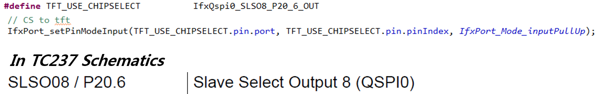
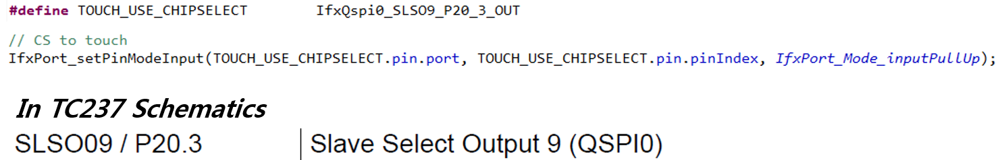
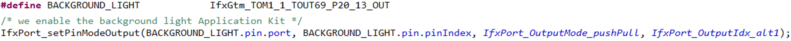

# TFT as modern Man-Machine Interface

## 시작하는 질문

* Application Kit에 TFT 가 부착되어 있네?  이것을 사용해서 필요한 정보를 출력하고, 사용자가 조정하는 정보들을 입력 받으면 폼나겠는 걸?  그런데 관련 정보는 어디서 찾을 수 있지?  AURIX 사용자 메뉴얼에도 TFT 모듈이라는 것은 없는데...

사용자에게 필요한 정보를 보여주고 입력을 받는 장치를 MMI, Man-Machine Interface, 라고 부릅니다.  기존에 스위치와 LED의 조합으로 보여주던 정보들을 그래픽 LCD와 터치 기능으로 MMI를 구성하는 사례들을 점점 많이 볼 수 있습니다.  

보기가 좋다고 개발하는 사람들도 편해지기만 한 것은 아닙니다.  TFT LCD를 구동하기 위해서 전용 하드웨어를 개발해야 하고, 이 하드웨어를 구동하는 소프트웨어도 구성해야 합니다.  Application Kit 의 경우에는 Xilinx의 FPGA를 사용하여 드라이버를 구성하고, SPI 통신으로 AURIX와 인터페이스 하도록 구성되어 있습니다.  그러므로 AURIX 쪽에서는 하드웨어의 구성에 대한 구체적인 정보를 알 필요는 없이 SPI 통신으로 주고 받는 정보의 형태들만 이해하면 됩니다.  이것도 예제 코드로 잘 구성되어 있어서 관련 함수의 호출만 이해하면 TFT를 사용하는 것에는 문제가 없습니다.  하드웨어에 대한 구체적인 정보를 모르더라도, 소프트웨어 라이브러리만 이해 한다면 필요한 기능을 마음껏 사용할 수 있는 것! 이것이 라이브러리의 매력 입니다.  


------


## Objectives

* TFT 드라이버를 이용하여 LCD 와 터치 기능을 이용할 수 있는 Man-Machine Interface를 구현할 수 있습니다.

## References

* TC23x TC22x Family User's Manual v1.1 - Chap 20 QSPI

**[Example Code]**

* InfineonRacer_TC23A - TftApp

------


## Example Description

* TFT 드라이버를 이용하여 Text, Bar, Menu, Graph 등을 LCD에 출력하고, Touch screen으로 정보를 입력할 수 있습니다.

## Background 정보

> * SPI 통신 (Serial Peripheral Interface)
>
>   * SPI 통신은 동기화된 시리얼 통신 방법입니다.
>   * 주로, 근거리 통신에 사용됩니다.
>   * 1980년대 모토롤라에 의해 개발되었습니다.
>   * 특징으로는 Master-Slave 구조의 양방향 구조이며, 하나의 Master와 다수 개의 Slave가 존재하게 됩니다.
>   * SPI는 four-wire 시리얼 버스라고도 불리는 데, 그 이유는 통신에 총 4개의 선을 사용하기 때문입니다. (SCLK: Serial Clock, MOSI: Master Output Slave Input, MISO: Master Input Slave Output, Slave Select)
>
>   
>
>   * 데이터 저장 및 전송을 위해 shift register가 사용됩니다.
>
>   
>
> * 어떤 파일들이 추가되어야 하는지
>
> * 라이브러리의 기능

* TFT Driver

  * Conio TFT driver 
  * 사용자가 구현하기 어려운 Display 기능이나 Touch screen 정보를 받아오는 기능을 손쉽게 이용할 수 있도록 함수가 구현되어 있습니다.

* TFT 구동 방식

  * iLLD 에서는 Cunio Interrupt service가 주기적으로 돌면서 Display를 하고 Touch 정보를 받아옵니다.

* I/O

  * TFT는 SPI 통신을 이용하여 AURIX와 정보를 주고 받습니다. 그러므로, QSPI를 사용하기 위한 PIN 설정이 필요합니다.

  

  * Touch 정보 역시 SPI 통신을 이용하여 받습니다.

  

  * Background light는 Gtm TOM을 이용하여 PWM으로 조절합니다.


## AURIX - related

## iLLD - related

* Text를 display에 출력하고, 어떤 함수에서 touch 좌표를 받고, 그것을 어떻게 사용하는지 간단히 살펴봅시다.

### Module Configuration

```c
int core0_main(void)
{
	// 기타 기능 Configuration 생략
    
    // TFT를 사용하기 위한 Port 설정
    // CS to touch
    IfxPort_setPinModeInput(TOUCH_USE_CHIPSELECT.pin.port, TOUCH_USE_CHIPSELECT.pin.pinIndex, IfxPort_Mode_inputPullUp);
    // CS to tft
    IfxPort_setPinModeInput(TFT_USE_CHIPSELECT.pin.port, TFT_USE_CHIPSELECT.pin.pinIndex, IfxPort_Mode_inputPullUp);
    // INT from touch
    IfxPort_setPinModeInput(TOUCH_USE_INT.port, TOUCH_USE_INT.pinIndex, IfxPort_Mode_inputPullUp);
    // Background light는 Gtm TOM을 이용하여 조절한다
    // PWM Port Out 설정이 필요
    IfxPort_setPinModeOutput(BACKGROUND_LIGHT.pin.port, BACKGROUND_LIGHT.pin.pinIndex, IfxPort_OutputMode_pushPull, IfxPort_OutputIdx_alt1);

    /* Enable the global interrupts of this CPU */
    IfxCpu_enableInterrupts();

    // Static Scheduler Initialization
    BasicStm_init();

    // Static Scheduler Run
    while (TRUE)
    {
        BasicStm_run();
    }
    return 0;
}

void tft_app_init (uint8 RtcRunning)
{
    // TFT Interrupt service 를 주기적으로 부르기 위한 설정
    IfxSrc_init(&TFT_UPDATE_IRQ, ISR_PROVIDER_CPUSRV0, ISR_PRIORITY_CPUSRV0);
    IfxSrc_enable(&TFT_UPDATE_IRQ);

    conio_driver.pmenulist = (TDISPLAYENTRY *)&menulist[0];
    conio_driver.pstdlist = (TDISPLAYENTRY *)&stdlist[0];

    // TFT driver를 초기화한다
    tft_init ();                
    touch_init ();
    conio_init ((const pTCONIODMENTRY)conio_displaymode_list);
#ifdef TFT_OVER_DAS
    conio_driver.pdasmirror = &das_buffer[0];   //a buffer is available for PC sharing
    conio_driver.dasstatus = 0; //we can update
#endif

    controlmenu.cpusecondsdelta = 0.1f;
    tft_ready = TRUE;
    
    // LCD Background 밝기 초기화, 초기 diplay 설정
    background_light_init();
    graph_drawInfineonLogo();
    display_io_init();
}
```


### Interrupt Configuration

```c
void cpu_service0Irq(void)
{
	__enable();
	if (tft_ready == 0) return;
    touch_periodic ();
    // touch periodic 에서 받은 x좌표, y좌표가 conio periodic의 입력이 됨
    conio_periodic (touch_driver.xdisp, touch_driver.ydisp, conio_driver.pmenulist, conio_driver.pstdlist);
    conio_driver.blinky += 1;
}
```


### Module Behavior

```c
// 여러가지 Text display 하는 함수
void display_io_run(void)
{
    // DISPLAY_IO1: Standard text output mode
    // 기능: Motor enable, volume, servo motor angle에 대한 정보를 text로 Display에 출력
	conio_ascii_printfxy (DISPLAY_IO1, 0,  4, (uint8 *)" Motor0En : %4d     Motor1En : %4d", IR_getMotor0En(), IR_getMotor1En());
	conio_ascii_printfxy (DISPLAY_IO1, 0,  5, (uint8 *)" Motor0Vol: %4.2f     Motor1En: %4.2f", IR_getMotor0Vol(), IR_getMotor1Vol());
	conio_ascii_printfxy (DISPLAY_IO1, 0,  6, (uint8 *)" SrvAngle : %4.2f", IR_getSrvAngle());

    // 생략
}

// x,y 좌표에 text 출력하는 함수
void conio_ascii_printfxy (TDISPLAYMODE displaymode, sint32 x, sint32 y, const uint8 * format, ...)
{
    // Input
    // - Displaymode(Bar인지 text인지 graph인지...)
    // - Text가 입력 될 좌표 x, y
    // - 실제 출력할 string
    // - Conversion specifier에 치환 될 인자
    sint32 result, len;
    uint8 buffer[80];
    va_list ap;
    va_start (ap, format);
    result = vsprintf ((char *)buffer, (char *)format, ap);
    va_end (ap);
    if (result < 0)
        return;
    len = strlen ((char *)buffer);
    if (len > TERMINAL_MAXX)
        len = TERMINAL_MAXX;               //cut it down
    conio_ascii_gotoxy (displaymode, x, y);
    conio_ascii_cputs (displaymode, &buffer[0]);
}

// TFT interrupt service가 주기적으로 실행될 때 불러오는 함수
// Touch에 대한 정보를 받아온다
void touch_periodic (void)
{
    touch_driver.bounce_cnt += 1;
    if (touch_driver.bounce_cnt < touch_driver.bounce_limit)
        return;
    touch_driver.bounce_cnt = 0;
    //the touch is selected
    touch_driver.touchmode = 0;
#ifdef TFT_OVER_DAS
    if (touch_dasinfo.event == 0)
#endif
    {
        if (IfxPort_getPinState(TOUCH_USE_INT.port, TOUCH_USE_INT.pinIndex) == FALSE)
        {
            touch_driver.xmax = XMAX_TOUCH;
            touch_driver.xmin = XMIN_TOUCH;
            touch_driver.ymax = YMIN_TOUCH;
            touch_driver.ymin = YMAX_TOUCH;
            g_Qspi_Touch.qspiBuffer.spiTxBuffer[0] = 0x90;
            g_Qspi_Touch.qspiBuffer.spiTxBuffer[1] = 0x00;
            g_Qspi_Touch.qspiBuffer.spiTxBuffer[2] = 0xD0;
            g_Qspi_Touch.qspiBuffer.spiTxBuffer[3] = 0x00;
            g_Qspi_Touch.qspiBuffer.spiTxBuffer[4] = 0x00;

            while (IfxQspi_SpiMaster_getStatus(&g_Qspi_Touch.drivers.spiMasterChannel) == SpiIf_Status_busy) {};

            IfxQspi_SpiMaster_exchange(&g_Qspi_Touch.drivers.spiMasterChannel, &g_Qspi_Touch.qspiBuffer.spiTxBuffer[0],
                &g_Qspi_Touch.qspiBuffer.spiRxBuffer[0], TOUCH_BUFFER_SIZE);

            // data가 유효해질 때까지 기다림
            while (IfxQspi_SpiMaster_getStatus(&g_Qspi_Touch.drivers.spiMasterChannel) == SpiIf_Status_busy) {};
            touch_driver.prev_time = touch_driver.time;
            touch_driver.time = (__mfcr (0xFC04) & 0x7FFFFFFF) >> 8;
            // 이전 값은 prev에 저장
            touch_driver.prev_x = touch_driver.x;
            // SPI 통신으로 받은 Touch 좌표가 저장됨
            touch_driver.x = ((g_Qspi_Touch.qspiBuffer.spiRxBuffer[1]<<8) | (g_Qspi_Touch.qspiBuffer.spiRxBuffer[2])) >> 3;
            // 이전 값은 prev에 저장
            touch_driver.prev_y = touch_driver.y;
            // SPI 통신으로 받은 Touch 좌표가 저장됨
            touch_driver.y = ((g_Qspi_Touch.qspiBuffer.spiRxBuffer[3]<<8) | (g_Qspi_Touch.qspiBuffer.spiRxBuffer[4])) >> 3;

            touch_driver.prev_status = touch_driver.status;
            touch_driver.status = TOUCH_DOWN;
        }
        else
        {
            touch_driver.prev_time = touch_driver.time;
            touch_driver.prev_y = touch_driver.y;
            touch_driver.y = -1;
            touch_driver.prev_x = touch_driver.x;
            touch_driver.x = -1;
            touch_driver.prev_status = touch_driver.status;
            touch_driver.status = TOUCH_UP;
        }
    }
 #ifdef TFT_OVER_DAS
    else
    {
        if (touch_dasinfo.button == 1)
        {
            touch_driver.xmax = XMAX_DAS;
            touch_driver.xmin = XMIN_DAS;
            touch_driver.ymax = YMIN_DAS;
            touch_driver.ymin = YMAX_DAS;
            touch_driver.prev_time = touch_driver.time;
            touch_driver.time = (__mfcr (0xFC04) & 0x7FFFFFFF) >> 8;
            touch_driver.prev_x = touch_driver.x;
            touch_driver.x = touch_dasinfo.x;
            touch_driver.prev_y = touch_driver.y;
            touch_driver.y = touch_dasinfo.y;
            touch_driver.prev_status = touch_driver.status;
            touch_driver.status = TOUCH_DOWN;
        }
        else
#endif
        {
            touch_driver.prev_time = touch_driver.time;
            touch_driver.prev_y = touch_driver.y;
            touch_driver.y = -1;
            touch_driver.prev_x = touch_driver.x;
            touch_driver.x = -1;
            touch_driver.prev_status = touch_driver.status;
            touch_driver.status = TOUCH_UP;
        }
#ifdef TFT_OVER_DAS
    }
#endif

    if ((touch_driver.status == TOUCH_DOWN) && (touch_driver.prev_status == TOUCH_UP))
    {
        // touch screen에서 떼고 있다가 누름
        touch_event.time = touch_driver.time;
        touch_event.x = touch_driver.x;
        touch_event.y = touch_driver.y;
        touch_driver.prev_x_down = touch_driver.x;
        touch_driver.prev_y_down = touch_driver.y;
        touch_driver.prev_time_down = touch_driver.time;
        touch_event.dx = -1;
        touch_event.dy = -1;
        touch_event.dtime = -1;
        touch_driver.cnt = 0;
        touch_event.status = TOUCH_DOWN;
        touch_driver.touchmode |= (1 << touch_event.status);
        touch_calcdisp ();

        return;
    }
    if ((touch_driver.status == TOUCH_DOWN) && (touch_driver.prev_status == TOUCH_DOWN))
    {
        // touch screen을 계속 누르고 있음
        touch_event.time = touch_driver.time;
        touch_event.dtime = touch_driver.time - touch_driver.prev_time;
        touch_event.x = touch_driver.x;
        touch_event.y = touch_driver.y;
        touch_event.dx = touch_driver.x - touch_driver.prev_x;
        touch_event.dy = touch_driver.y - touch_driver.prev_y;
        touch_driver.cnt += 1;
        if (touch_driver.cnt < 100)
            touch_event.status = TOUCH_MOVE;
        else
        {
            if (touch_driver.cnt > 1000)
                touch_event.status = TOUCH_DOWN10S;
            else
                touch_event.status = TOUCH_DOWN3S;
        }
        touch_driver.touchmode |= (1 << touch_event.status);
        touch_driver.status = TOUCH_MOVE;
        touch_calcdisp ();

        return;
    }
    if ((touch_driver.status == TOUCH_DOWN) && (touch_driver.prev_status == TOUCH_MOVE))
    {
        // touch screen을 계속 누르고 있음
        touch_event.time = touch_driver.time;
        touch_event.dtime = touch_driver.time - touch_driver.prev_time;
        touch_event.x = touch_driver.x;
        touch_event.y = touch_driver.y;
        touch_event.dx = touch_driver.x - touch_driver.prev_x;
        touch_event.dy = touch_driver.y - touch_driver.prev_y;
        touch_driver.cnt += 1;
        if (touch_driver.cnt < 100)
            touch_event.status = TOUCH_MOVE;
        else
        {
            if (touch_driver.cnt > 1000)
                touch_event.status = TOUCH_DOWN10S;
            else
                touch_event.status = TOUCH_DOWN3S;
        }
        touch_driver.touchmode |= (1 << touch_event.status);
        touch_driver.status = TOUCH_MOVE;
        touch_calcdisp ();

        return;
    }
    if ((touch_driver.status == TOUCH_UP) && (touch_driver.prev_status == TOUCH_MOVE))
    {
        // touch screen을 계속 누르고 있다가 뗌
        touch_event.time = touch_driver.time;
        touch_event.dtime = touch_driver.prev_time - touch_driver.prev_time_down;
        touch_event.x = touch_driver.prev_x;
        touch_event.y = touch_driver.prev_y;
        touch_event.dx = touch_driver.prev_x - touch_driver.prev_x_down;
        touch_event.dy = touch_driver.prev_y - touch_driver.prev_y_down;
        touch_event.status = TOUCH_UP;
        touch_driver.touchmode |= (1 << touch_event.status);
        touch_driver.status = TOUCH_UP;
        touch_calcdisp ();

        return;
    }
    if ((touch_driver.status == TOUCH_UP) && (touch_driver.prev_status == TOUCH_DOWN))
    {
        // touch screen을 누르고 뗌
        touch_event.time = touch_driver.time;
        touch_event.dtime = touch_driver.prev_time - touch_driver.prev_time_down;
        touch_event.x = touch_driver.prev_x;
        touch_event.y = touch_driver.prev_y;
        touch_event.dx = touch_driver.prev_x - touch_driver.prev_x_down;
        touch_event.dy = touch_driver.prev_y - touch_driver.prev_y_down;
        touch_event.status = TOUCH_UP;
        touch_driver.touchmode |= (1 << touch_event.status);
        touch_driver.status = TOUCH_UP;
        touch_calcdisp ();

        return;
    }
}

// Touch 좌표를 display 기준 좌표계로 변환
inline void touch_calcdisp (void)
{
    touch_event.xdisp =
        ((float) touch_event.x - touch_driver.xmin) / (touch_driver.xmax - touch_driver.xmin) * (float) TERMINAL_MAXX;
    if (touch_event.xdisp < 0)
        touch_event.xdisp = 0;
    if (touch_event.xdisp >= TERMINAL_MAXX)
        touch_event.xdisp = TERMINAL_MAXX - 1;
    touch_event.ydisp =
        ((float) touch_event.y - touch_driver.ymin) / (touch_driver.ymax - touch_driver.ymin) * (float) TERMINAL_MAXY;
    if (touch_event.ydisp < 0)
        touch_event.ydisp = 0;
    if (touch_event.ydisp >= TERMINAL_MAXY)
        touch_event.ydisp = TERMINAL_MAXY - 1;
    touch_driver.xdisp = touch_event.xdisp;
    touch_driver.ydisp = touch_event.ydisp;
}
```


## 추가적인 설명


------


## 마치며...