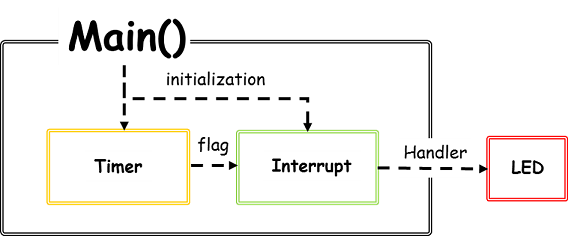
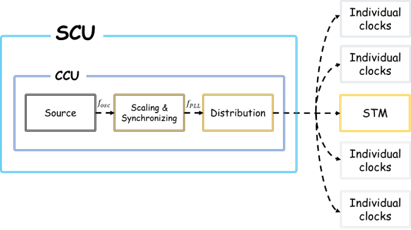
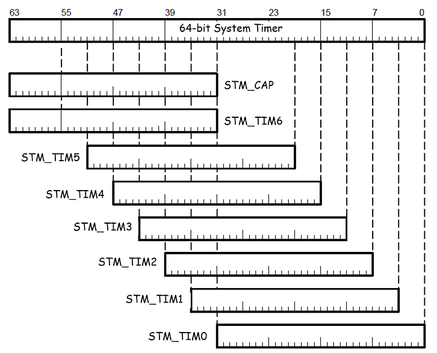
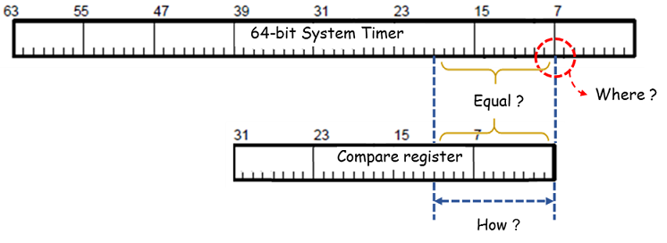
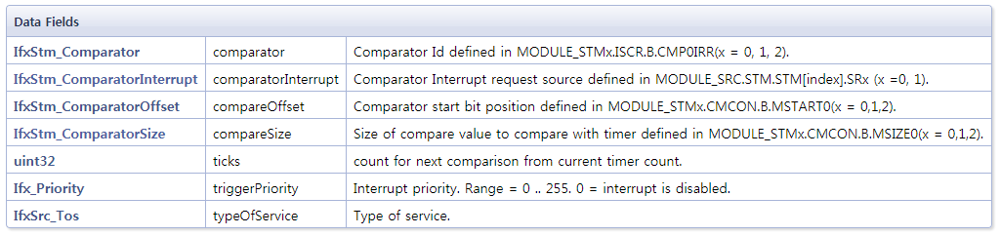
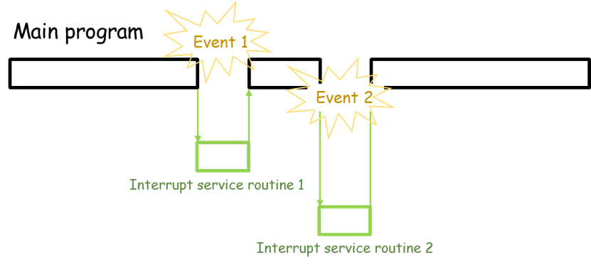

Twinkle twinkle little star
===========================

Objectives
----------

-	Timer와 interrupt의 개념 및 용도에 대한 이해
-	STM을 사용한 interrupt의 구현

References
----------

-	iLLD_1_0_1_4_0_TC2xx_Release.zip; iLLD source and doc
-	iLLD_Demos_1_0_1_4_0_TC2xx.zip; iLLD examples
-	TC21x/TC22x/TC23x Family User’s Manual V1.1

Example Description
-------------------

#### 개요

-	시스템의 주기적 제어
      - 리얼 타임 시스템은 종료가 없는 무한루프로 구성되는 경우가 많음
      - 무한루프 안에서의 실행주기는 루프의 구성에 따라 가변적
      - 다양한 주기적 요구사항 처리에 대해 flexibility를 가지는 도구가 필요

#### 구현

-	5Hz의 주기로 LED를 점멸

#### 구조

- 타이머를 초기화하고 일정한 주기로 인터럽트를 발생시켜 LED를 제어

- 타이머
    - 주기적 시간처리를 위한 위한 디지털 카운터 회로 모듈
    - 일정 시간간격으로 주기적인 이벤트를 발생시킬 수 있음

- 인터럽트
    - 이벤트 기반 예외처리 메커니즘
    - 프로그램을 중단하고 우선순위에 따라 예외를 처리

Hardware
--------------

-	​Application Kit TC237 V1.0
	-	내장 LED (P13.0)

iLLD - related
--------------

####	CCU(clock control unit)
- 다양한 타이머 모듈을 병렬적으로 사용하기 위한 control unit
  - Basic system tick의 생성
  - Clock speed의 scaling
  - Clock distribution

- How to use
  - 아래와 같이 iLLD에 정의된 코드로 타이머를 초기화
  - 별 다른 설정이 없다면 f_PLL = 200MHz, f_STM = 100MHz의 주기로 system tick이 발생
~~~
g_AppCpu0.info.pllFreq = IfxScuCcu_getPllFrequency();
g_AppCpu0.info.cpuFreq = IfxScuCcu_getCpuFrequency(IfxCpu_getCoreIndex());
g_AppCpu0.info.sysFreq = IfxScuCcu_getSpbFrequency();
g_AppCpu0.info.stmFreq = IfxStm_getFrequency(&MODULE_STM0);
~~~

---

#### STM(system timer)

- 64bit를 동시에 동기화하여 사용가능
    - 서로 다른 timing range를 가진 여러 개의 32bit time register(TIMx)
    - 하나의 time register가 읽힐 때 동시에 upper part를 관측하는 capture register(CAP)  

##
- 부분적인 compare match를 통한 flexible한 인터럽트 flag 생성

- How to use

  - Compare register를 이용하기 위해서는 capture를 위한 구체적인 define이 필요

**1. 사용할 STM 모듈의 정보를 받아와 구조체 형식으로 저장하며 초기화**
~~~
g_Stm.stmSfr = &MODULE_STM0;
IfxStm_initCompareConfig(&g_Stm.stmConfig);
~~~
~~~
void IfxStm_initCompareConfig(IfxStm_CompareConfig *config)
{
    config->comparator          = IfxStm_Comparator_0;
    config->compareOffset       = IfxStm_ComparatorOffset_0;
    config->compareSize         = IfxStm_ComparatorSize_32Bits;
    config->comparatorInterrupt = IfxStm_ComparatorInterrupt_ir0;  
    config->ticks               = 0xFFFFFFFF;
    config->triggerPriority     = 0;
}
~~~
**2. 수정할 변수에 원하는 수치를 입력**
~~~
g_Stm.stmConfig.ticks           = ???
~~~

  

**3. 수정된 configuration을 업데이트**

~~~
IfxStm_initCompare(g_Stm.stmSfr, &g_Stm.stmConfig);

/* 초기화 이후 compare register는 지정된 ticks를 관측하면 interrupt flag를 발생시킴 */
~~~

---

#### Interrupt

- 이벤트 기반 예외처리 메커니즘
  - 이벤트로 인식할 트리거 정의
  - 이벤트가 빌생하면 프로그램을 중단
  - handler function을 통해 예외를 처리 후 main program으로 복귀

####
- How to use

**1. 이벤트 처리를 위한 handler 함수 프로그래밍**
~~~
void STM_Int0Handler(void)
{
  /* 지속적인 인터럽트를 위해 트리거가 되는 stm의 compare ticks를 증가시킴 */

    IfxStm_clearCompareFlag(g_Stm.stmSfr, g_Stm.stmConfig.comparator);
    #ifdef SIMULATION
	IfxStm_increaseCompare(g_Stm.stmSfr, g_Stm.stmConfig.comparator, 1000);
    #else
	IfxStm_increaseCompare(g_Stm.stmSfr, g_Stm.stmConfig.comparator, TimeConst_1ms);
    #endif    
        IfxCpu_enableInterrupts();

  /* 인터럽트 마다 counter를 누적하며 특정 주기에 원하는 기능(BlinkLed)을 작동 */
    g_Stm.counter++;

    if(g_Stm.counter == 1000){
    	g_Stm.counter = 0;
    }

    task_flag_1m = TRUE;

    if(g_Stm.counter % 10 == 0){
    	task_flag_10m = TRUE;
    }
    if(g_Stm.counter % 100 == 0){
        task_flag_100m = TRUE;
        BlinkLed_run();
    }
    if(g_Stm.counter % 1000 == 0){
        task_flag_1000m = TRUE;
    }

    appIsrCb_1ms();
}
~~~

~~~
/* BlinkLed_run function은 실행될 때마다 LED의 on/off 상태를 바꿈 */

static void BlinkLed_run(void)
{
    /* ^=는 xor의 개념 */

    g_Stm.LedBlink ^= 1;

    if (g_Stm.LedBlink == TRUE)
    {
        IfxPort_setPinState(&MODULE_P13, 0, IfxPort_State_high);
    }
    else
    {
        IfxPort_setPinState(&MODULE_P13, 0, IfxPort_State_low);
    }
}
~~~

**2. STM의 compare기능을 인터럽트 트리거로 이용**

~~~
IfxStm_initCompare(g_Stm.stmSfr, &g_Stm.stmConfig);
~~~

**3. 인터럽트 정의**

~~~
IFX_INTERRUPT(STM_Int0Handler, 0, ISR_PRIORITY_STM_INT0);
// IFX_INTERRUPT_INTERNAL(isr, vectabNum, prio)
// STM_Int0Handler : 위에서 프로그래밍한 handler function
// vectabNum : 사용할 cpu number
// prio : 인터럽트 priority (board 내에 사전 정의된 값 사용)
~~~

**4. 인터럽트 활성화**
~~~
IfxCpu_enableInterrupts();
~~~

추가적인 설명
-------------

#### Timer 제어

- System tick을 원하는 주기로 만들어야 할 때는 다음과 같은 절차를 거침

**1. 메뉴얼을 찾거나 코드를 추적하여 내부 scaling 구조 파악**

~~~
IFX_INLINE float32 IfxScuCcu_getStmFrequency(void)
{
  /* STM의 경우 source freqency를 STMDIV의 값으로 나누어 scaling */

  return IfxScuCcu_getSourceFrequency() / SCU_CCUCON1.B.STMDIV;  
}
~~~

**2. Safety ENDINIT 해제**

~~~
/* 특정 system parameter들은 안전을 위해 보안이 걸려있음 */
/* Safety ENDINIT를 해제해 wirte access 권한 획득 */

IfxScuWdt_clearSafetyEndinit(IfxScuWdt_getSafetyWatchdogPassword());
~~~

**3. Paremeter 수정**
~~~
/* register가 업데이트 가능 상태일 때 까지 대기 */

while (SCU_CCUCON1.B.LCK != 0x0)
{
    ;
}

/* paremeter 수정 후 업데이트 */

SCU_CCUCON1.B.STMDIV = 4;
SCU_CCUCON1.B.UP = 1;
~~~
**4. Safety ENDINIT set**

~~~
/* 해제했던 Safety ENDINIT을 다시 실행 */

IfxScuWdt_setSafetyEndinit(IfxScuWdt_getSafetyWatchdogPassword());
~~~
