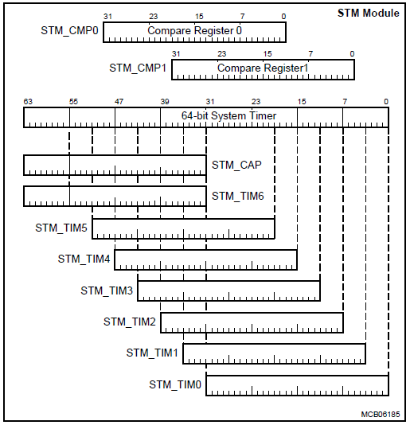
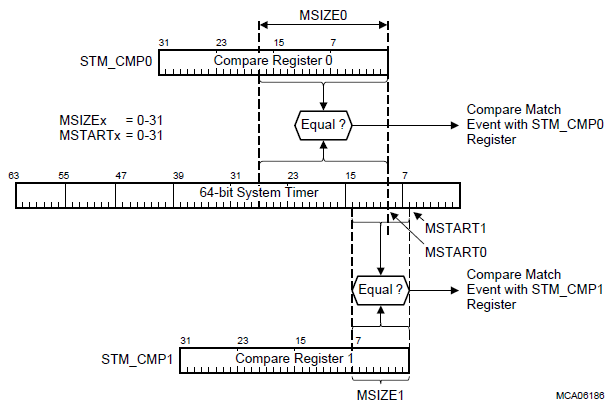

# Twinkle twinkle little star

## 시작하는 이야기

"반짝 반짝 작은 별~~~" 우리가 즐겨 부르던 동요입니다.

마이크로컨트롤러에 프로그래밍 할 때도 첫 번째로 만들어 봐야 하는 프로그램으로 일정 시간주기를 정해주고 주기마다 LED를 반짝이게 하는 것입니다. 단 불빛만 반짝인다고 만족해서는 안 됩니다. 이 프로그램으로 우리는 다음의 사항들을 확실하게 할 수 있게 됩니다.

* 디지털 출력을 내보낼 수 있고,
* 시스템타이머를 사용할 줄 알게 되고,
* 인터럽트를 처리할 수 있게 된다.

 이 프로그램은 앞으로 진행할 다른 모든 프로그램의 기초가 됩니다. 심지어 실제로 최종 프로그램을 동작시킬 때에도, background로 실행되는 이 루틴은 살았는지 죽었는지 알 수 없는 마이크로컨트롤러의 심장박동으로 사용될 것입니다. 깜깜하기만 한 마이크로컨트롤러 보드에 작은 불빛을 밝혀 봅시다.


Objectives
----------

*	시스템타이머를 이해하고 활용할 수 있다.
* 인터럽트를 활용할 수 있다.

References
----------

*	TC23x TC22x Family User's Manual v1.1 - 17 STM
* iLLD_TC23A 1.0.1.4.0 - Modules/iLLD/STM

**[Example Code]**

* MyStm_TC23A

* MyIlldModule_TC23A - Stm

Example Description
-------------------

* 시스템 타이머를 사용해서 1초 마다 인터럽트를 발생시킨다.
* 인터럽트를 이용해서 2초 주기로 LED107를 점멸시킨다.


## Backgounds

* 타이머란?
	- 세상에는 대개 주기적으로 처리하는 일이 있으며 프로그램 역시 마찬가지.
	- 그런 주기적 시간처리를 위한 clock 모듈을 타이머라고 한다.

- 시스템 타이머
	- 프로그램 내부에는 여러가지 타이머가 있을 수 있고,
	- 전체 시스템의 시간을 동기화 해야할 때가 있을 것이며,
	- 그 때 시스템의 기준이 될 타이머가 필요하다.
	- 그것이 시스템 타이머이며 *Tick* 이라고 불리는 매우 작은 단위의 시간이 누적된다.

AURIX - related
--------------

#### STM (System timer)

* 64-bit timer of 32-bit microcontroller
    - TC237이 한 번의 명령어로 다룰 수 있는 데이터량은 32 bit 이며,
  	- 하나의 레지스터에는 최대 2^32의 *Tick* 을 누적시킬 수 있다.
    - STM은 복수의 32-bit 레지스터를 사용하여 *Tick* 의 누적허용량을 늘리면서,
    - 더욱 유연하게 동작할 수 있는 시스템 타이머이다.
    - *Tick* 은 일정한 주기(*f_stm*)에 따라 자동으로 값이 더해져 증가한다.(Free-running)
    - 이 때 여러 레지스터에서 하나의 *Tick* 값을 읽어들이기 위해  capture라는 기능이 있다.


- Timer 값의 정확한 시간 알기 (***Timer register와 capture register***)
  	- 64-bit의 *Tick* 값을 동기화해 읽어 옴으로써 시스템의 정확한 동작 시간을 알 수 있다.
  	- STM의 내부에는 별개의 range를 가지는 32bit timer register(STM_TIMx)들이 있고,
  	- 동기화를 위한 capture register(STM_CAP)가 존재한다.
  	- 만약 사용자가 하위단의 시간정보를 요청한다면(TIM0~TIM5),
  	- 그 요청와 동시에 capture register에서 상위단(32~63bit,TIM6)의 시간을 capture한다.



- 정해진 시간에 동작하기 (***Timer의 누적시간을 이용하는 Compare register***)
  	- Timer를 이용하는 가장 큰 이유는 정확한 시간 혹은 주기로 정해진 동작을 수행하기 위해서이다.
    (ex 정해진 주기로 LED를 껐다 킴)
  	- 이를 위해서 timer를 인터럽트를 발생시키기 위한 trigger 역할로 이용 할 수 있다.
  	- STM에서는 이를 위한 compare register라는 것이 존재하며 구성하여 이용할 수 있다.
  	- 구성된 register는 tick이 쌓일 때마다 비교를 하여 일치할 시 flag를 발생시킨다.
  	- TC237은 두 개의 compare 레지스터를 제공하며 선택적으로 사용할 수 있다.



iLLD - related
--------------


### Module Configuration

* 시스템 타이머에 누적되는 Tick을 이용하여 주기적으로 LED를 제어하고자 한다.
- 때문에 compare register를 이용해 특정 주기마다 인터럽트를 발생시킬 것이다.

```c
// in StmDemo.c
void IfxStmDemo_init(void)
{
	// ...
    initTime();

    g_Stm.stmSfr = &MODULE_STM0;
    IfxStm_initCompareConfig(&g_Stm.stmConfig);

    g_Stm.stmConfig.triggerPriority = ISR_PRIORITY_STM_INT0;
    g_Stm.stmConfig.typeOfService   = IfxSrc_Tos_cpu0;
    g_Stm.stmConfig.ticks           = TimeConst_1s;

    IfxStm_initCompare(g_Stm.stmSfr, &g_Stm.stmConfig);
	// ...
}
```

* 이 때 각 구조체 변수들의 의미를 알아야 하는데,
```c
//in StmDemo.h
typedef struct
{
    IfxStm_Comparator          comparator;             // 사용할 compare register의 번호
    IfxStm_ComparatorInterrupt comparatorInterrupt;    // 인터럽트 flag를 어디로 내보낼지
    IfxStm_ComparatorOffset    compareOffset;          // compare를 시작할 bit (MSTARTx)
    IfxStm_ComparatorSize      compareSize;            // compare register의 사이즈 (MSIZEx)
    uint32                     ticks;                  // compare할 누적 tick 값
    Ifx_Priority               triggerPriority;        // 인터럽트 우선순위
    IfxSrc_Tos                 typeOfService;          // 사용할 CPU 번호  
} IfxStm_CompareConfig;
```

* 이 중 ticks를 수정하여 인터럽트 flag를 발생시킬 주기를 결정한다. (아래 BSP에 정의된 변수 사용)

### Interrupt Configuration
* Tick 값이 compare register의 값과 같아졌을때 발생하는 인터럽트에 관한 설정
```c
// in ConfigurationIsr.h
#define ISR_PRIORITY_STM_INT0       40
#define ISR_PROVIDER_STM_INT0       IfxSrc_Tos_cpu0    
#define INTERRUPT_STM_INT0          ISR_ASSIGN(ISR_PRIORITY_STM_INT0, ISR_PROVIDER_STM_INT0)

// in StmDemo.c
IFX_INTERRUPT(STM_Int0Handler, 0, ISR_PRIORITY_STM_INT0);
```


### Module Behavior

* Timer register에 누적된 *Tick* 값이 compare register의 값과 같아진다면 인터럽트가 한 번 발생한다.

- 이 인터럽트를 일정 주기로 실행시키기 위해서는 compare를 반복시킬 필요가 있다.

* 때문에 인터럽트가 발생할 때 마다 compare register의 값을 주기만큼 증가시킬 것이며,

- 이것은 인터럽트의 handler function을 통해 구현된다.


```c
// in StmDemo.c
void STM_Int0Handler(void)
{
    IfxStm_clearCompareFlag(g_Stm.stmSfr, g_Stm.stmConfig.comparator);
    IfxStm_increaseCompare(g_Stm.stmSfr, g_Stm.stmConfig.comparator, TimeConst_1s);
    IfxCpu_enableInterrupts();
    IfxBlinkLed_Task();
}
```

* Handler 함수는 실행되자마자 다음 interrupt를 준비한다.	 
	1. Interrupt flag를 reset하고, `IfxStm_clearCompareFlag`
	2. Compare register의 값을 주기만큼 더해주며,  `IfxStm_increaseCompare`
	3. Interrupt를 다시 활성화한다. `IfxCpu_enableInterrupts`

- 이후 `IfxBlinkLed_Task`함수를 통해 LED를 제어한다.

```c
// in StmDemo.c
static void IfxBlinkLed_Task(void)
{
    // ^=는 XOR의 개념, 실행할 때 마다 LED의 state를 바꾸고 counter를 올림

    g_Stm.LedBlink ^= 1;

    setOutputPin(&MODULE_P13, 0, g_Stm.LedBlink);

    g_Stm.counter++;
}

```


* 이 때 누적시키는 `counter`값을 이용해 스케쥴러를 구성하면 병렬적인 시간처리가 가능해진다.

```c
// in StmDemo.c
void IfxStmDemo_run(void)
{
    // 아직은 아무 기능도 하고 있지 않다.

    while (g_Stm.counter < 10)
    {}
}
```


### BSP (Board support package)

* 실제 시간단위를 사용하는 사용자 친화적 타이머 보조 모듈.

- `initTime()` 함수를 통해 시스템 타이머의 tick과 사람의 시간단위를 매칭시킨 상수를 생성한다.
```c
// in Bsp.c
void initTime(void)
{
    sint32 Fsys = IfxStm_getFrequency(BSP_DEFAULT_TIMER);

    TimeConst[TIMER_INDEX_10NS]  = Fsys / (1000000000 / 10);
    TimeConst[TIMER_INDEX_100NS] = Fsys / (1000000000 / 100);
    TimeConst[TIMER_INDEX_1US]   = Fsys / (1000000 / 1);
    TimeConst[TIMER_INDEX_10US]  = Fsys / (1000000 / 10);
    TimeConst[TIMER_INDEX_100US] = Fsys / (1000000 / 100);
    TimeConst[TIMER_INDEX_1MS]   = Fsys / (1000 / 1);
    TimeConst[TIMER_INDEX_10MS]  = Fsys / (1000 / 10);
    TimeConst[TIMER_INDEX_100MS] = Fsys / (1000 / 100);
    TimeConst[TIMER_INDEX_1S]    = Fsys * (1);
    TimeConst[TIMER_INDEX_10S]   = Fsys * (10);
    TimeConst[TIMER_INDEX_100S]  = Fsys * (100);
}
```
* 위에서 생성한 constants들을 이용하면 좀 더 쉽고 직관적인 시간 제어가 가능해진다.
```c
// in Bsp.h
#define TimeConst_0s    ((Ifx_TickTime)0)                 
#define TimeConst_10ns  (TimeConst[TIMER_INDEX_10NS])    
#define TimeConst_100ns (TimeConst[TIMER_INDEX_100NS])    
#define TimeConst_1us   (TimeConst[TIMER_INDEX_1US])       
#define TimeConst_10us  (TimeConst[TIMER_INDEX_10US])    
#define TimeConst_100us (TimeConst[TIMER_INDEX_100US])      
#define TimeConst_1ms   (TimeConst[TIMER_INDEX_1MS])           
#define TimeConst_10ms  (TimeConst[TIMER_INDEX_10MS])            
#define TimeConst_100ms (TimeConst[TIMER_INDEX_100MS])         
#define TimeConst_1s    (TimeConst[TIMER_INDEX_1S])           
#define TimeConst_10s   (TimeConst[TIMER_INDEX_10S])               
#define TimeConst_100s  (TimeConst[TIMER_INDEX_100S])           
```

## 추가적인 설명

- 이번 장에서 추가로 설명할 내용은 없습니다.
- 대신 간단한 exercise를 해결해보며 이해도를 높여봅시다.

### [Exercise 1] 바ㅡㅡ안 짜ㅡㅡ악 을 빤짝빤짝 으로

* 위의 예제는 인터럽트의 주기가 1초이기 때문에 LED107의 점멸 주기는 2초가 됩니다.
* 주기를 100msec로 바꿔서 200msec 주기로, 즉 LED를 5Hz의 주기로 점멸시켜 봅시다.
* 위의 코드에서 2군데만 수정하면 됩니다.


### [Exercise 2] 인터럽트 발생 주기를 1msec로

* 인터럽트 발생 주기를 1msec 로 변경해 봅시다.
* LED107은 5Hz로 점멸시킵니다.  LED108은 0.5Hz로 점멸시킵니다.
* 프로그래밍 가이드
  * ISR(`STM_Int0Handler(void)`)에서 직접 LED를 점멸하는 대신  `g_Stm.counter`를 1씩 증가 시킵니다.
  * `IfxStmDemo_run(void)` 함수에서 `g_Stm.counter` 값을 살펴보면서 100 이 될 때마다 LED107 Toggle 함수를 호출하고, 1000 이 될 때마다  LED108 Toggle 함수를 호출하도록 합니다.
* **[중요]**
  * 위와 같은 방식으로 프로그래밍 하는 것이 스케쥴러의 기본 아이디어 입니다.  
  * 여기서 가장 기본이 되는 주기적 증가 카운터, 이 예에서는 `g_Stm.counter` 를 Tick 이라 부르며, 시계의 초침과 같은 역할을 합니다.
