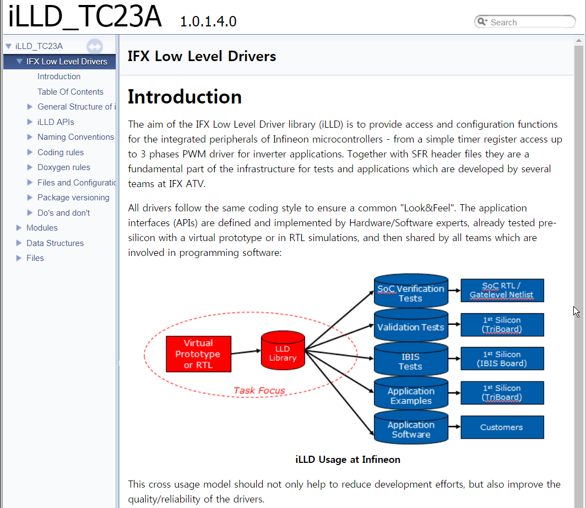
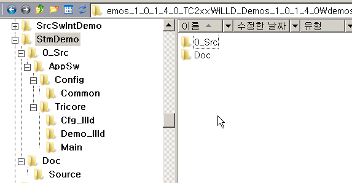
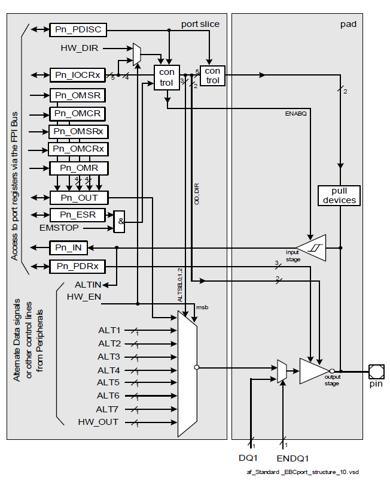
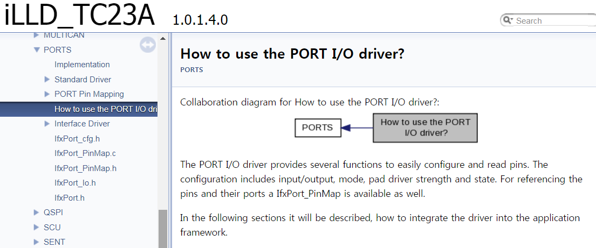
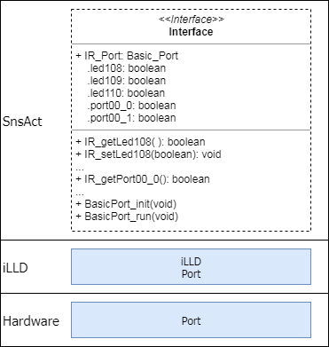

# What is iLLD?

## 시작하는 질문

* AURIX를 사용해 보려고 한다.  **무엇을 보아야 하나? 어떤 코드를 참고해야 하나?**
* iLLD라는 것이 있다는데, Low-Level Driver 라고? **이것은 무슨 의미이지? 어떻게 사용하는 것이지?**

## Objectives

* iLLD의 구조를 이해하고
* iLLD의 도움말을 참고해서 이해하는 방법과
* iLLD의 Demo code와 AURIX User Manual을 참고하는 방법을 익힌다.

## References
* iLLD_TC23A 1.0.1.4.0 도움말: IFX Low Level Drivers
* AURIX TC23x Family User's Manual - Toc & Introduction
* iLLD_TC23A_Demos_1_0_1_4_0 - StmDemo

**[Example Code]**

* _MyiLLDFramework_TC23A
* MyStm_TC23A
* MyPort_TC23A


## 관련 자료 살펴보기

### AURIX User's Manual 참고하는 방법

* User's Manual - 파일을 찾아 열어보니 3435page 라고? 이것을 읽어볼 수는 있는 것인가?
    * 읽어 보아야 하는 것이다.  절대적(?)인 자료이다.
    * 순서대로 읽는 것이 아니라 구조적으로 읽어야 한다.
* 매뉴얼 구조적 읽기
    * 새로운 것이 아니다.  필요한 정보 필요할 때 읽자는 말이다.
    * 구조를 파악하는데 필요한 내용은 찬찬히
    * 사전적인 내용은 필요할 때 찾아보자


**[EXERCISE]**

* AURIX 전체 구조를 파악하는데 필요한 내용은? 다시 말해서 시작하면서 꼭 읽어보아야 하는 내용은?
    * ToC; 약자에 친해지자
    * 1.Introduction
    * 3.On-Chip System Buses and Bus Bridges
    * 4.Memory Maps; Linker의 memory map 이 해결해 준다.
    * 5.BootROM Contents; Debugger로 다운로드 하면 Flash 영역에 들어가고 부팅하면 실행된다.  지금은 고민 말자.
    * 6.CPU Subsystem; Compiler가 해결해 준다.
    * 나머지 챕터는 각 서브시스템별 설명이다.  필요할 때 찾아보면서 이해해 가면 된다.


### iLLD Help 참고하는 방법

* iLLD는 설치했는데 어떻게 사용하는 것이지? 설명서는 어디 있는 것인가?
    * **iLLD_1_0_1_4_0/Doc/TC23A/html/index.html** 파일을 열면 browser 로 확인할 수 있다.
    * 별도의 문서를 따로 만든 것이 아니라 BIFACES의 DoxyGen 기능을 사용하여 생성한 문서이다.
    

* 도움말의 목차를 보니 어마어마 하다.  이것은 어떻게 읽어야 하는 것이지?
	 * 매뉴얼과 마찬가지로 구조적 읽기를 해야 한다.
	  * iLLD를 기준으로 iLLD 자체에 대한 설명을 하는 부분을 우선적으로 읽고
  	* 모듈, 즉 AURIX의 서브시스템과 그 외에 부가적으로 제공하는 함수들을 필요에 따라 찾아보면 된다.


**[EXERCISE]** iLLD의 기본 구조와 활용법을 이해하기 위해서 **[IFX Low Level Drivers]** 부분을 읽고 다음의 질문에 답해 보세요.

* in General Structure of iLLDs

    * Content of Peripheral Drivers ?
    * Configuration Data Structures ?
    * Handles ?

* in iLLD Module의 초기화 API?

```c
<Driver Prefix>_initConfig(<Driver Prefix>_Config *cfg);

<Driver Prefix>_init(<Driver Prefix>_Handle *handle, <Driver Prefix>_Config *cfg);
```

* iLLD Module의 기능 API?

```c
<Driver Prefix>_<functionality>(<Driver Prefix>_Handle *handle)
```

* in Naming Conventions (Open MyStm_TC23A Project)


```c
// in StmDemo.h
    typedef struct
    {
        Ifx_STM             *stmSfr;            /**< \brief Pointer to Stm register base */
        IfxStm_CompareConfig stmConfig;         /**< \brief Stm Configuration structure */
        volatile uint8       LedBlink;          /**< \brief LED state variable */
        volatile uint32      counter;           /**< \brief interrupt counter */
    } App_Stm;

// in StmDemo.c
    App_Stm g_Stm;
    //
    IfxStm_initCompareConfig(&g_Stm.stmConfig);
    //
    IfxStm_initCompare(g_Stm.stmSfr, &g_Stm.stmConfig);
```


* To find `IfxStm_CompareConfig`  type definition & `IfxStm_initCompare()` method definition
    * 위의 정의들은 어느 디렉토리의 어느 파일에 되어 있나요?
    * [Hint] 해당하는 definition 을 선택하고 `F3` 혹은 `Open Declaration` menu 선택

* Cpu/Std/Platform_Types.h 파일을 열고 다음의 정보들을 확인해 보세요
    * Bit order:  MSB_FIRST or LSB_FIRST
    * Byte order: HIGH_BYTE_FIRST or LOW_BYTE_FIRST
    * sint8 ?
    * uint8 ?
* in Files and Configuration
    * 다음 폴더에 있는 파일들의 용도를 설명하세요.
    * _Reg:
    * _Impl:
    * _PinMap:
    * _Lib:
    * Port:


**[EXERCISE]** iLLD에서 제공하는 모듈들의 종류와 용도를  **[Modules]** 에서 설명하고 있습니다.  이것을 참고해서 다음의 질문에 답해 보세요.

* Module 은 크게 다음의 두가지로 분류될 수 있습니다.  각각의 차이는 무엇일까요?
    * iLLD
    * Service software
* iLLD/General functionalities/Data handling/Circular buffer 와 FIFO 가 있습니다.  각각의 용도는 무엇일까요?
    * Circular buffer
    * FIFO
* iLLD/Service software/System Engineering/ Board Support package/Board support package/initTime 과 wait 을 선택하고 그 설명을 확인해 보세요.
    * initTime()
    * wait()
* iLLD/Service software/System Engineering/Math/Look-ups/Look-ups float32/ 을 선택하고 어떤 기능을 하는 모듈인가 설명해 보세요.
* iLLD/Service software/System Engineering/Math/Math 32bit floating point/Low-pass Filter/ 를 선택하고 어떤 기능을 하는 모듈인가 설명해 보세요.


### iLLD Demo code를 참고하는 방법

* iLLD Demo는 설치했는데 어떻게 사용하는 것이지?
    * 아래 그림과 같이 iLLD의 모듈명과 일치하는 Demo 밑에 0_Src 라는 폴더와 Doc 이라는 폴더를 각각 가지고 있다.
      
    * 0_Src/AppSw 를 해당하는 BaseFramework 의 폴더에 복사하면 빌드할 수 있다.
    * /Doc 폴더 밑에는 예제에 대한 간단한 설명이 기술되어 있다.  이 폴더를 복사해서 DoxyGen 을 실행하면 해당 내용을 포함하는 문서를 생성할 수도 있다.
* Demo 프로젝트의 특징
    * AURIX의 다양한 Variant 들을 고려하여 하드웨어적인 의존성을 최소화 하여 구성되어 있다.  Multi-core 칩에서도 실행해 볼 수 있다.
    * 모듈간의 의존성을 최소화 하여 해당 모듈만 독립적으로 실행해 볼 수 있다.
    * iLLD의 설정은 Cfg_Illd 폴더에서,
    * iLLD의 전형적인 활용 예는 Demo_Illd 폴더에서
    * 함수의 실행은 Main 폴더의 main 함수에서
    * 기본 iLLD Module 이 아닌 것은 iLLD Library 폴더에서 복사해 와야 한다.


## MyStm\_TC23A 만들기

### Example Description

* StmDemo 예제를 구성해서 실행해 보자
* Stm을 사용하여 Port 출력으로1초마다 토글, 즉 2초 주기로 LED를 점멸해 보자

**[첫단계]** \_MyiLLDFramework\_TC23A 만들기 <= \_MyBaseFramework\_TC23A + iLLD sources

* iLLD를 사용할 수 있는 Framework 만들기
    * BaseFramework에는 최소한의 iLLD 구성 요소만 들어 있음
    * 필요한 모듈만 /0_Src/BaseSw 로 복사해서 선택적으로 사용해야한다.
    * 매 프로젝트마다 필요한 파일을 찾아서 복사하기 매우 번거로우므로 iLLD 소스를 모두 복사해서 사용
    * 항후 iLLD관련 프로젝트를 만들 때 이프로젝트를 복사해서 사용한다.
* [Action] \_MyBaseFramework\_TC23A 를 복사해서 \_MyiLLDFramework\_TC23A 프로젝트 생성
    * iLLD_1_0_1_4_0/Src/BaseSw 를 통째로 _MyiLLDFramework_TC23A/0_Src/BaseSw 로 복사
    * 모든 iLLD 모듈을 사용할 수 있게 된다.
* [Check] 프로젝트를 빌드하고 실행해 본다.

**[둘째단계]** MyStm\_TC23A 만들기

* StmDemo 예제를 복사, 혹은 import, 해서 실행해 본다.
* [Action] _MyiLLDFramwork_TC23A 복사해서 MyStm_TC23A 프로젝트를 만든다.
    * /iLLD_Demos_1_0_1_4_0_TC23A/demos/Aurix1G/StmDemo/0_Src/AppSw 밑의 파일들을 모두 복사해서 MyStm_TC23A/0_Src/AppSw 로 붙여 넣는다.
    * /iLLD_Demos_1_0_1_4_0_TC23A/demos/Aurix1G/StmDemo/Doc/ 밑의 텍스트 파일을 열어본다.  프로그램 동작에 관한 간단한 설명이 나와 있다.  이 코드는 어떤
* [Check] 프로젝트를 빌드하고 실행해 본다.  실행은 되고 브레이크 포인트도 동작하지만 LED가 점멸되지는 않는다.

**[세째단계]** Customization

* 사용하는 Board와 CPU에 맞게 코드를 Customization 한다.
* [Action1] mainPage.dox 파일을 열고 다음의 내용을 확인해 보세요
    * 이 프로그램의 동작은?
    * 사용하는 LED는 어느 핀에 연결되어 있어야 하는가?
    * 이 코드는 어떤 보드에서 확인이 된 것인가?
* [Action2] AppKit TC2X7 보드의 메뉴얼과 도면을 참고해서 다음의 내용을 확인해 보세요.
    * LED107 은 어떤 포트에 연결되어 있는가?
* [Action3] /Demo_Illd/StmDemo.c 파일을 열고 다음의 사항을 수정해 보세요.
    * AppKit TC2X7 의 LED107 포트를 점멸할 수 있도록 해당 내용을 찾아 수정해 보세요.
* [Check] 프로젝트를 빌드하고 실행해 본다.  LED107이 2초 주기로 점멸한다.
* [Exercise] 2초 주기 => 0.2초 주기로 변경해 보세요.

### Demo Code를 분석하는 방법 Summary

위와 같은 방식으로 해당 모듈에 대한 Demo Code를 분석하고 실행해 볼 수 있습니다.

1. Demo Code의 문서파일을 열어서 해당 동작을 살펴보고
2. 이제 \_MyiLLDFramework_TC23A 와 iLLD의 Demo Code를 합치고
3. 사용하는 Board 와 용도에 맞게 수정하면 됩니다.

이제 AURIX 서브시스템과 iLLD의 활용 방법을 연습하며 하나씩 이해해 나갈 수 있게 됩니다.


## MyPort_TC23A 만들기

* StmDemo를 살펴보니 디지탈 출력, 즉 Port를 사용하여 On/Off 하는 동작 코드가 들어 있습니다.
* 이 코드를 활용해서 InfineonRacer 에서 디지털 입출력을 할 수 있는 모듈로 설계하고 구현해 보자.

```c
//
static void IfxBlinkLed_Init(void)
{
    IfxPort_setPinMode(&MODULE_P33, 6, IfxPort_Mode_outputPushPullGeneral);
    IfxPort_setPinMode(&MODULE_P13, 0, IfxPort_Mode_outputPushPullGeneral);
}
//

static void setOutputPin(Ifx_P *port, uint8 pin, boolean state)
{
    if (state)
    {
        IfxPort_setPinState(port, pin, IfxPort_State_high);
    }
    else
    {
        IfxPort_setPinState(port, pin, IfxPort_State_low);
    }
}
```


### Example Description

* AppKit TC2X7 Board의 구체적인 하드웨어 핀과 설정 정보를 추상화하여
    * LED108, 109, 110 을 점멸할 수 있는 함수와
    * Port0.0, Port0.1 의 정보를 읽어들일 수 있는 함수를 만들자
    * 구조체를 만들어서 이 값을 관리할 수 있도록 하자.


### Hardware

* iLLD는 서브시스템 하드웨어를 추상화 한 것이지, 없는 하드웨어의 기능을 만든 것이 아니다.
    * User's Manual에서 해당 내용에 대한 개략적인 구조와 특징은 이해해야 한다.
* Must-Read Section
    * User's Manual Chap14 GPIO(Ports) pp 976 - 982
* Port는 여러 Slice로 구성되고 각 Slice는 다음과 같은 구조를 가지고 있다.
    * 한마디로 .... 복잡하다.
    * 이 그림의 네모 상자들이 모두 레지스터 들이다.
    * 이 레지스터에 값을 결정해 주어야 사용할 수 있고, 이 레지스터를 통하여 입출력 할 수 있다.
* Port의 기능에 대한 설명은 User's Manual을 **꼭** 참고하십시요.  이곳에서는 생략하도록 하겠습니다.




### iLLD - related

* iLLD의 Port Manual을 어떻게 살펴보아야 하는가?
    * 각 모듈의 iLLD Help 를 살펴보면 구조와 자료형, 메쏘드, 관련 파일 등 관련 정보들이 사전적으로 나옵니다.

    * 대표적인 사용예로 **How to use the Module...** 영역이 있습니다.

    * User's Manual 에서 해당 모듈의 구조와 특징을 살펴보았듯이 전형적인 사용예에 대하여 How to use 영역을 찬찬히 살펴보면 됩니다.

      

[Exercise] How to use the Port I/O 영역을 읽어보고 다음의 질문에 답하세요.

* Port iLLD를 사용하기 위해서는 어떤 헤더 파일을 include 해야 하나요?
* P13.0 을 출력으로 설정하기 위해서는 어떻게 Pin Mode를 설정해야 하나요?
* P13.0 을 High 상태로 출력하려면 어떤 함수를 어떻게 해야 하나요?
* P00.0 을 입력으로 설정하기 위해서는 어떻게 Pin Mode를 설정해야 하나요?
* P00.0 의 입력을 읽어들이려면 어떤 함수를 어떻게 사용해야 하나요?


* How to use 영역을 살펴보다 보면 구체적인 Method에 대하여 궁금해지고, 그 Method에서 사용하는 자료형 등에 대하여 확인할 필요가 있습니다.  이때 해당 함수, Method에 대하여 검색, 혹은 Link를 사용해서 찾아보면 됩니다.

[Exercise]

* `IfxPort_setPinMode()` 함수의 정의를 찾아보세요.  그리고 파라메터의 종류와 의미들에 대하여 찾아보세요.
* `IfxPort_Mode` 는 무엇인가요?  이것에 대한 정보를 찾아보세요.
    * LED를 켜고 끄는 용도로 사용하려면 어떤 값으로 설정해야 하나요?
    * 디지탈 입력을 읽어들이는 용도로 사용하려면 어떤 값으로 설정해야 하나요?


### [Summary] IO 서브시스템과 iLLD 활용하는 방법

1. 하드웨어의 구조에 대하여 이해합니다.
2. 해당하는 iLLD의 사용예를 살펴 봅니다.
3. 나의 사용 방법과 직접적인 관련이 있는 내용을 찬찬히 살펴보며
4. 해당 Method 와 Structure, Enumeration 정보들을 구체적으로 찾아봅니다.
5. 내가 사용할 코드 조각, 보통 snippet 이라고 합니다,을 구성합니다.
6. 필요하면 별도의 테스트 프로젝트를 구성하여 이와 같은 분석 작업을 진행합니다.


**[MyIlldModule_TC23A vs. InfineonRacer 프로젝트 구성]**

* MyIlldModule_TC23A는 IO subsystem과 iLLD Module을 시험하기 위한 프로젝트입니다.
* InfineonRacer는 시험된 모듈을 활용하여 용도에 맞게 개발해 가는 프로젝트 입니다.


### Ports in InfineonRacer

위와 같이 Port 관련 라이브러리에 대하여 기본적인 이해를 한 후 내 사용예에 맞게끔 프로그램을 설계합니다.

**[첫번째] 자료구조와 API 설계**

* 알고리즘 보다 **어떻게 사용할 것인가?**가 오백배 더 중요하다.
    * 프로그래밍을 처음 학습할 때는 알고리즘에 집중해서 기능 구현에 치중하게 됩니다.
    * 이렇게 만들어진 기능은 작성한 사람을 위한 것이지, 정작 이 기능을 사용하는 사람의 편의성은 전혀 고려되지 않은 경우가 많습니다.
    * 어떻게 만들 것인가 보다 어떻게 사용할 것인가를 먼저 고민해서 함수, 모듈, 객체를 설계해야 다른 사람이 사용할 수 있습니다.
    * 다른 사람을 위해서가 아니라, 바로 내가 이것을 사용할 첫번째 사용자 입니다.

* **객체는 자료와 Method의 조합**
    * 객체지향적으로 프로그래밍을 하면 재사용성, 은닉성 등등 좋은 점이 많습니다.
    * C++ 만으로 이것이 가능한 것은 아닙니다.
    * C 언어로 객체지향적으로 모듈을 만들 수 있습니다.
    * Class member 대신 구조체로, Class function 대신 연관된 함수들로, 그리고 이것들을 좋은 명명법을 사용해서 이름을 붙이면 모듈화된 객체를 만들어 사용할 수 있습니다.

  

  ​

* **Header 파일은 사용자가 참고해야 하는 정보들의 집합**
    * 다음의 코드와 같이
    * `IR_Port` 구조체를 만들고
    * `IR_getXXX()`, `IR_set()` 스타일로 함수들을 설계합니다.
    * 이러한 정보들로 Header를구성합니다.

```c
// in header file
typedef struct
{
	volatile boolean led108;
	volatile boolean led109;
	volatile boolean led110;
	volatile boolean port00_0;
	volatile boolean port00_1;
} Basic_Port;

/******************************************************************************/
/*------------------------------Global variables------------------------------*/
/******************************************************************************/
IFX_EXTERN Basic_Port IR_Port;

/******************************************************************************/
/*-------------------------Function Prototypes--------------------------------*/
/******************************************************************************/
IFX_EXTERN void IR_setLed108(boolean led);
IFX_EXTERN void IR_setLed109(boolean led);
IFX_EXTERN void IR_setLed110(boolean led);

IFX_EXTERN boolean IR_getLed108(void);
IFX_EXTERN boolean IR_getLed109(void);
IFX_EXTERN boolean IR_getLed110(void);

IFX_EXTERN boolean IR_getPort00_0(void);
IFX_EXTERN boolean IR_getPort00_1(void);

IFX_EXTERN void BasicPort_init(void);
IFX_EXTERN void BasicPort_run(void);
```


**[두번째] Library 예제 코드, Snippet을 조합하여 기능 구현**

* 라이브러리 분석으로 얻은 정보들로 해야하는 기능 함수들을 구현합니다.

* 다음과 같이 구조적으로 함수와 변수들에 대하여 설계를 하고 각각을 구체화 합니다.

  ​

* 설정 정보 추출

```c
#define LED107						IfxPort_P13_0
#define PORT00_0					IfxPort_P00_0
```

* 초기화 함수

```c
void BasicPort_init(void)
{

	/* IR_Port 변수 초기화 */

	/* LED Port output */

	/* Digital Input */

}
```

* 입출력 함수

```c
void IR_setLed108(boolean led){
	if(led != FALSE){
		led = TRUE;
	}
	IR_Port.led108 = led;
}

boolean IR_getLed108(){
    return(IR_Port.led108);
}
```

* 주기적 실행 함수

```C
void BasicPort_run(void)
{
    /* LED Port output */
	setOutputPin(LED108.port, LED108.pinIndex, IR_Port.led108);

	/* Digital Input */
	IR_Port.port00_0 =  IfxPort_getPinState(PORT00_0.port, PORT00_0.pinIndex);
}

static void setOutputPin(Ifx_P *port, uint8 pin, boolean state)
{
    if (state)
    {
        IfxPort_setPinState(port, pin, IfxPort_State_high);
    }
    else
    {
        IfxPort_setPinState(port, pin, IfxPort_State_low);
    }
}
```

* [참고] 주기적 실행 함수, `Module_run()` 함수를 구성하는 이유

    * `IR_setLed108()` 함수에서 LED108의 상태 변수를 변경하고

    * `BasicPort_run()` 함수에서 상태 변수 값으로 해당 포트에 출력을 합니다.

    * 이 두가지 일을 하나의 함수로 묶어서 처리해도 됩니다.

    * 그러나, 이와같이 Event 방식으로 정보를 처리하고 Periodic 하게 실제 입출력을 처리하는 이유는 실제 제어시스템들은 이벤트 방식으로 처리하는 것보다 주기적인 방식으로 처리하는 것이 안정되기 때문입니다.

    *  Scheduler 부분에서 구체적인 구현 방식에 대해서는 설명할 것입니다만, 디지탈제어의 기본 전제 조건은 균일한 샘플링 주기 입니다.

    * 시스템의 보호나 예외상황의 처리와 같은 사건들은 스케쥴러를 통하지 않고 바로 처리하도록 구성할 수도 있습니다.

    ​

**[세번째] Test & Debug**

* 구성된 Module 에 대한 사용자 입장에서의 평가 와 기능 시험
* Test Bench 를 구성
    * main 함수를 사용해서 초기화 함수 호출, 주기 함수 호출
    * 디버거를 사용해서 중요한 변수값 모니터링 및 변경하며 모듈의 동작 여부 확인
    * 필요한 경우 추가적인 테스트 코드 구성

```
   /* Initialization section */
    printf("Initialization started\n");
    initTime(); // Initialize time constants
    BasicPort_init();
    /* background endless loop */
    printf("Background loop started\n");
    while (TRUE)
    {
    	BasicPort_run();
        wait(TimeConst_100ms*5);
    }

```


**[네번째] Optimization & Clean-up**

* 기능이 동작한다고 프로그래밍이 끝난 것이 아니다.
* 청소부터 해야 한다. 쓸데 없는 주석은 없는지, 시험을 위해서 임시로 삽입된 코드는 없는지
* 최적화 해야 한다.  메모리와 속도 측면에서

```c
boolean IR_getLed108(){
    return(IR_led108);
}

#define IR_getLed108() IR_Port.led108
```
